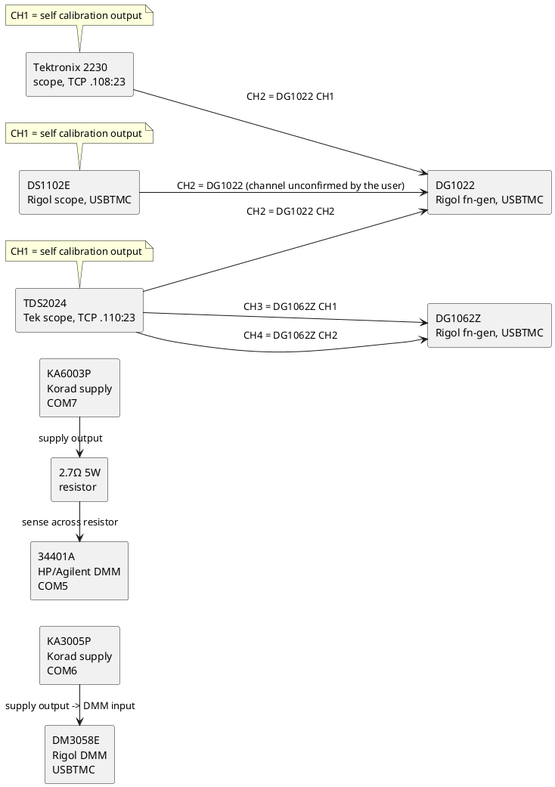

# 2026-09-24

## Real-hardware test pass against the current bench setup

Ran dev-term's console CLI (`dotnet run --project src/DevTerm.Console -- ... --cli true`) directly
against the physical bench as currently wired, to confirm the SCPI/device profiles and transports
still work against real instruments (not just the earlier one-off spot checks). Scope: every
instrument reachable from this PC (serial, TCP, or USBTMC) at the time of testing. Bench topology as
described by the user:

Only the DMM/supply/scope *control* links (serial/TCP/USBTMC to this PC) were exercised below — the
analog signal wiring (calibration outputs, function-generator fan-out) above is context for what each
scope/meter is actually looking at, not something dev-term drives.

### Device configuration matrix

| Device | Role in bench setup | Profile used | Transport / address | Framing | Real-hardware result |
|---|---|---|---|---|---|
| Korad KA3005P | Drives DM3058E's input | `korad-ka3005p.json` | Serial COM6 | 9600 8N1, no handshake, `--lineending None` | Confirmed working |
| Korad KA6003P | Drives the 2.7Ω resistor / 34401A | `korad-ka6003p.json` | Serial COM7 | 9600 8N1, no handshake, `--lineending None` | Confirmed working |
| HP/Agilent/Keysight 34401A | Senses across the resistor | `hp-agilent-keysight-34401a.json` | Serial COM5 | 9600 8N2 (2 stop bits), no parity/handshake, `--lineending Lf` | Confirmed working, with caveats (see Findings) |
| Tektronix 2230 | Scope, CH1 self-cal / CH2 ← DG1022 CH1 | `tektronix-2230.json` | TCP 192.168.0.108:23 | `--lineending Cr` | Confirmed working, with caveats (see Findings) |
| Tektronix TDS2024 | Scope, CH1 self-cal / CH2 ← DG1022 CH2 / CH3-CH4 ← DG1062Z CH1-CH2 | `tektronix-tds2024.json` | TCP 192.168.0.110:23 | `--lineending Cr` | Confirmed working, with caveats (see Findings) |
| Rigol DM3058E | DMM, reads KA3005P's output | `rigol-dm3058e.json` | USBTMC, VID 0x1AB1 PID 0x09C4 | — | Still fails — parked bulk-IN stall (see Findings) |
| Rigol DS1102E | Scope, CH1 self-cal / CH2 ← DG1022 | none bundled (closest is `rigol-ds1105e.json` — **DS1105E, not DS1102E**, not verified interchangeable) | USBTMC, VID 0x1AB1 PID 0x0588 (enumerates as "DS1000 SERIES") | — | Not attempted — same USBTMC stall expected, and profile applicability itself is unconfirmed |
| Rigol DG1022 | Function generator, feeds all three scopes' CH2 | `rigol-dg1022.json` | USBTMC, VID 0x1AB1 PID 0x0588 (enumerates as "DG3000 SERIES" — see note) | — | Not attempted — same USBTMC stall expected |
| Rigol DG1062Z | Function generator, feeds TDS2024 CH3/CH4 | none bundled | USBTMC, VID 0x1AB1 PID 0x0642 ("DG1000Z Serials") | — | Not attempted — no profile, and same USBTMC stall expected |

Detected via `--listusbtmcdevices true`: `1AB1:09C4 Rigol Technologies DM3000 SERIES`,
`1AB1:0588 Rigol Technologies DS1000 SERIES`, `1AB1:0588 Rigol Technologies DG3000 SERIES`, and
`1AB1:0642 Rigol Technologies. DG1000Z Serials` — note the DG1022 and DS1102E enumerate under the
*same* PID (0x0588) with the descriptor text reporting "DG3000 SERIES" for what is physically a
DG1022 (older DG1000-family unit, per its serial number prefix `DG1D...`) — the descriptor's own
series name doesn't match the unit's actual model, so PID alone isn't enough to disambiguate the two
USBTMC-instrument-class devices on this bench; a serial-number check (`--serialnumber`) would be
needed to target one specifically.

### Commands tested and responses

**Korad KA3005P (COM6):**

| Sent | Received (raw) | Notes |
|---|---|---|
| `*IDN?` | `KORAD KA3005P V5.8 SN:03396447` | No terminator on the reply — the ASCII presenter's line buffering never flushes it; had to use `--presenter hex` (or add it alongside ascii) to see anything at all (see Findings) |
| `STATUS?` | `0x12` (`00010010`) | Beeper on (bit 4), output off (bit 6), OCP/OVP off, CH1 in CV |
| `VSET1?` | `02.00` | |
| `ISET1?` | `0.077` | |
| `VOUT1?` | `00.00` | Consistent with output off |
| `IOUT1?` | `0.000` | Consistent with output off |

**Korad KA6003P (COM7):**

| Sent | Received (raw) | Notes |
|---|---|---|
| `*IDN?` | `KORAD KA6003P V5.8 SN:50266913` | |
| `STATUS?` | `0x12` (`00010010`) | Same decode as KA3005P: beeper on, output off |
| `VSET1?` | `05.00` | |
| `ISET1?` | `1.000` | |
| `VOUT1?` | `00.00` | |
| `IOUT1?` | `0.000` | |

**HP/Agilent/Keysight 34401A (COM5)** — sequence run as `*CLS`, `SYST:ERR?`, `SYST:REM`,
`SYST:ERR?`, `MEAS:VOLT:DC?`, `SYST:ERR?`, `MEAS:RES?`, `SYST:LOC`:

| Sent | Received | Notes |
|---|---|---|
| `*IDN?` (separate run) | `HEWLETT-PACKARD,34401A,0,5-1-1` | |
| `*CLS` | *(none — set command)* | |
| `SYST:ERR?` | `+550,"Command not allowed in local"` | Stale queue entry from an earlier attempt in this same session, before remote mode was asserted — not from this command |
| `SYST:REM` | *(none — set command)* | |
| `SYST:ERR?` | `-103,"Invalid separator"` | Also a stale/leftover queue entry — draining, not caused by `SYST:REM` itself |
| `MEAS:VOLT:DC?` | `+4.12725000E-03` | Real measurement, 4.127 mV DC — plausible residual with KA6003P's output off |
| `SYST:ERR?` | `+550,"Command not allowed in local"` | Last of the stale backlog draining |
| `MEAS:RES?` | `+4.74156800E+00` | Real measurement, 4.74 Ω — 2-wire resistance through the 2.7 Ω resistor plus lead/connection resistance |
| `SYST:LOC` | *(none — set command)* | Released remote lockout as a courtesy before disconnecting |

**Tektronix 2230 (TCP 192.168.0.108:23):**

| Sent | Received | Notes |
|---|---|---|
| `ID?` (1st, on a fresh connection) | `STATUS 97;READY;` | Not the identify string — see Findings |
| `ID?` (2nd, same connection) | `ID TEK/2230,V81.1,VERS:13;` | Matches the previously-recorded value |

**Tektronix TDS2024 (TCP 192.168.0.110:23):**

| Sent | Received | Notes |
|---|---|---|
| `ID?` (immediately after connect, x3 attempts) | *(nothing)* | See Findings — command sent too soon after connect |
| `ID?` (after a ~2s settle) | `ID TEK/TDS 2024,CF:91.1CT,FV:v4.12 TDS2CM:CMV:v1.04` | Matches the previously-recorded value; CR-terminated as already fixed in `ScpiReplyPresenter` |

**Rigol DM3058E (USBTMC):**

| Sent | Received | Notes |
|---|---|---|
| `*IDN?` | *(nothing — connection opens, no reply ever arrives)* | Confirms the parked bulk-IN stall bug (`BACKLOG.md`) is still present, unchanged |

### Findings

- **New: the Tektronix 2230 pushes an unsolicited `STATUS <n>;READY;` line immediately on TCP
  connect, before any reply to the first real command.** This explains the "one run showed the reply
  doubled" note from `docs/changes/2026-09-23.md` — it wasn't a doubled reply to the same `ID?`, it
  was this connection-time banner arriving first, followed by the real `ID?` reply as a second line.
  Reproduced twice, consistently, on fresh connections. Anything that talks to the 2230 over this TCP
  bridge (a future 2230 "codes"-protocol view, in particular) needs to either discard the first line
  after connecting or treat it as a real (if unsolicited) status push, not assume the first line back
  is always the reply to the first command sent.
- **The TDS2024's TCP bridge can silently drop a command sent immediately after the TCP connection
  is reported open.** Three consecutive attempts to send `ID?` right after connecting got no reply at
  all (verified independently with a raw, dev-term-free `TcpClient` probe that also got no reply on
  the same timing); waiting roughly 2 seconds before sending resolved it every time after. The 2230
  didn't show this — its banner line arrives immediately. Likely the serial-to-Ethernet bridge itself
  needs a moment after accepting the TCP connection before its serial side is actually listening,
  independent of dev-term. Worth keeping in mind for anything that connects-then-immediately-sends
  against either of these bridges; not something to "fix" in dev-term itself since a bare socket has
  the identical behavior.
- **The 34401A's SCPI error queue is a real FIFO that persists across separate dev-term connections**
  (a property of the instrument, not the app) — an earlier failed attempt in this same test pass (a
  `MEAS:VOLT:DC?` sent while still in local mode) left `+550`/`-103` entries sitting in the queue,
  which a later, unrelated `SYST:ERR?` call drained one at a time, one call per queued entry. Nothing
  to fix in dev-term — just a reminder that `SYST:ERR?` during interactive testing may be reporting a
  *previous* mistake, not the command that immediately preceded it; `*CLS` at the start of a session
  is worth sending but doesn't retroactively make old errors disappear from a reply you already
  requested before it ran.
- **Reconfirmed (not new): an unterminated reply (both Korad profiles - no terminator on any reply,
  per the profile's own notes) never flushes through the line-buffering ASCII presenter.** Had to add
  `hex` to `--presenter` to see anything from either Korad unit at all; this is expected/by-design
  behavior (documented in the profile's own `Notes` field), not a bug, but worth remembering when
  testing any device with no reply terminator — plain `--presenter ascii` alone will look silently
  dead.
- **DM3058E's USBTMC bulk-IN stall reproduces unchanged** — connects, opens, but `*IDN?` never gets a
  reply. Per `docs/changes/2026-09-23.md`, this is confirmed not a firmware limitation (the same
  physical units work under Rigol's own Ultra Sigma/NI-VISA stack), and the next concrete step
  identified there is a packet capture of a working NI-VISA `*IDN?` exchange to diff against what
  dev-term sends. USBPcap + Wireshark are now available on this bench PC, and a Python
  `pyusb`/`python-usbtmc` exchange would give an independent non-.NET reference capture to compare
  against `LibUsbDotNet`'s — noted in `BACKLOG.md` as the next actionable step; not attempted this
  session (out of scope for a same-day confirm-the-existing-profiles pass).
- **Bench/profile model mismatch, unresolved**: the bench's oscilloscope is a Rigol **DS1102E**; the
  only bundled Rigol scope profile is `rigol-ds1105e.json` (**DS1105E**). These are different specific
  models in the same family — not verified interchangeable, so no DS1102E command testing was
  attempted against that profile. Also, the DG1022 and DS1102E currently enumerate under the same
  USBTMC PID (`0x0588`), and the DG1022 unit's own descriptor misreports itself as "DG3000 SERIES"
  rather than DG1000 — see the configuration matrix note above. Both are backlog items, not fixed
  here.

No dev-term code changes landed from this pass — every profile tested (Korad ×2, HP 34401A,
Tektronix 2230, Tektronix TDS2024) round-tripped correctly against real hardware as already shipped;
the only unresolved item is the pre-existing, already-tracked USBTMC stall and the DS1102E/DG1022
profile-identity gaps noted above.
