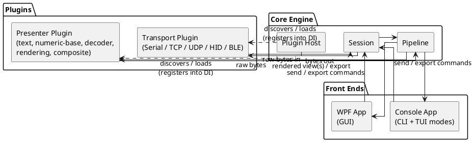

# Architecture Overview

## Purpose

Describes the high-level architecture of dev-term: the core abstractions, how data flows from a device to a screen (and back), and how transports/presenters/front ends stay independent of each other.

## Design principles

- Separate the three concerns cleanly: **transport** (getting bytes to/from a device), **interpretation** (turning bytes into something meaningful), and **presentation** (showing it to the user, in whichever front end they're using).
- Everything a device- or protocol-specific extension point (transports, presenters/decoders) is a plugin against a small, stable contract — the core never has device- or protocol-specific knowledge baked in.
- Core is UI-agnostic and transport-agnostic; it knows about `ITransport` and `IPresenter`, never about "the serial transport" or "the HPGL decoder" specifically.
- Async/streaming first — devices produce bytes at arbitrary times, not in request/response lockstep, and byte-level and message-level views must both stay live.
- Composition is standard .NET dependency injection, all the way down: the core, every plugin, and both front ends are wired together through `Microsoft.Extensions.DependencyInjection`/Generic Host, not through ad hoc `new`s or service locators. See [platform.md](platform.md).

## Core concepts

### Session

A `Session` binds one `ITransport` instance to a pipeline of presenters for a single logical connection to a device. Multiple sessions can be open concurrently (e.g., watching two serial ports, or a serial port and a TCP bridge, side by side).

### Transport

`ITransport` — abstraction over a byte- or message-oriented, full-duplex (or receive-only) connection to a device: connection lifecycle (discover/open/close), device-specific configuration, and streaming bytes in and out. See [transports.md](transports.md).

### Presenter

`IPresenter` — turns a raw byte stream into a viewable (and, where it makes sense, editable/sendable) representation. Presenters range from simple text/numeric-base views to stateful protocol decoders to renderers that produce graphics and export files. See [presenters.md](presenters.md).

### Pipeline

A session's pipeline is a chain of presenters/decoders that a raw byte stream flows through, fanning out to one or more simultaneous views — e.g., raw hex and a decoded protocol view of the same stream at once, or a byte-unframer (SLIP/COBS) feeding an inner decoder.

The pipeline isn't always a straight line: a **composite/channelized decoder** can demultiplex a single stream into several named channels (split by a header/discriminator byte, a time slot, or similar framing), each of which is then handed to its own sub-presenter — which might itself be a different text encoding, a different numeric base, or another nested decoder. See [presenters.md](presenters.md) for detail; this is the model for interlaced telemetry where different fields of the same frame carry differently-encoded data.

### Plugin host

Transports and presenters are discovered and loaded as plugins against versioned contracts, registering themselves into the shared DI container rather than being compiled into the core or the front ends. See [plugin-model.md](plugin-model.md).

### Front ends

Two deployable applications sharing the same core engine and DI composition: a console app (offering both CLI and TUI modes) and a WPF app (GUI). They share sessions, transports, and presenter plugins, differing only in how they render and how the user interacts. See [frontends.md](frontends.md) and [platform.md](platform.md).

## Data flow

## Non-goals (for now)

- Not a full protocol-analysis suite (e.g., not aiming to replace Wireshark for deep packet inspection) — the focus is device development/debugging workflows.
- Not initially targeting mobile platforms.

## Open questions

- Plugin isolation mechanism: in-process (`AssemblyLoadContext`) vs. out-of-process (IPC) plugin hosting.
- Whether presenters/decoders can also *originate* traffic (e.g., simulate a device) or are receive-only in v1.
- Cross-session scripting/automation model for the CLI front end.
