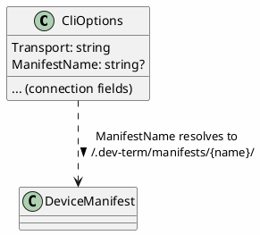

# Connection Profiles

## Purpose

Lets a user save a named connection configuration once and pick it again later from a menu, in
either front end (TUI or WPF), instead of re-entering connection settings every session or only
ever having the one untitled `appsettings.Local.json` profile. A profile can also point at a
[device manifest](device-manifests.md), so picking a profile can mean "connect this way, *and* load
what this specific device can do and how to show it" in one step.

## Relationship to the existing `appsettings.Local.json`

That file doesn't go away — it's still the always-loaded *default* profile (config layering, see
[platform.md](platform.md)): no args, no menu, it's just what you get. Named profiles are an
additional, separate mechanism for **explicit** selection: several saved configurations, browsable
and pickable by name, each optionally tied to a device manifest. The default profile itself has no
name and no manifest reference — it's the "just connect to whatever I usually use" shortcut; named
profiles are for "connect to *this specific* thing."

## Shape

A profile is just a `CliOptions`-shaped JSON file — the same connection fields (transport type and
its per-transport settings, presenter, line ending) `DevTermConfiguration`'s profile-save logic
already projects out of a live `CliOptions` — reusing the exact same binding pipeline
(`Microsoft.Extensions.Configuration.Json` + `Bind()`) that already loads `appsettings.Local.json`,
rather than a separate parallel type. One addition on `CliOptions` itself makes this work:

- **`ManifestName`** (optional) — **a name, not a path.** Resolves to
  `~/.dev-term/manifests/{ManifestName}/` (a folder `DeviceManifestLoader` already knows how to
  load) rather than storing a filesystem path directly, so a profile stays portable across
  machines and doesn't break if the manifest folder moves — the profile just says *which* device,
  not *where* its files happen to sit right now.

**Storage location**: profiles live under a per-user home directory, not next to any particular
front end's build output (unlike `appsettings.Local.json`, which deliberately stays with each
app's own output — see "Relationship" above) — this is what lets one saved profile work
identically from the console app or WPF, wherever each happens to be built/run from. Manifests
resolve from **two** locations, checked in order, so a user can override a built-in manifest
without touching the install:

1. `~/.dev-term/manifests/{device-name}/` — the user's own, personal manifests.
2. `./manifests/{device-name}/` (relative to the app's own install/build output) — pre-packaged
   manifests that ship with dev-term itself (e.g. the device proposals already documented, once
   any of them are actually built).

```
~/.dev-term/
  profiles/
    {profile-name}.json
  manifests/
    {device-name}/
      device.json
      ... (any files it references)

<app install directory>/
  manifests/
    {device-name}/
      device.json          # pre-packaged, ships with the app
```



## Startup flow (both TUI and WPF)

1. Bind `CliOptions` from the existing layered config (files/env/CLI args) as today.
2. **If that's already a complete, valid configuration** (`CliOptionsValidator` succeeds) — skip
   straight to the execution model (the connect-and-interact screen both front ends already have).
   This is the "configured from args, go right to it" case.
3. **If not** — show a Configure screen instead of hard-failing (today's behavior: print an error
   and exit). The Configure screen lets the user either fill in connection fields manually, or pick
   an existing named profile from the same list the menu uses, and offers "Save as a new profile"
   before proceeding. Only once the resulting configuration validates does it proceed to the
   execution model.

## Menu access, mid-session

Both front ends get a **"Device Profiles"** menu (a real menu bar item, not just a startup-time
screen), listing every profile found in `profiles/`. Picking one **at any time** — not just at
startup — tears down the current session/transport, connects with the picked profile's settings,
and loads its referenced manifest if it has one. This is the same action the Configure screen's
"load a profile" option triggers; the menu is just always available, not gated on the current
config being invalid.

**A missing manifest is a warning, not a hard failure**: if `ManifestName` doesn't resolve under
either manifest location (see "Shape" above), the connection still proceeds using the default text
presenters — the manifest only adds device-specific commands/UI on top of a connection that works
fine without it. The user sees a warning (exact presentation TBD per front end), not a blocked
connection.

## What this explicitly is not (yet)

- **Not wired to `IControlSurface`** — loading a profile's referenced manifest makes its
  `UiDefinition` available, but nothing yet renders it or turns it into a live control surface,
  same "step one" scope as [ui-definitions.md](ui-definitions.md) and
  [device-manifests.md](device-manifests.md) themselves.
- **Not a replacement for `appsettings.Local.json`** — see "Relationship" above; both exist,
  serving different purposes (implicit default vs. explicit named choice).

## Open questions

- Whether switching profiles mid-session (via the menu) should warn/confirm if a session is
  actively connected, or just tear down and reconnect silently.
- Whether the Configure screen and the menu should share one underlying "profile picker" component
  (a list + load action) rather than two separate implementations of the same idea — likely yes,
  worth designing that way from the start once actually built.
- Whether a profile's `ManifestPath` should be validated (the manifest actually loads) at save
  time, at profile-list time, or only when the profile is actually picked to connect — affects how
  early a broken reference surfaces to the user.
