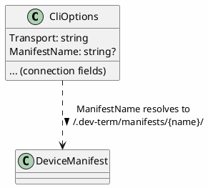

# Connection Profiles

## Purpose

Lets a user save a named connection configuration once and pick it again later from a menu, in
either front end (TUI or WPF), instead of re-entering connection settings every session or only
ever having the one untitled `appsettings.Local.json` profile. A profile can also point at a
[device manifest](device-manifests.md), so picking a profile can mean "connect this way, *and* load
what this specific device can do and how to show it" in one step.

## Relationship to the existing `appsettings.Local.json`

That file doesn't go away — it's still the always-loaded *default* profile (config layering, see
[platform.md](platform.md)): no args, no menu, it's just what you get. Named profiles are an
additional, separate mechanism for **explicit** selection: several saved configurations, browsable
and pickable by name, each optionally tied to a device manifest. The default profile itself has no
name and no manifest reference — it's the "just connect to whatever I usually use" shortcut; named
profiles are for "connect to *this specific* thing."

## Shape

A profile is just a `CliOptions`-shaped JSON file — the same connection fields (transport type and
its per-transport settings, presenter, line ending) `DevTermConfiguration`'s profile-save logic
already projects out of a live `CliOptions` — reusing the exact same binding pipeline
(`Microsoft.Extensions.Configuration.Json` + `Bind()`) that already loads `appsettings.Local.json`,
rather than a separate parallel type. One addition on `CliOptions` itself makes this work:

- **`ManifestName`** (optional) — **a name, not a path.** Resolves to
  `~/.dev-term/manifests/{ManifestName}/` (a folder `DeviceManifestLoader` already knows how to
  load) rather than storing a filesystem path directly, so a profile stays portable across
  machines and doesn't break if the manifest folder moves — the profile just says *which* device,
  not *where* its files happen to sit right now.

**Storage location**: profiles live under a per-user home directory, not next to any particular
front end's build output (unlike `appsettings.Local.json`, which deliberately stays with each
app's own output — see "Relationship" above) — this is what lets one saved profile work
identically from the console app or WPF, wherever each happens to be built/run from. Manifests
resolve from **two** locations, checked in order, so a user can override a built-in manifest
without touching the install:

1. `~/.dev-term/manifests/{device-name}/` — the user's own, personal manifests.
2. `./manifests/{device-name}/` (relative to the app's own install/build output) — pre-packaged
   manifests that ship with dev-term itself (e.g. the device proposals already documented, once
   any of them are actually built).

```
~/.dev-term/
  profiles/
    {profile-name}.json
  manifests/
    {device-name}/
      device.json
      ... (any files it references)

<app install directory>/
  manifests/
    {device-name}/
      device.json          # pre-packaged, ships with the app
```



## Startup flow (both TUI and WPF)

1. Bind `CliOptions` from the existing layered config (files/env/CLI args) as today.
2. **If that's already a complete, valid configuration** (`CliOptionsValidator` succeeds) — skip
   straight to the execution model (the connect-and-interact screen both front ends already have).
   This is the "configured from args, go right to it" case.
3. **If not** — show a Configure screen instead of hard-failing (today's behavior: print an error
   and exit). The Configure screen lets the user either fill in connection fields manually, or pick
   an existing named profile from the same list the menu uses, and offers "Save as a new profile"
   before proceeding. Only once the resulting configuration validates does it proceed to the
   execution model.

## Menu access, mid-session

Both front ends get a **"Device Profiles"** menu (a real menu bar item, not just a startup-time
screen), listing every profile found in `profiles/`. Picking one **at any time** — not just at
startup — tears down the current session/transport, connects with the picked profile's settings,
and loads its referenced manifest if it has one. This is the same action the Configure screen's
"load a profile" option triggers; the menu is just always available, not gated on the current
config being invalid.

**Landed at a reduced scope, 2026-09-15**: both front ends now have a real "File > Device
Profiles..." menu item (TUI: `TuiMode.BuildWindow`'s `MenuBar`, reusing `ConfigureMode.BuildWindow`
as a nested modal; WPF: a new `DeviceProfilesWindow`) — at first, picking a profile saved it as the
untracked default (`appsettings.Local.json`) and asked for a restart rather than live-swapping the
running session's transport as designed above (see the live-switching update further below for how
this was later closed). The TUI's menu also picked up a real Ctrl+Q shortcut while landing this
(previously advertised in the title bar but never actually wired to anything) — see
`docs/design/testing.md`'s TUI section and `CLAUDE.md`'s constraints list for what made both take
more than expected: a `MenuItem`'s `Key`/`InputGestureText` argument only labels the shortcut for
display in both Terminal.Gui and WPF, it doesn't register a live accelerator by itself.

**Live mid-session switching landed, 2026-09-15**: picking a profile now tears down the running
session/transport and opens the picked one in place, no restart — closing the reduced-scope gap
above. `DevTermSessionBuilder.Build(CliOptions)` (`DevTerm.Configuration`) composes a fresh
`Session`+`IPresenter` pair through its own small throwaway `IServiceProvider`, built the exact same
way `AddDevTermFrontEnd` composes the app's real, long-lived host — necessary because that host has
no API to re-register a transport into itself once built, and is only ever built once, eagerly, in
`Program.cs`/`App.xaml.cs`, before either front end starts. `MainWindow.SwitchProfileAsync` and a
`SwitchProfileAsync` local function inside `TuiMode.BuildWindow` (Terminal.Gui has no object to hang
an equivalent method on, so it's exposed via `TuiWindowParts` for tests instead) both: unsubscribe
the old session's `Output` handler, close and dispose it, swap in the new session/presenter/options,
resubscribe, then open the new session — reporting a connection failure the same way `Connect`/
`ToggleConnectionAsync` already do, without reverting to the old (already-closed) session. The
throwaway `IServiceProvider` itself is deliberately never disposed — see
`DevTermSessionBuilder.Result`'s own doc comment for why that's safe (the transport it composed is
already disposed directly by `Session.DisposeAsync`, and every transport's own `CloseAsync`/
`DisposeAsync` already guards against being called twice), not an oversight. Verified end-to-end
against a real local TCP loopback socket in both front ends — not yet against real hardware.

**Also landed, same day**: a separate "File > Connect"/"Disconnect" menu item (a single item whose
label flips, not two) in both front ends, closing or reopening the *same* `Session`/transport
without touching profiles at all — `TuiMode.ToggleConnectionAsync`/`MainWindow.ToggleConnectionAsync`.
This surfaced a real bug in `Session` itself: it created its read-loop `CancellationTokenSource`
once, in the constructor, and only ever cancelled it — so reopening after a close started the new
read loop with an already-cancelled token, ending it immediately and silently. Fixed by creating a
fresh one on every `OpenAsync` instead; see `CLAUDE.md`'s constraints list and
`DevTerm.Core.Tests.SessionTests.OpenAsync_AfterClose_RestartsTheReadLoopForRealIncomingData` (a
regression test confirmed to fail without the fix, not just a passing test written after). Sending
while disconnected is guarded in both front ends (a message in the TUI's output pane / WPF's output
list, not a crash). This is intentionally a different, smaller feature than mid-session *profile
switching* above — it reconnects with the exact same settings, it doesn't pick a different profile.

**Editor logic is shared between front ends, 2026-09-15**: `DevTerm.Configuration.ConnectionEditorViewModel`
holds all the connect/load/save/import/export logic (validation, `ConnectionProfileStore` I/O) once,
not duplicated per front end. WPF's `DeviceProfilesWindow` is now XAML bound directly to it
(`Command="{Binding ConnectCommand}"`, `Text="{Binding Transport, UpdateSourceTrigger=PropertyChanged}"`,
etc.) with no business logic left in code-behind. The TUI's `ConfigureMode` builds the same view
model but, since Terminal.Gui has no data-binding system of its own, copies field values to/from it
explicitly around each button press (`PushFieldsIntoViewModel`/`PullFieldsFromViewModel`) rather
than staying continuously in sync the way WPF's bindings do. `RelayCommand` (a small, from-scratch
`ICommand`) makes this possible — `ICommand` itself is a base-class-library type, not WPF-specific,
so a plain class library can implement and expose it, and the TUI side just calls `Execute(null)`
directly instead of going through WPF's command-binding machinery.

**Import/export, same day**: both the TUI's `ConfigureMode` and WPF's `DeviceProfilesWindow` can
save the current fields to a standalone JSON file and load one back — `ConnectionProfileStore.ExportToFile`/
`LoadFromFile`, the same shape (and the same `Bind()`-based serialization) a named profile already
uses, so an exported file can also just be dropped into `~/.dev-term/profiles/` by hand. WPF adds a
"Browse..." file-picker button on top (unavoidable to have *some* code-behind for a native dialog);
the TUI takes a typed path instead, since Terminal.Gui has no native file-picker used here.

**Startup flow parity, same day**: WPF's `App.xaml.cs` now mirrors the console app's `Program.cs`
restructuring from earlier today — `CliOptions` is bound and validated *before* the DI host is
built, and an invalid configuration opens `DeviceProfilesWindow` (via a new `Result`/`CloseRequested`
pair mirroring the TUI's `ConfigureMode.Run`) instead of showing an error and exiting. Needed one
WPF-specific fix: the default `ShutdownMode` (`OnLastWindowClose`) would quit the whole app the
moment that startup editor window closed, since there's no `MainWindow` yet at that point — set to
`OnExplicitShutdown` for the startup window, then back to `OnMainWindowClose` once the real
`MainWindow` is actually shown.

**A missing manifest is a warning, not a hard failure**: if `ManifestName` doesn't resolve under
either manifest location (see "Shape" above), the connection still proceeds using the default text
presenters — the manifest only adds device-specific commands/UI on top of a connection that works
fine without it. The user sees a warning (exact presentation TBD per front end), not a blocked
connection.

**Real pickers and more fields, same day**: Transport/Presenter/Line ending/Parity/Stop bits are now
actual selectors in both front ends (WPF `ComboBox`es bound via `{Binding}`; TUI
`OptionSelector<TEnum>`, via two TUI-only enums since it needs a real `enum` and the shared view
model's `Transport`/`Presenter` are plain strings) rather than free-text fields, with the visible
field group switching based on the selected Transport. Serial gained Data bits/Parity/Stop bits;
there's now a free-text Description field; Delete and Refresh sit next to Load; Save asks for
confirmation before overwriting an existing name; Load sets "Save as profile named" to the loaded
name; WPF's saved-profiles list grows/shrinks with the window. `CliOptions` gained
`[Category]`/`[DisplayName]` attributes documenting the field groupings (metadata only for now).
Full field-by-field/action-by-action reference, including what's still open (HID vendor/product ID
enumeration, dirty-field confirmation, zip export/import with conflict
resolution, a TUI file picker/scrollbar): [`docs/specs/connection-editor.md`](../specs/connection-editor.md) —
the first of a new `docs/specs/` series, one file per screen/user-flow, precise where this doc is
about intent and `docs/user-guide/` is about how to use it.

**Presenter picker and parser, 2026-09-18**: `CliOptions.Presenter` is now a list (a JSON array in
a saved profile) — the editor shows one checkbox per presenter — and a separate `Parser` names the
presenter that encodes typed lines, so display and send format are decoupled. Old profiles with a
scalar `"Presenter": "hex"` (and no `Parser`) still load: `DevTermConfiguration.Bind` splits a
scalar/comma-separated `Presenter` (also how `--presenter ascii,hex` and `DEVTERM_PRESENTER` arrive),
and `Parser` falls back to the first presenter. Front ends now hold a `PresenterCatalog` rather than
a single `IPresenter`, so the send format can change per line.

## What this explicitly is not (yet)

- **Not wired to `IControlSurface`** — loading a profile's referenced manifest makes its
  `UiDefinition` available, but nothing yet renders it or turns it into a live control surface,
  same "step one" scope as [ui-definitions.md](ui-definitions.md) and
  [device-manifests.md](device-manifests.md) themselves.
- **Not a replacement for `appsettings.Local.json`** — see "Relationship" above; both exist,
  serving different purposes (implicit default vs. explicit named choice).

## Open questions

- ~~Whether switching profiles mid-session (via the menu) should warn/confirm if a session is
  actively connected, or just tear down and reconnect silently.~~ Resolved when live switching
  landed (2026-09-15): tears down and reconnects silently, no confirmation prompt — matches
  Connect/Disconnect's own no-confirmation precedent. Worth revisiting now that dirty-field
  confirmation has landed (2026-09-16 — see `docs/changes/2026-09-16.md`), if the same "are you
  sure" pattern should extend to mid-session profile switching too.
- Whether the Configure screen and the menu should share one underlying "profile picker" component
  (a list + load action) rather than two separate implementations of the same idea — likely yes,
  worth designing that way from the start once actually built.
- Whether a profile's `ManifestPath` should be validated (the manifest actually loads) at save
  time, at profile-list time, or only when the profile is actually picked to connect — affects how
  early a broken reference surfaces to the user.
