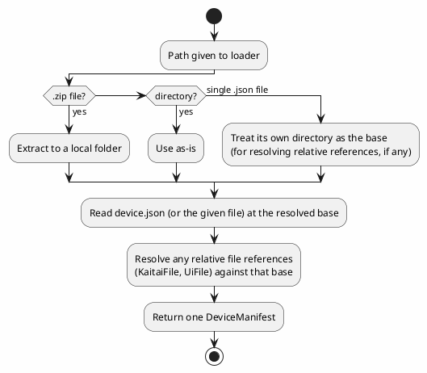

# Device Manifests

## Purpose

Ties together two things already designed separately — the declarative command/response schema
sketched in [device-control-modules.md](device-control-modules.md)'s "Declarative command/response
schema" section, and the control-panel model in [ui-definitions.md](ui-definitions.md) — into one
file (or one small package of files) that fully configures dev-term for a specific device with
**no code**: what bytes to send for each command, how to recognize/parse what comes back, what
transport it expects, and what control panel to show. This is the "assembled declaratively" path
device-control-modules.md's open questions already anticipated, for devices simple enough not to
need a real code plugin (most bench/hobbyist gear with a fixed command set — SCPI-like or the
Tektronix-codes case are exactly this).

## Two packaging shapes, one loading path

- **Single file** — a JSON manifest with everything inline: identity, transport hints, outbound
  command templates, a text-pattern-based response schema, and an inline UI definition (see
  [ui-definitions.md](ui-definitions.md)). Works fully for **text-protocol devices** (SCPI-like,
  Tektronix codes) since nothing in that case needs a file that isn't naturally JSON already.
- **A folder, or a `.zip` of one** — the same manifest (`device.json`) at the root, plus sibling
  files it references by relative path. This is the only option once a device's inbound protocol
  needs a **binary** layout via [Kaitai Struct](https://kaitai.io/) (`.ksy`, its own YAML-ish
  format, not JSON) — the manifest references the `.ksy` file by relative path instead of trying to
  embed it. A `.zip` is just a convenience wrapper: extract it to a local folder, then load that
  folder exactly the same way — no separate zip-specific logic anywhere else.

One loader handles all three inputs (a `.json` file path, a directory path, or a `.zip` file path)
and produces the same in-memory `DeviceManifest`, so nothing downstream needs to care which shape a
given device came in.

## Manifest shape (conceptual)

- **Identity**: name, vendor, version, description.
- **Transport hint**: loose key/value defaults for pre-filling connection setup (e.g. `serial` +
  baud rate, or `hid` + VID/PID) — a hint the user can still override, not a hard requirement, since
  the same device might be reached different ways (e.g. an instrument over both RS-232 and LAN).
- **Inbound protocol** — one of:
  - A reference to an external `.ksy` file (binary layouts, via Kaitai Struct — package mode only).
  - A list of simple response patterns (name + a literal/regex match) for text protocols — the
    "recognize/parse the response" half already sketched in device-control-modules.md.
- **Outbound commands** — a list of `{name, parameters (name/type/range/unit), send template}`,
  matching device-control-modules.md's own sketch exactly (e.g. a command named "Set Voltage" with
  a numeric `value` parameter templated into `"SOUR:VOLT {value}\r"`).
- **UI** — a [`UiDefinition`](ui-definitions.md), either inline (single-file mode) or referenced by
  relative path (package mode, for authors who'd rather keep it in its own file even though it
  could be inline).

## Live panels (landed 2026-09-25)

A loaded manifest is now a working, no-code device control module for text protocols, opened from
**Device > Device Manifest...** in both front ends on the *current* session (see
[docs/specs/device-control-panel.md](../specs/device-control-panel.md)'s "Picking a device
manifest"). `DevTerm.DeviceManifests.ManifestPanel.Attach(session, manifest)` builds the three parts
a generic renderer needs:

- **`ManifestUiBuilder.Build`** — the manifest's own `Ui`, or one generated from its outbound
  commands when it has none (a field per parameter, a button per command, a reply indicator per
  query), so a commands-only manifest still gets a panel.
- **`ManifestControlSurface`** (`IControlSurface` + `ICommandPreview`, the same shape as
  `ScpiControlSurface`) — finds the command by `OutboundCommand.EffectiveId` (`Id`, else `Name`),
  substitutes each `{Parameter}` token (values arrive comma-joined from a `ParameterFieldIds`
  button; a parameterless template's `{value}` takes a single control's value), appends the
  manifest's `Terminator`, and sends ASCII over the session. A parameter field or display control id
  is a no-op (the renderers commit fields by their own id), an unknown id throws. A query
  (`IsQuery`, or an explicit `ReplyId`) registers its reply id (`{id}.reply` by default) before
  sending. The preview and the send share one `Resolve` path.
- **`ManifestReplyPresenter`** — the inbound half: the same CR/LF/CRLF line buffering and FIFO
  reply correlation as the SCPI module, now shared as `DevTerm.Core.Presenters.LineReplyPresenter`
  (which `ScpiReplyPresenter` also derives from — no duplicate), plus every `Inbound.Patterns` regex
  matched against every complete line: the pattern's `Name` gets its first capture group and each
  named group (`(?<chA>…)`) its own value. That's what feeds indicators and the chart controls
  (see [ui-definitions.md](ui-definitions.md)), for a correlated reply and for unsolicited streamed
  telemetry alike. It renders no text of its own, and it's bound into the live pipeline only while
  the panel is open (`Session.AddPresenter`/`RemovePresenter`).

Manifest fields added for this (all optional, so existing manifests load unchanged):
`DeviceManifest.Terminator`; `OutboundCommand.Id`, `IsQuery`, `ReplyId`; `CommandParameter.DefaultValue`
and `Format` (a .NET numeric format, e.g. `"00.00"` for `VSET1:05.00`; `Type` `number`/`integer`
values are parsed, clamped to `Minimum`/`Maximum`, and formatted, `string` is sent as typed); and
`InboundProtocol.LineTerminated` (false for a device whose replies have no terminator). JSON is read
case-insensitively, so hand-written camelCase manifests work.

**Where they come from**: `DevTerm.Configuration.InstalledManifests.Discover()` lists
`~/.dev-term/manifests` then the app's `manifests\` folder (the two locations
[connection-profiles.md](connection-profiles.md) already resolves a `ManifestName` from) — every
subfolder with a `device.json`, every `.zip`, every other `.json` (`ManifestCatalog`) — and the
picker also takes any path. The first bundled manifest is **Loopback Sensor Demo**
(`src/DevTerm.DeviceManifests/Manifests/loopback-sensor-demo/device.json`, copied into every front
end's output as `manifests\loopback-sensor-demo\device.json`): a simulated sensor answered by the
loopback transport (`MEAS?`, `Samples: N`), exercising the bar graph, strip chart and all three
vector modes with no hardware — tested end to end over the real loopback transport.

## What this explicitly is not (yet)

- **Not a code plugin mechanism** — see [plugin-model.md](plugin-model.md) for dynamic *code*
  plugin loading, which is a separate, larger, not-yet-built concern. A device manifest is for the
  no-code case device-control-modules.md's declarative-schema section describes; a device needing
  real logic still needs a real plugin.
- **Not a connection opener** — a manifest's panel rides on whatever session is already open; its
  `Transport` hint doesn't pre-fill or open a connection, and a profile's `ManifestName` doesn't
  open the panel by itself yet.
- **Not a Kaitai Struct reimplementation** — the manifest only *references* a `.ksy` file by path;
  actually running Kaitai-generated parsing code against it is separate, future work, so binary
  replies aren't decoded (a `.ksy`-referencing manifest loads and its commands send, but only text
  patterns publish values).

## Open questions

- ~~Whether outbound command templates need more than simple placeholder substitution~~ —
  **settled 2026-09-25**: pushed onto the parameter (`Type`, `Minimum`/`Maximum` clamping, a
  `Format` string, `DefaultValue`), keeping the template syntax plain `{Name}` substitution. Unit
  conversion is still not supported.
- ~~Whether response patterns need to express *which* command they're a reply to~~ — **settled
  2026-09-25** for the synchronous case: pairing is per *command* (`IsQuery`/`ReplyId`, FIFO like
  SCPI), and patterns stay independent, always-on matches against every line, which is what lets
  them decode streamed telemetry too. Interleaved/concurrent replies remain unsupported.
- Where package-mode manifests actually live on disk once loaded from a `.zip` — still extracted to
  a fresh temp folder per load (`%TEMP%\devterm-manifests\…`) and never cleaned up; a per-user cache
  keyed by the zip's hash would avoid re-extracting and the leak.
- Whether a single-file manifest should be allowed to *also* reference an external `.ksy` (accepting
  that it's then not really "single file" in practice) or whether that combination should be
  rejected outright to keep the two modes' guarantees clean and unambiguous.

See [connection-profiles.md](connection-profiles.md) for how a manifest gets *reached* in practice
— a saved connection profile references one by path, so picking a profile from a menu is what
actually loads a manifest, not something manifests trigger on their own.
