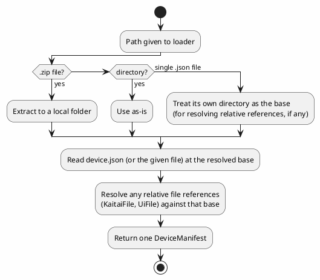

# Device Manifests

## Purpose

Ties together two things already designed separately — the declarative command/response schema
sketched in [device-control-modules.md](device-control-modules.md)'s "Declarative command/response
schema" section, and the control-panel model in [ui-definitions.md](ui-definitions.md) — into one
file (or one small package of files) that fully configures dev-term for a specific device with
**no code**: what bytes to send for each command, how to recognize/parse what comes back, what
transport it expects, and what control panel to show. This is the "assembled declaratively" path
device-control-modules.md's open questions already anticipated, for devices simple enough not to
need a real code plugin (most bench/hobbyist gear with a fixed command set — SCPI-like or the
Tektronix-codes case are exactly this).

## Two packaging shapes, one loading path

- **Single file** — a JSON manifest with everything inline: identity, transport hints, outbound
  command templates, a text-pattern-based response schema, and an inline UI definition (see
  [ui-definitions.md](ui-definitions.md)). Works fully for **text-protocol devices** (SCPI-like,
  Tektronix codes) since nothing in that case needs a file that isn't naturally JSON already.
- **A folder, or a `.zip` of one** — the same manifest (`device.json`) at the root, plus sibling
  files it references by relative path. This is the only option once a device's inbound protocol
  needs a **binary** layout via [Kaitai Struct](https://kaitai.io/) (`.ksy`, its own YAML-ish
  format, not JSON) — the manifest references the `.ksy` file by relative path instead of trying to
  embed it. A `.zip` is just a convenience wrapper: extract it to a local folder, then load that
  folder exactly the same way — no separate zip-specific logic anywhere else.

One loader handles all three inputs (a `.json` file path, a directory path, or a `.zip` file path)
and produces the same in-memory `DeviceManifest`, so nothing downstream needs to care which shape a
given device came in.

## Manifest shape (conceptual)

- **Identity**: name, vendor, version, description.
- **Transport hint**: loose key/value defaults for pre-filling connection setup (e.g. `serial` +
  baud rate, or `hid` + VID/PID) — a hint the user can still override, not a hard requirement, since
  the same device might be reached different ways (e.g. an instrument over both RS-232 and LAN).
- **Inbound protocol** — one of:
  - A reference to an external `.ksy` file (binary layouts, via Kaitai Struct — package mode only).
  - A list of simple response patterns (name + a literal/regex match) for text protocols — the
    "recognize/parse the response" half already sketched in device-control-modules.md.
- **Outbound commands** — a list of `{name, parameters (name/type/range/unit), send template}`,
  matching device-control-modules.md's own sketch exactly (e.g. a command named "Set Voltage" with
  a numeric `value` parameter templated into `"SOUR:VOLT {value}\r"`).
- **UI** — a [`UiDefinition`](ui-definitions.md), either inline (single-file mode) or referenced by
  relative path (package mode, for authors who'd rather keep it in its own file even though it
  could be inline).

## What this explicitly is not (yet)

- **Not a code plugin mechanism** — see [plugin-model.md](plugin-model.md) for dynamic *code*
  plugin loading, which is a separate, larger, not-yet-built concern. A device manifest is for the
  no-code case device-control-modules.md's declarative-schema section describes; a device needing
  real logic still needs a real plugin.
- **Not wired to anything yet** — like `ui-definitions.md`'s model, this is the file-format/loading
  design plus (once built) a representation model, not a working device control module. Nothing
  yet turns a loaded `DeviceManifest` into an actual `IControlSurface`/decoder pair or opens a
  connection from one, because `IControlSurface` itself doesn't exist in code yet.
- **Not a Kaitai Struct reimplementation** — the manifest only *references* a `.ksy` file by path;
  actually running Kaitai-generated parsing code against it is separate, future work.

## Open questions

- Whether outbound command templates need more than simple placeholder substitution (`{value}`) —
  e.g. numeric formatting/padding, unit conversion — or whether that's pushed onto the parameter
  definition itself (a `Format` hint) rather than the template syntax.
- Whether response patterns need to express *which* command they're a reply to (request/response
  pairing — the same open question already flagged in device-control-modules.md) or stay
  independent, always-on matches against whatever comes back.
- Where package-mode manifests actually live on disk once loaded from a `.zip` — a per-user cache
  directory, alongside the app, or something the plugin model (once built) already needs to solve
  for real code plugins anyway, in which case this might not need its own answer.
- Whether a single-file manifest should be allowed to *also* reference an external `.ksy` (accepting
  that it's then not really "single file" in practice) or whether that combination should be
  rejected outright to keep the two modes' guarantees clean and unambiguous.

See [connection-profiles.md](connection-profiles.md) for how a manifest gets *reached* in practice
— a saved connection profile references one by path, so picking a profile from a menu is what
actually loads a manifest, not something manifests trigger on their own.
