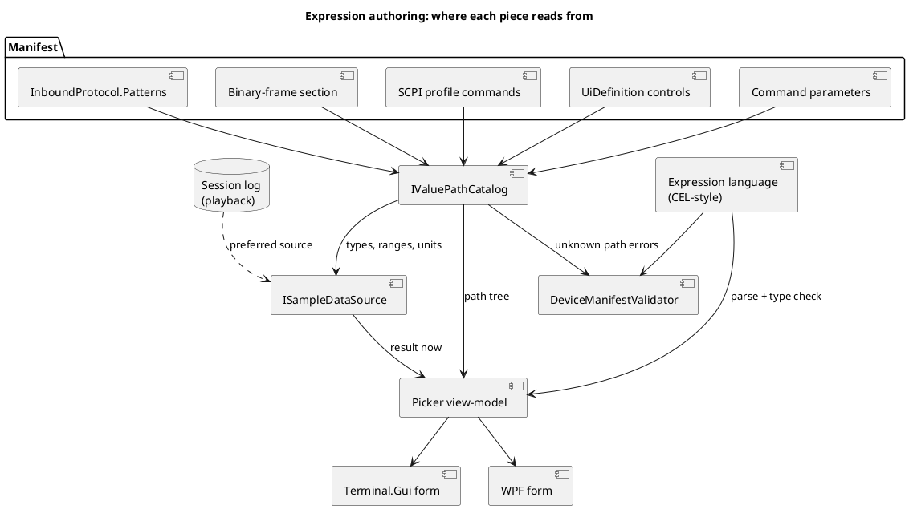
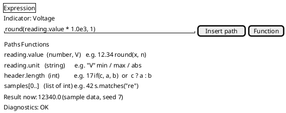

# Expression picker, value-path catalog, sample data, and a CEL-style language

Requested 2026-10-02 as the next step of [the manifest expression builder](manifest-editor-expression-builder.md).
Three asks, in priority order: (1) at minimum, enumerate the **valid parameter paths** an expression may reference
and **generate realistic sample data** so previews look real; (2) a **picker control** that builds valid expressions
by choosing values, not typing; (3) a small **programming language**, ideally close to Google's
[Common Expression Language (CEL)](https://github.com/google/cel-spec).

## Problem

Today an author types `{id}` references by memory into a text box. Nothing lists which ids exist (decoder values,
control ids, command parameters), nothing knows their type or range, and the manifest editor's live preview has no
data to show unless a device is connected. Regex captures and binary-frame fields (see `TODO.md`) will add nested and
repeated values that `{id}` cannot name. Expressions are also limited to arithmetic, comparison and `if`, so string
tests, regex matching and list handling are impossible.

## Design

### 1. Value-path catalog (build first)

**The catalog works off the device profile, never a `.ksy` file.** `IValuePathCatalog.Enumerate(profile)` takes a
device manifest or a SCPI device profile (`Profiles/*.json`) and returns every path an expression can legally read, each as a
`ValuePath { Path, Type, Unit?, Min?, Max?, Choices?, Source, Example }`. Sources, all derivable from the manifest
without a device:

| Source | Paths produced |
|---|---|
| `InboundProtocol.Patterns` | each named capture group, or the pattern's id for group 1 (type inferred from a numeric/format hint, else string) |
| profile's binary-frame section (`Inbound.Frame`) | field names, dotted for nested (`header.length`) and indexed for repeated (`samples[0]`); present only if the manifest declares one |
| SCPI profile commands | each query command's reply as a value (type from the profile's response hint), each command's parameters |
| UI controls | each control's current value by id (slider/numeric: range; toggle: bool; choice: its options) |
| command parameters | `ParameterExpressions` targets |

The catalog is also what the validator uses to reject an unknown path with a precise message, replacing the
unresolved-`{id}` checks scattered today.

### 2. Sample-data generator

`ISampleDataSource` produces a values dictionary (and a short time series) for a manifest from the catalog: numeric
paths follow their `Min`/`Max`/`Unit` (a smooth walk plus noise, not uniform random), choices cycle, strings come
from the pattern's own example if it has one, and a pattern with a regex gets a string it actually matches.
Preference order: a real recorded session log (the Playback feature), then the manifest's declared examples, then
generated values. Deterministic by seed so screenshots and tests are stable. It drives the editor's preview, the
picker's "result now" readout, and the loopback transport's scripted device.

### 3. Picker control (both front ends)

An expression editor with: a searchable path tree (from the catalog, showing type/unit/example), a function and
operator list filtered by the types in play, insert-at-caret, live parse/type diagnostics, and a result readout
evaluated against sample data. It can also build structurally (pick a path, an operator, a value) for authors who
never type. One view-model in a shared library, rendered by Terminal.Gui and WPF like the other editor forms.

### 4. Language: a CEL-style dialect

CEL fits: side-effect-free, non-Turing-complete, typed, with `&&`/`||`/`?:`, `in`, `size()`, `has()`, string
functions, and `matches()` for regex, plus maps and lists that map onto dotted and indexed paths. Two routes:

- **A. Extend our own `Expression`** to a CEL subset (same grammar family; `{id}` kept as sugar for `values.id`).
  No dependency, and load-time validation and the picker's type information stay under our control. Recommended start.
- **B. Adopt a .NET CEL library.** Full spec compliance, but a new dependency, and the picker and validator would
  need its type-checker API. Only worth it if a maintained library passes a spike.

**Spike result (2026-10-02): build A.** The two candidates on NuGet are `Cel` 0.3.3 (telus-oss/cel-net, Apache-2.0, pre-1.0)
and `Cel.NET` (rayokota, which also pulls Avro). Tried `Cel` in a throwaway console project: it parses and evaluates
well (arithmetic, `?:`, `&&`, `has()`, `size()`, dotted map access, double*int in non-strict mode), reports a parse
error with line/column, and throws `CelUndeclaredReferenceException` for an unknown name. But it has no type-check API
(`CelEnvironment.Parse` hands back a raw ANTLR `StartContext`), no way to list its functions or their signatures, and it
drags in `Google.Protobuf` and the ANTLR runtime. The picker needs exactly the pieces it lacks (type information before
evaluating, a function list), so route B would mean wrapping the parse tree ourselves anyway. Extend our own
`Expression`.

The language stays non-Turing-complete: no loops, no assignment, bounded evaluation.

## Order of work

1. Path catalog (patterns, controls, parameters); the validator uses it. Smallest useful piece, unblocks the rest.
2. Sample-data generator, wired into the manifest editor preview.
3. Picker view-model plus TUI and WPF forms (with `docs/specs/` and `docs/user-guide/` entries when it ships).
4. CEL spike (done: build our own), then the language extension (regex `matches()`, strings, lists, `has()`, dotted/indexed paths).
5. Binary-frame paths join the catalog once a profile can declare a binary-frame section. A `.ksy` is never read by the
   catalog: the `.ksy` importer (`TODO.md`) only generates that section into a profile, and the catalog reads the profile.

## Open questions, resolved

- **`{id}` or bare identifiers?** Both parse and mean the same; `{id}` stays canonical because it is what the picker
  inserts and what every bundled manifest uses. Manifests are not rewritten on load.
- **Sample rate for time-series data?** Not needed as its own concept: a recorded session log (`RecordedSamples`) supplies
  real series, and a paced loopback stream ([loopback sample rate](loopback-sample-rate.md)) covers live previews.
- **A regex tester pane?** No. The picker inserts and checks `matches()`; the editor's Pattern form already has a
  sample-line tester.

## Left out on purpose

Picker buttons for the newer functions (`contains`, `startsWith`, `endsWith`, `size`, `number`, `string`, `has`, `split`,
`join`) and picker offers for them beyond the six in `ExpressionPickerViewModel.Functions` are tracked in `BACKLOG.md`;
they parse and evaluate today, they just aren't offered as buttons.
