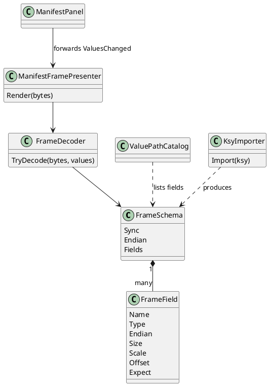
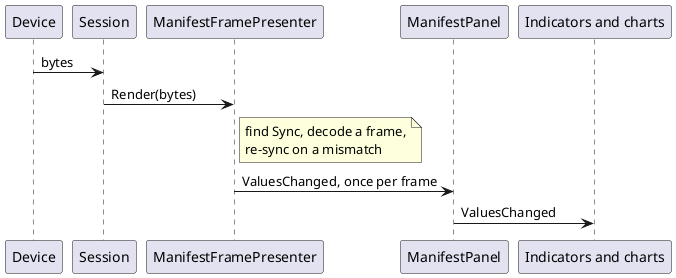
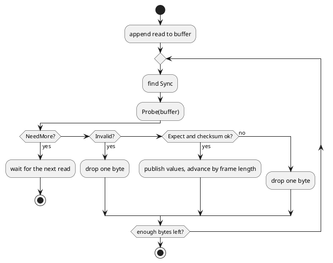

# `.ksy` importer and binary frames

## Why

`InboundProtocol.Patterns` turns a text line into named values with regexes. A binary device has no lines, so
nothing published values for it. This adds the binary counterpart: a **frame** declared in the manifest, and an
importer that produces one from a Kaitai Struct (`.ksy`) file. Decided 2026-10-02: our own small reading of `.ksy`,
framed as a *transformation* into dev-term's manifest format, not a Kaitai runtime.

## Model

`Inbound.Frame` is a `FrameSchema`: optional `Sync` hex bytes, a default `Endian`, and ordered `Fields`. A field has a
`Name`, `Type` (`u1 u2 u4 u8 s1 s2 s4 s8 f4 f8 str bytes skip`), optional per-field `Endian`, `Size` (for `str`/`bytes`/
`skip`), `Scale`/`Offset`, `Unit`, `Label`, `Minimum`/`Maximum`, and `Expect` (hex bytes the field must equal).
Offsets are implied by the fields before. Numbers publish formatted like a text reply, so existing expressions,
indicators and charts read them unchanged.

## Decoding rules

- With `Sync`, the presenter searches for it, so garbage before a frame is skipped; without it, a mismatched `Expect`
  drops one byte and retries.
- Partial frames wait for more bytes, including across reads. The buffer is capped (64 KB) against a wedged stream.
- One `ValuesChanged` per decoded frame, so a chart sees every sample of a burst.
- Never throws on wire data.

## Bit fields, variable length and checksums

- **Bit fields**: `Type` `b1` to `b64` is an unsigned value of that many bits, packed most significant bit first
  (Kaitai's default). A byte-sized field after bit fields starts on the next byte boundary. They publish like numbers
  (`Scale`/`Offset` apply); `Expect` is not allowed on them.
- **Variable length**: `LengthField` names an earlier integer field; the frame is that value plus `LengthAdjust` bytes
  long, and the last field (`bytes`/`str`, no `Size`) takes what is left. `Probe` says `NeedMore` until the length
  field and then the whole frame have arrived, and `Invalid` for a length shorter than the fixed part or over 64 KB, so
  the presenter drops a byte and re-syncs instead of waiting for it.
- **Checksum**: a trailer (`Kind`, optional `Start` offset and `Endian`) covering the frame from `Start` up to itself.
  A mismatch discards the frame like a failed `Expect`.
- **Importer**: `bN` types become bit fields, and `size: other_field` on a final bytes/str attribute becomes the
  length field (`LengthAdjust` is the fixed bytes before it). An attribute after a variable-size one stops the frame
  with a warning. Kaitai has no checksum syntax, so a checksum is added by hand. `meta.bit-endian: le` warns.

## Importer

`KsyImporter.Import(text)` returns a `FrameSchema` and warnings. Handled: `meta.endian`, `seq` attributes of numeric
types (with `le`/`be` suffix), `str` with `size`, untyped `size` byte runs, `contents` magic (becomes `Expect`; leading
magic also becomes `Sync`), and `doc` as the label. A user type from `types` is flattened into dotted names (`header.length`, up to 8 levels
deep), and `repeat: expr` with a literal count (1 to 256) becomes indexed names (`samples[0]`, `points[1].x`). Both
read in expressions as `{header.length}` / `{samples[0]}`. A dynamic attribute (`repeat-until`, `repeat: eos`, a
computed repeat count, `if`, `switch-on`, `size-eos`) ends the frame there with a warning, since later offsets are unknown. Uses YamlDotNet for the YAML.

## Completion checklist

What is needed before this proposal can be closed. Tick items as they land, in the same change.

- [x] Model, decoder, presenter, panel wiring, catalog paths, validator checks
- [x] JSON/XML round trip and the importer
- [x] Manifest editors' Binary frame entry and Import button, both front ends
- [x] Unit and screenshot tests
- [x] Live check: Radex One frame on COM8 (`docs/test/2026-10-02-14-42-26.md`)
- [x] DE-5000, K8055 and Zoom H4n `.ksy` layouts checked against documented bytes; live-capture checks deferred until a device is on hand (extend then)
- [x] Bit fields (`b1`..`b64`, MSB first; the Zoom H4n status `.ksy` imports and decodes)
- [x] Length-prefixed or variable-size frames (`LengthField` + `LengthAdjust`, last field `bytes`/`str` with no size)
- [x] Checksums (`sum8`, `xor8`, `crc8`, `crc16-modbus`, `crc16-ccitt`; standard vectors tested)
- [x] Generated JSON Schema for the frame (part of `schemas/device-manifest.schema.json`, see `format-schema-files.md`)
- [x] Editor forms for `LengthField`, `LengthAdjust` and `Checksum` (2026-10-03)

## Status

Built 2026-10-02: model, decoder, presenter, panel wiring, catalog paths (`ValuePathSource.Frame`), validator checks,
JSON/XML round trip, importer, and (2026-10-02) the manifest editors' **Binary frame** outline entry with field forms and an **Import** button in both front ends ([spec](../../specs/manifest-editor.md)). Unit- and screenshot-tested, plus one live check: the imported Radex One read-data frame was run through `ManifestFramePresenter` against a real unit on COM8 (every field published, three runs; `docs/test/2026-10-02-14-42-26.md`). The other devices' `.ksy` layouts (DE-5000, K8055, Zoom H4n) are checked against captured or documented bytes only. Not built:

- the live check of the Zoom H4n status `.ksy` against a real recorder (it decodes the documented masks only), and of the
  DE-5000 and K8055 layouts against captures. Deliberately deferred: extend when a device is on hand.

Built 2026-10-03: editor forms for `LengthField`, `LengthAdjust` and `Checksum` on the Frame form. **Complete for now.**

Built 2026-10-02: bit fields, length-prefixed frames and checksums (`FrameAdvancedTests`, 12 tests, standard CRC vectors).
