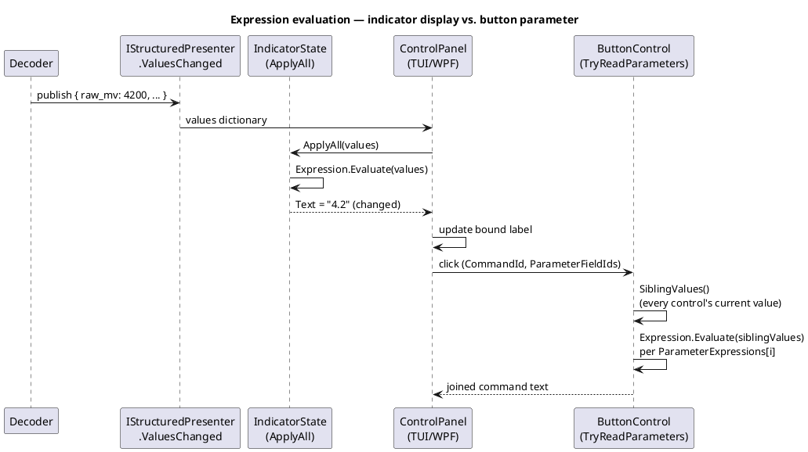

# Manifest editor expression builder

Sourced from `BACKLOG.md`'s "Proposed Ideas" section (added 2026-09-30): "for the manifest editor
create an expression builder — expressions should be setable fields allows for data values to be
mapped to parameters for controls."

## Problem

[UI definitions](../ui-definitions.md)' live display controls (`IndicatorControl`,
`BarGraphControl`, `StripChartControl`, `VectorControl`) bind directly to a decoder's published
values by id — `IStructuredPresenter.ValuesChanged` publishes a dictionary keyed by `UiControl.Id`,
and a control just shows whatever value arrives under its id, verbatim. There's no way to *derive* a
displayed value from the raw one (unit conversion — raw ADC counts to volts, a scale/offset, combining
two published values into one) without writing that logic into the decoder itself in code. The same
gap exists on the outbound side: `ButtonControl.ParameterFieldIds` reads each named sibling control's
raw current value and comma-joins them into the command — there's no way to transform a value (format
a number, apply a scale) before it's sent.

This matters specifically for the [device manifest](../device-manifests.md) case (a no-code, JSON-only
device configuration) — a code-based device module (K8055, Busylight) can always just write the
transform in its decoder; a manifest has no code to write it in at all.

## Design

Add an optional `Expression` string to the places a value currently passes through unmodified:

- `IndicatorControl.Expression` / a chart's `ChartChannel.Expression` — evaluated against the live
  published-values dictionary before display, in place of a bare `Id` lookup when present.
- A parameter-mapping expression for `ButtonControl` — evaluated per field (or as one expression over
  all named fields) before joining into the command, in place of the current bare comma-join, when
  present.

**Expression language**: a small, dev-term-owned arithmetic expression grammar (numeric literals, the
published values as named variables, `+ - * /`, parentheses, and a handful of built-in functions —
`round`, `min`, `max`, maybe a basic `if`/ternary) — not a general-purpose external DSL. This matches
the precedent already set in [device-control-modules.md](../device-control-modules.md)'s own
"declarative command/response schema" section, which deliberately chose a lightweight dev-term-owned
schema over a heavyweight external dependency for the same reason (plain ASCII query/response gear
doesn't need Kaitai Struct's weight; this doesn't need a general expression-engine dependency either).
A hand-rolled recursive-descent parser over this small a grammar is a few hundred lines, fully unit
testable with no external dependency, and the resulting `.ksy`-style "own the schema" precedent is
already established for the manifest/UI-definition layer.

**Alternative considered**: embedding an existing .NET expression-evaluation library (e.g. NCalc).
Faster to start, but pulls in a runtime dependency for what's a genuinely small grammar, and (per the
Kaitai precedent above) this project has consistently preferred owning small schemas outright over
taking on an external dependency for them. Worth revisiting only if the hand-rolled grammar's scope
grows past simple arithmetic (e.g., string manipulation, lookups against an external map file — closer
to the "mappable presenters" idea in [presenters.md](../presenters.md)).

**Where it's authored**: the [manifest editor](../../specs/manifest-editor.md) gains an "Expression"
field next to the controls above, alongside the existing per-control fields it already edits
(Description, Constraint). Validated live against the manifest's own sample/preview values (the editor
already has a live panel preview — see `ui-definitions.md`'s "Display controls, manifest panels, and
TUI fitting" milestone) so a syntax error or an unknown variable name is caught while editing, not at
first live use.

## Resolved questions

- **Can an expression reference other controls' current values?** Indicator (and chart channel)
  expressions evaluate only against the live published-values dictionary — the same `{id}` values a
  bare display already binds to, not other controls' widget state. Button `ParameterExpressions`
  evaluate against every *sibling control's* current numeric value instead (`SiblingValues()`), since
  a button's whole job is composing one command out of several fields' current state.
- **Does this generalize to `TextFieldControl.Constraint`?** No — it stayed scoped to
  `IndicatorControl.Expression`, `ChartChannel.Expression`, and `ButtonControl.ParameterExpressions`.
  A text field's `Constraint` is about validating *user-typed* input, not deriving a displayed/sent
  value from other values; folding expressions into it would be a different feature.
- **Bad/unparsable expression behavior?** Rejected at manifest load: `DeviceManifestValidator` parses
  every expression-bearing property up front and reports every failure, matching `ValueConstraint`'s
  existing "never throw, always report" convention. At runtime (a manifest that somehow still carries
  a bad expression, or one that evaluates against an id that never arrives) nothing throws:
  `IndicatorState.Text` simply stays null until its referenced id arrives, and a chart channel without
  a resolvable expression falls back to reading its own id as the raw value — never a crash, never a
  stuck bad value.

## Status

**Implemented.** `Expression` (`DevTerm.UiDefinitions`) is a hand-rolled recursive-descent parser/
evaluator — numeric literals, `{id}` variable refs, `+ - * /`, unary `-`/`+`, parens, `round(x[,n])`,
`min`/`max` (variadic), `abs(x)`, comparisons, `&&`/`||` (short-circuiting), `if(cond,a,b)`. `Parse`/
`TryParse` can fail (and `DeviceManifestValidator` rejects a bad one at load); `Evaluate` never throws.
`IndicatorControl.Expression` and `ChartChannel.Expression` drive live display (`IndicatorState`,
`BarGraphState`/`StripChartState` in `LiveDisplayState.cs`); `ButtonControl.ParameterExpressions`
drives outbound parameter composition. Wired into the manifest editor's form
(`ControlForm.ParameterExpressions`/`IndicatorExpression`/`Channels`), both front ends' live control
panel (`ControlPanelMode.cs`, `ControlPanelWindow.xaml.cs`), and the manifest editor's live preview.
Covered by `ExpressionTests`, `IndicatorStateTests`, `ChartControlsTests`, `DeviceManifestTests`,
`ManifestEditorTests`, and TUI/WPF wiring tests in `ControlPanelModeTests`/`ControlPanelWindowTests`.
Not yet verified against real hardware — this is a pure UI/manifest-model feature with no device-side
behavior to exercise, so that gap is expected rather than a coverage hole.

**Extension built (2026-10-02).** Expressions now also reach dotted/indexed paths and regex captures: the value-path catalog,
sample-data generator, expression picker and CEL-style language landed
([expression picker](expression-picker-paths-and-cel.md)), and a binary-frame inbound schema (`Inbound.Frame`) can be
generated from a `.ksy` by `KsyImporter` ([.ksy importer](ksy-importer.md)). Generated schema files for the
manifest formats are a separate, not-started proposal: [Schema files for custom formats](../proposals/format-schema-files.md).
