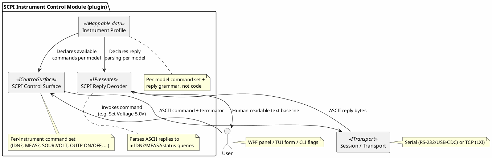

# Proposal: SCPI Bench Instrument Control Module

## Status: implemented (2026-09-23)

Built as `DevTerm.Devices.Scpi` — a data-driven profile mechanism rather than one hardcoded module
per instrument, per the "Proposed shape" section below. Confirmed target hardware, one curated
profile each: HP/Agilent/Keysight 34401A, Rigol DM3058E, Rigol DG1022/DG1022Z, Rigol **DS1102E**
(the profile originally shipped as `rigol-ds1105e.json` — DS1105E is not a real Rigol model and
never matched the bench's actual scope; corrected 2026-09-24, see docs/changes/2026-09-24.md and
docs/test/2026-09-24-09-54-39.md), Korad KA3005P, Korad KA6003P. See:

- `ScpiInstrumentProfile`/`ScpiCommandDefinition`/`ScpiParameterDefinition` — the declarative
  command/response schema this doc's own "Open questions" flagged as undecided; JSON, loaded by
  `ScpiProfileCatalog` from bundled `Profiles/*.json` plus a drop-in `ScpiProfiles/` folder next to
  the executable, so adding an instrument later needs a new JSON file, not a rebuild.
- `ScpiControlSurface` — template substitution (`{Name}` tokens), numeric clamping, per-profile
  terminator, and a `sendCustom` passthrough escape hatch for anything not in a given profile's
  curated command list.
- `ScpiReplyPresenter` — line-buffered ASCII decoding plus FIFO query/reply correlation
  (`IScpiReplyTracker.QuerySent`), resolving the "can a command declare an expected reply pattern"
  open question below for the common synchronous case.
- `ScpiUiDefinitionBuilder` — maps a profile onto the existing generic `UiDefinition`/
  `IControlSurface` renderer (`ControlPanelMode`/`ControlPanelWindow`, proven against the K8055 and
  Busylight) rather than a bespoke "pick a command, fill parameters" widget; this needed one small,
  generic addition to the shared model, `ButtonControl.ParameterFieldIds` (see
  [ui-definitions.md](../ui-definitions.md)).
- Auto-detect is honestly scoped to `*IDN?` plus a regex match against each profile's `IdnPattern`
  (`ScpiProfileCatalog.TryMatchByIdn`) — there is no standardized "list supported commands" SCPI
  query, so this is not real command discovery, just an identification shortcut with a Generic
  fallback profile when nothing matches.
- **Verified against one real instrument so far**: an HP/Agilent/Keysight 34401A over real RS-232
  (2026-09-23) confirmed 9600 baud/8 data bits/2 stop bits/no parity/**no hardware handshake**/**LF**
  terminator, and a real root cause for "device beeps, no measurement shown" — RS-232 on this
  instrument never auto-enters remote mode the way GPIB does, so `SYSTem:REMote` must be sent before
  any query or it answers SCPI error `+550 "Command not allowed in local"`. The bundled
  `hp-agilent-keysight-34401a.json` profile now has a `remote` command plus a `Notes` field (below)
  documenting this. Korad KA3005P/KA6003P were confirmed 2026-09-23 (see docs/changes/2026-09-23.md)
  and Rigol DS1102E (renamed from the wrong-model DS1105E) was confirmed 2026-09-24 (see
  docs/test/2026-09-24-09-54-39.md). Rigol DM3058E and DG1022/DG1022Z remain unverified against real
  hardware (DM3058E is blocked on the still-parked USBTMC bulk-IN stall — see BACKLOG.md) — a
  reasonable-effort starting point per each instrument's public SCPI reference, not confirmed
  correct. GPIB-only paths (bare HP 34401A) remain unreachable, per the open question below.
- **Four follow-ups from that real-hardware pass, also landed 2026-09-23**:
  - `ScpiInstrumentProfile.Notes` — free-text operational knowledge (required non-default connection
    settings, a mandatory preamble command) folded into `UiDefinition.Description` by
    `ScpiUiDefinitionBuilder.Build` and rendered by both `ControlPanelWindow`/`ControlPanelMode`
    (neither rendered `Description` before this).
  - `CliOptions.Handshake` (already wired end-to-end into the real serial transport) is now exposed
    in both configuration UIs — a `Handshake:` row in `DeviceProfilesWindow` (WPF) and an
    `OptionSelector<Handshake>` row in `ConfigureMode` (TUI), right after Stop bits in both.
  - `CliOptions.ScpiProfile` persists the chosen instrument-profile/auto-detect choice onto a saved
    connection; both front ends' "SCPI Instrument..." menu items skip their picker dialog when the
    saved value still resolves to a real choice (`ScpiProfileCatalog.AutoDetectChoiceName`/
    `Generic.Name`/a loaded profile's name), falling back to showing the picker otherwise. Also
    exposed as a "SCPI profile:" row in both configuration UIs, shown only when the `scpi` presenter
    is selected.
  - `ScpiProfileCatalog` now also loads from a per-user `~/.dev-term/scpi-profiles` folder (in
    addition to the bundled `Profiles/` and app-folder `ScpiProfiles/` drop-in), mirroring the
    existing per-user connection-profile/device-manifest storage convention.
- The Tektronix 2230 remains explicitly out of scope for a full command set here — see the new
  [tektronix-2230-protocol.md](tektronix-2230-protocol.md) proposal — though a minimal one-command
  profile (`ID?`) was added the same day; see `docs/changes/2026-09-23.md`.

## Source

This proposal is derived from an existing (separate) project tracked in the
[`mwwhited-notes/shared`](https://github.com/mwwhited-notes/shared) repository — Matt's personal
technical notebook, a git submodule of the `notes` wrapper repo, unrelated to this codebase except
as prior art:

- [`shared/projects/scpi-instrument-control/README.md`](https://github.com/mwwhited-notes/shared/tree/main/projects/scpi-instrument-control) — project overview, status: planning/research
- [`shared/projects/scpi-instrument-control/`](https://github.com/mwwhited-notes/shared/tree/main/projects/scpi-instrument-control) — full project directory (equipment list, architecture sketch, references)

That project's own stated goal (a custom .NET Core VISA driver plus an RS-232/Ethernet gateway
for SCPI bench equipment) substantially overlaps with what dev-term already provides —
serial and TCP transports are built, unit-tested, and verified against real hardware (a bench
oscilloscope, both direct-serial and over a serial-to-Ethernet bridge, per the top-level
[README](../../../README.md)). This proposal reframes that project's goal as a dev-term device
control module rather than a from-scratch driver, per [device-control-modules.md](../device-control-modules.md).

## Purpose

Give dev-term a device control module for SCPI-compatible bench test equipment: a control
surface for outbound commands (set voltage, trigger, query measurement) plus a decoder for
inbound replies/telemetry, bundled as one plugin per [device-control-modules.md](../device-control-modules.md)'s
"Motivating example," which is this exact scenario.

## Target hardware (from the source project)

| Instrument | Interface | Notes |
|---|---|---|
| HP/Agilent/Keysight 34401A | GPIB/RS-232 | 6½-digit bench DMM — confirmed (2026-09-15) readable at 9600 8N2 over RS-232 by an existing third-party tool, [HP-Agilent-Keysight-34401A-Control-and-Data-Logging-Software](https://github.com/Niravk1997/HP-Agilent-Keysight-34401A-Control-and-Data-Logging-Software/releases); useful as a known-good serial-settings/command reference once this is built against real hardware |
| Rigol DM3058E | USB/RS-232 | 5½-digit bench DMM |
| Rigol DG1022 / DG1022Z (unlocked as DG1062Z) | Built-in display, USB/LAN/GPIB (opt) | Function/arbitrary waveform generator |
| Korad KA3005P / KA6003P | USB/RS-232 | Programmable bench power supplies |

Full current inventory (specs, acquisition dates, status): `shared/.personal/incoming/test-equipment.md`
— gitignored in the source repo (synced from a private submodule per that repo's
`PERSONAL-PROTOCOL.md`), so not directly linkable here, but checked directly (2026-09-15) for
other candidates: the wider equipment list has 44 items across categories, and of those, the
oscilloscope section is the one worth flagging — it records no interface at all for most units
(only Model/Bandwidth/Channels/etc.), so nothing there can be assumed SCPI-capable without
checking further:

- **Rigol DS1102E** — has USB (confirmed directly); Rigol scopes of this era commonly do USBTMC
  over that port, matching the [USBTMC](../transports.md) gap already noted for the DG1022 family
  — same "needs its own raw-USB transport" dependency as that device, not the existing serial/TCP
  transports.
- **Tektronix TDS2024** — confirmed to support **GPIB and serial** as fitted options; the
  Centronics module currently installed is for faster print/screen-capture output, not the only
  interface available, just the one currently equipped in place of a GPIB module. Once
  [GPIB via a Prologix-protocol controller](../transports.md) exists, this becomes a real target —
  either by swapping in a GPIB option module, or via its serial option if that's easier to source.
- **Hitachi V-1150** (analog) and **DSO201/DSO Nano** (pocket DSO) — no remote interface exists on
  either by design.
- **Digilent Analog Discovery 2** — USB, but via Digilent's own WaveForms SDK, not SCPI/USBTMC/a
  serial protocol at all; a fundamentally different integration path (P/Invoke against their C
  library) if ever pursued, out of scope for this proposal.
- The already-verified **Tektronix 2230 (×2)** remains the one confirmed real oscilloscope target,
  via its own pre-SCPI "codes" protocol, not SCPI — see the note in `BACKLOG.md` about a
  Tektronix-codes decoder proposal.

## Why SCPI fits the existing contracts cleanly

SCPI is textual, not binary — this is a much softer decoder problem than Radex One or Favero
(see the sibling proposals in this directory):

- **Outbound**: plain ASCII command strings (e.g. `:VOLT 5.0`, `*IDN?`, `:MEAS:VOLT:DC?`) —
  these are exactly `IControlSurface` commands whose "encoding" is just the string itself plus a
  terminator, reusing the existing ASCII presenter's send path (`IPresenterInput`, see
  [presenters.md](../presenters.md)) rather than needing custom binary framing.
- **Inbound**: replies are themselves ASCII (numeric readings, `*IDN?` strings, status bytes) —
  a decoder here is close to a thin wrapper over the existing ASCII/line-buffered presenter,
  with light structure extraction (e.g. parsing a `*IDN?` reply into make/model/serial/firmware
  fields) rather than a from-scratch binary parser.
- **Transport-agnostic**: SCPI instruments show up over GPIB (out of scope — no GPIB transport
  planned), RS-232 (the existing serial transport), USB-CDC (also serial, from the OS's point of
  view), and LAN/LXI (the existing TCP transport) — no new `ITransport` is needed for the RS-232
  and USB-CDC and LAN cases; see [transports.md](../transports.md).

## Proposed shape

- **Command set is per-instrument-family, not per-unit** — a DMM profile (`*IDN?`, `MEAS:VOLT:DC?`,
  `MEAS:CURR:DC?`, ...) and a power-supply profile (`SOUR:VOLT`, `SOUR:CURR`, `OUTP ON`/`OUTP OFF`,
  `MEAS:VOLT?`) cover the 34401A/DM3058E and KA3005P/KA6003P respectively, and a waveform-generator
  profile covers the DG1022/DG1022Z. This is the same "one generic thing, many devices via external
  data" pattern as [presenters.md](../presenters.md)'s mappable presenters (§5) and
  [device-control-modules.md](../device-control-modules.md)'s open question about a declarative
  command/response schema — SCPI is arguably the *best* fit for that declarative schema, since the
  command grammar is standardized enough (IEEE 488.2 common commands, `SCPI-99`) to describe
  generically rather than per-vendor.
- **`*IDN?` as the bootstrap command** — every SCPI instrument responds to `*IDN?` with
  `<manufacturer>,<model>,<serial>,<firmware>`; a control surface can use this to auto-select the
  right instrument profile on connect rather than requiring the user to pick one, similar in
  spirit to how a protocol decoder auto-detects framing.
- **Query/reply pairing matters here more than for streaming telemetry** — SCPI is
  request/response by nature (send `MEAS:VOLT:DC?`, get one line back), which is exactly the "does
  a command declare an expected reply pattern" open question already flagged in
  [device-control-modules.md](../device-control-modules.md). This project is a concrete forcing
  function for resolving that question, not just a hypothetical.

## Relationship to other backlog items

- **LXI (SCPI-over-LAN) instruments** use the RFC 2217-adjacent pattern of "serial protocol,
  network-reachable" but over a real TCP socket (LXI Core uses a raw TCP or VXI-11/RPC transport,
  not Telnet framing) — so this rides on the existing TCP transport directly, not on the RFC 2217
  work in [rfc2217.md](../rfc2217.md). Worth double-checking against a real LXI-capable instrument
  before assuming raw-TCP-SCPI is sufficient (the source project notes this as unverified/planning
  stage).
- The source project's own "RS-232/Ethernet gateway" idea (a Raspberry Pi/BeagleBone bridging a
  GPIB/RS-232-only instrument onto the network) is a **transport-level concern**, not a
  control-module concern — if built, it belongs alongside the RFC 2217 work
  ([rfc2217.md](../rfc2217.md)) rather than inside this module, since a generic serial-over-network
  bridge is useful to every dev-term session, not just SCPI ones.

## Open questions

- ~~Whether a declarative SCPI command/response schema...~~ **Resolved**: yes —
  `ScpiInstrumentProfile`'s JSON schema, per "Status: implemented" above.
- ~~How much of "parse `*IDN?`"/"parse a numeric `MEAS?` reply" is generic...~~ **Resolved**:
  `ScpiReplyPresenter` does line-buffering plus FIFO id-correlation generically (no per-family
  parsing at all); a specific reply's *meaning* stays a profile/UI concern (an `IndicatorControl`
  just shows the raw line), not something baked into the decoder.
- Whether GPIB support is ever in scope (none of the transports in [transports.md](../transports.md)
  cover it) — still open. If not, the bare HP 34401A and other GPIB-only paths are out of reach
  unless accessed via a GPIB-to-USB/Ethernet adapter that presents as serial or TCP to the OS.
