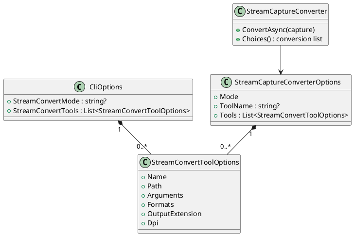
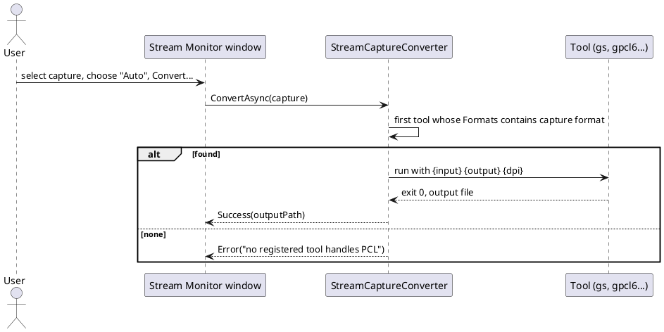

# Registering several converter tools for the Stream Monitor

Built 2026-10-02. Extends the single "External tool" mechanism in
[stream-content-detection.md](stream-content-detection.md) so more than one converter can be registered, each declaring the capture formats it handles (Ghostscript for PostScript, GhostPCL for PCL 5,
anything else a user has).

## Why

`StreamConvertExternalToolPath/Arguments` holds exactly one program. PostScript and PCL need different
tools, so a user with both had to edit the profile between captures. The
[Ghostscript guide](../../user-guide/ghostscript-conversion.md) lists "one tool at a time" as a limit.

## Shape

The list of tools is **app-wide**: every profile, device and front end shares it, and it is edited from
**Device > Converter Tools...**, next to Stream Monitor, in both front ends. It lives in `~/.dev-term/converter-tools.json`
(`ConverterToolsStore`). A profile's own `StreamConvertTools` (the first design put the list per profile) still loads
and merges in, but has no editing screen; on a name clash the app-wide tool wins. The effective list is app-wide tools
first, then the profile's. The list is made of tool entries (a `List<T>`, never a dictionary, so JSON and XML
both serialize it, see `CLAUDE.md`):

| Field | Meaning |
|---|---|
| `Name` | Shown in the conversion list and used to pick it. Unique, case-insensitive. |
| `Path` | The executable. |
| `Arguments` | Argument template, `{input}` `{output}` `{dpi}`, split on whitespace then substituted per token (unchanged rule). |
| `Formats` | Comma-separated capture formats it accepts (`ps`, `pcl`, `hpgl`, `bmp`...). Empty means any. |
| `OutputExtension` | Extension of the file it writes. Default `png`. |
| `Dpi` | Value for `{dpi}`. Default 150. |

The conversion list offers, in order: **None**, **HP-GL to SVG**, **Auto**, one entry per registered tool (by
`Name`), and the legacy single **External tool**. **Auto** runs the first registered tool
whose `Formats` include the selected capture's format, and reports "no registered tool handles X" otherwise.
Picking a tool by name runs it regardless of `Formats`, so a user can force one.

The single-tool settings keep working: `StreamConvertExternalToolPath` still defines the legacy **External tool**
entry, so every existing profile behaves as before. The built-in Web service mode was removed (decided 2026-10-02: a registered script or `curl` covers it); a profile
saying `webservice` now fails validation as an unknown mode.

Selection is stored as `StreamConvertMode`: the existing values, plus `auto` and `tool:<Name>`. The validator accepts any
non-empty `tool:<name>`, since the name may belong to an app-wide tool it cannot see; an unknown name is reported when
Convert... runs. `StreamCaptureConverter.FromCliOptions` takes the app-wide tools from its caller and never reads the
disk itself, so tests never touch a user's own file.

## Completion checklist

What was needed to close this out.

- [x] Options, Auto and by-name selection, conversion list in both windows
- [x] Tool-list editor, app-wide, from Device > Converter Tools... in both front ends (`docs/specs/converter-tools-editor.md`)
- [x] Settings persist through profile save/load
- [x] Web service mode removed
- [x] Screenshots of both editors in the user guide
- [x] Real Ghostscript and GhostPCL runs (`RealGhostscriptConversionTests`, 2026-10-02)
- [x] Status and the `docs/design/README.md` one-liner updated

## Status

**Implemented 2026-10-02.**

- The options, `StreamCaptureConverter` selection (Auto and by name), and the conversion list in both Stream Monitor
  windows.
- The tool list is app-wide (`ConverterToolsStore`, `~/.dev-term/converter-tools.json`), edited from **Device > Converter
  Tools...** in both front ends ([spec](../../specs/converter-tools-editor.md)). The earlier per-profile "Edit tools..."
  button was removed; a profile's own `StreamConvertTools` still loads and merges in.
- Web service mode removed (`StreamConvertWebService*`, the `webservice` mode, its validator case, the HTTP client
  registration and its tests).
- Verified against real tools: Ghostscript (PostScript to PNG) and GhostPCL (PCL to PNG) through the registered-tool path
  (`RealGhostscriptConversionTests`); both skip as Inconclusive where the tool isn't installed. Everything else is unit
  and screenshot tested. A PostScript or PCL capture straight from a device hasn't been converted yet.
