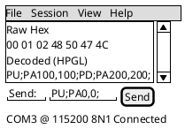

# Front Ends: CLI, TUI, GUI

## Purpose

Describes the three user-facing modes over the shared core engine — CLI and TUI (both in the console app) and GUI (WPF) — and how responsibilities split between them.

## Shared foundation

All three modes operate on the same session/transport/presenter model from the core engine (see [architecture.md](architecture.md)). None of them talk to a transport or presenter plugin directly — they go through the core, so a plugin written once (a transport, a text/numeric presenter, a protocol decoder, a rendering presenter, a composite decoder) works identically in all three.

**Startup/configure flow, TUI and GUI only** (CLI keeps today's hard-fail-on-bad-config behavior,
since there's no one to interact with a form): if the bound `CliOptions` already validates, both
skip straight to the execution model — the connect-and-interact screen each already has. If not,
both show a Configure screen instead of exiting with an error, and both also get a **"Device
Profiles" menu** (available at any time, not just at startup) for picking a named, saved connection
— see [connection-profiles.md](connection-profiles.md) for the full shape, including how a profile
can reference a [device manifest](device-manifests.md) so picking one also loads what that specific
device can do. Design only so far, not yet built.

## Executables

There are two deployable front-end applications, not three — TUI and CLI are two *modes* of the same console executable, since both are text-only and share the same terminal-hosting concerns:

- **Console app** — a single console executable providing both the CLI (scriptable/non-interactive) and TUI (full-screen interactive) modes described below. Mode selection is a startup concern (an explicit flag, or auto-detecting an interactive terminal vs. redirected/piped input/output) — see open questions. Built on .NET's Generic Host like every other part of the app (see [platform.md](platform.md)), so it composes the same core services as the WPF app.
- **WPF app** — the GUI front end, built with WPF. This makes the GUI Windows-only by choice, while the console app (CLI + TUI) has no such constraint and can run cross-platform — a deliberate scoping trade-off: full graphical rendering (HPGL/PostScript/PCL drawings, telemetry plots) is a Windows-first feature, and non-Windows users still get the full core functionality through the console app's text views and export commands.

**A fourth deployment shape, low priority** (noted 2026-09-15, given three front ends already
exist): a web server exposing the core engine over WebSockets, proxying configured connections to
a separate .NET MAUI front end — the same core (session/transport/presenter) behind a network
boundary instead of an in-process DI graph, for cross-platform mobile/desktop reach beyond what
WPF (Windows-only) and the console app (text-only) cover. Not designed further than this note.

## TUI (full-screen terminal UI)

The primary interactive mode for day-to-day device work: multiple panes (e.g., raw view, decoded view, send/command line), session switching, and live plugin selection, all inside the terminal. Closest in spirit to tools like a modern serial terminal or `tmux`-style multi-pane session. Rendering presenters (drawings, plots) degrade to a text/ASCII-art or summary representation where the terminal can't show real graphics, with a hint to use the GUI or export for the full rendering.

## CLI (scriptable, non-interactive)

A command-line mode for automation, CI, and scripting: open a session, apply a transport + presenter configuration, and stream decoded output to stdout (or raw bytes, for piping into other tools), with exit codes and flags suited to scripting rather than an interactive human. This is also the natural place to trigger an export non-interactively (e.g., "decode this capture as HPGL and write out.svg").

**Implemented** (`DevTerm.Console`): connects using a transport/presenter/config chosen via `CliOptions` (command-line args, env vars, or a saved `appsettings.Local.json` profile — see [platform.md](platform.md)), prints `[presenter] text` per line of output, and reads stdin for lines to send — so today's CLI is actually interactive-by-default (a REPL-like loop) rather than the pure batch/pipe mode described above; a dedicated non-interactive/scripted mode (env-driven, no stdin loop, explicit exit) is still just this section's original intent, not yet split out as its own thing.

## GUI (graphical desktop app, WPF)

A richer visual front end for cases where a graphical view adds real value beyond what a terminal can show: live rendering-presenter output (HPGL/PostScript/PCL drawings, telemetry plots), device control module control panels (see [device-control-modules.md](device-control-modules.md), rendered from the declarative model in [ui-definitions.md](ui-definitions.md) once that's wired up), a hex-grid editor for composing binary sends, and drag-and-drop plugin/session management. Built with WPF, so it ships as a separate Windows desktop application from the console app, both consuming the same core engine via DI (see [platform.md](platform.md)).

## Open questions

- How much session state (open connections, chosen presenters) is shareable/handoff-able between front ends (e.g., start a session in the console app, attach to it from the WPF app).
- ~~Whether the console app selects CLI vs. TUI mode via an explicit flag, auto-detection of an interactive terminal (isatty-style), or both.~~ **Decided**: an explicit flag, and TUI is the default — `dev-term` with no mode flag opens the TUI; `--cli true` forces the plain scriptable loop instead (e.g. for automation/CI). No terminal auto-detection.
- Whether GUI (WPF) ships in the same initial milestone as the console app (CLI/TUI) or follows later, given it's a separate, Windows-only executable.
- How much of a rendering presenter's live drawing/plot the TUI should attempt to approximate vs. simply pointing the user at the WPF app or an exported file.
