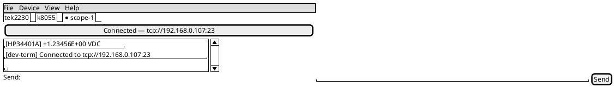
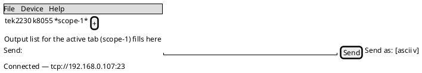
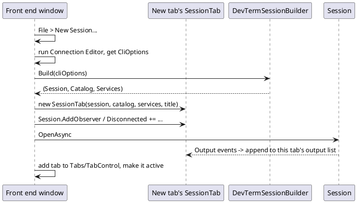

# Multiple sessions per window

Both front ends' main windows still hold exactly one `Session` (see [`docs/specs/tui-main-screen.md`](../specs/tui-main-screen.md)
and [`docs/specs/wpf-main-window.md`](../specs/wpf-main-window.md), each still listing "Only one
session per window" under Open items). This doc designs the change: opening more than one
connection at once, side by side, in the same window, in both front ends. Queued last in `TODO.md`'s
UI batch on purpose — it restructures both main windows and touches more shared front-end code than
any single item before it.

## Why this was blocked until now

Per-session isolation had to land first, or a second session would corrupt or leak into the first
one's state. That happened 2026-09-25, [presenters.md](presenters.md) §"Stateful presenter lifetime
vs. DI registration": every `IPresenter` and `PresenterCatalog` registration is transient, one
catalog is resolved per session, and two sessions in one process can't interleave partial frames
through a shared presenter instance any more. `DevTermSessionBuilder.Build(CliOptions)`
(`src/DevTerm.Configuration/DevTermSessionBuilder.cs`) already builds one fully independent
`(Session, PresenterCatalog, IServiceProvider)` triple from a throwaway DI container — today it's used
for live profile switching (replace the one session), and this design reuses it unchanged to *add* a
session alongside existing ones instead.

What's missing is entirely in the front ends: both `TuiMode`/`MainWindow` still hard-code one
`Session`/`PresenterCatalog`/output-list/send-history/status-line as fields on the window itself.
Multi-session support is a matter of extracting that bundle into a per-session unit and giving each
front end a way to hold several and switch between them — no core/config-layer change.

## The per-session unit: `SessionTab`

A new type (`DevTerm.Configuration`, shared by both front ends) bundles everything that's per-session
today:

```plantuml
@startuml
!include https://raw.githubusercontent.com/plantuml-stdlib/C4-PlantUML/master/C4_Component.puml

Container_Boundary(config, "DevTerm.Configuration") {
  Component(tab, "SessionTab", "record/class", "Owns one connection's Session, PresenterCatalog, IServiceProvider, SendHistory, and display state (title, output lines, status)")
  Component(builder, "DevTermSessionBuilder", "static class", "Builds an independent (Session, Catalog, Services) triple from CliOptions — unchanged")
}

Container_Boundary(tui, "DevTerm.Console") {
  Component(tuimode, "TuiMode", "Terminal.Gui window", "Owns a Tabs strip of SessionTabs; routes menu actions to the active one")
}

Container_Boundary(wpf, "DevTerm.Wpf") {
  Component(mainwindow, "MainWindow", "WPF window", "Owns a TabControl of SessionTabs; routes menu actions to the active one")
}

Rel(tab, builder, "created by")
Rel(tuimode, tab, "holds N, one active")
Rel(mainwindow, tab, "holds N, one active")
@enduml
```

`SessionTab` holds exactly what today's `TuiMode`/`MainWindow` fields already hold per connection —
this is a rename/extraction, not new state:

- `Session`, `PresenterCatalog`, `IServiceProvider` (from `DevTermSessionBuilder.Result`, or from the
  app's original startup `CliOptions`-bound host for the first/only tab — see Open questions).
- `SendHistory` (currently shared process-wide in both front ends; becomes per-tab — see Open
  questions).
- Output lines / the output pane's backing list (`OutputLine` records in WPF; the `Editor`'s text in
  TUI — each tab gets its own).
- The tab's display title, derived the same way the window title is today
  (`ConnectionDescription.Definition`, or the saved profile's name — see
  `docs/specs/tui-main-screen.md`'s **States** section) and reused as the tab label.
- Its own `Session.Disconnected` subscription, wired once at creation and disposed when the tab
  closes.

Neither `Session` nor `PresenterCatalog` themselves change — this is purely a front-end-side
grouping.

## UI shape

**WPF**: a stock `TabControl` docked above the send row, one `TabItem` per `SessionTab`, its header
bound to the tab's title (live-updating on profile switch/connect state the same way the window title
does today), `SendBox`/`ParserBox`/status bar rebuilt (or re-bound) per active tab. `OutputList` moves
from a window-level field to per-`TabItem` content.

**TUI**: Terminal.Gui v2.5.0 ships a real tab-strip control for exactly this,
`Terminal.Gui.Views.Tabs` (confirmed present via reflection against the installed 2.5.0 package,
distinct from a nonexistent "TabView" this doc initially assumed) — `View Value { get; set; }` is the
selected tab, `ValueChanged` fires on switch, `InsertTab(index, View)` adds one, and each "tab" is
itself a plain `View` (so a `SessionTab`'s output `Editor` + status line container becomes one
`Tabs`-managed subview). No hand-rolled tab strip is needed.





(First mockup: TUI, tabs as a row of menu-bar-adjacent labels with the active one marked. Second:
WPF, a `[+]` "New Session" tab per the common browser-tab convention. Both are illustrative, not
final — see Open questions on exact chrome.)

## Menu changes (both front ends)

- **File > New Session...** — opens the Connection Editor / Configure screen exactly as it already
  does today for a fresh startup, but the result adds a tab instead of replacing the window's only
  session. Reuses `DevTermSessionBuilder.Build` exactly as profile switching does.
- **File > Close Session** (or a tab's own close control, WPF's usual `TabItem` `×`) — closes that
  tab's `Session` and removes the tab. Closing the last remaining tab is an open question (below).
- **File > Connect/Disconnect**, **Device > ...*** menu items, **Device Profiles...** (as a live
  switch), **Start/Stop Logging**, **Stream Monitor...** all keep their current per-session behavior
  but now act on **the active tab's** session rather than the window's only one — the active-tab
  routing is the only real behavioral change to each of these; none of their own internal logic
  changes.

## Sequence: opening a second session



## Open questions

- **What stays window-scoped vs. becomes per-tab.** Candidates that are almost certainly
  window-scoped regardless of session count: theme (`View > Theme` already applies to "every open
  dev-term window", per both specs — one session tab isn't a window), the app preference file. Less
  obvious:
  - **`SendHistory`**: shared across all tabs today (one process-wide list). Per-tab is more
    consistent with "each tab is its own independent connection" but loses the convenience of recalling
    a line typed in another tab. Recommend per-tab, matching per-tab `PresenterCatalog`/output — but
    flagging since it's a visible behavior change, not just internal plumbing.
  - **Session logging**: today one log file follows one session across a live profile switch
    ([session-logging.md](session-logging.md)). With multiple tabs open at once, does "Start
    Logging..." log only the active tab, or could a user want several tabs logged to separate files
    concurrently? Recommend: logging stays a per-tab action (menu state reflects the active tab's
    logging status), so two tabs can log to two files independently — no design conflict with the
    existing per-session `SessionLogger`, just needs each tab to own its own logger instance instead
    of the window owning one.
  - **Stream Monitor**: currently one non-modal window watching "the current session," open across
    profile switches. With N tabs, does it watch only the tab active when it was opened, or follow tab
    switches, or need one Stream Monitor per tab? Recommend: scope it to the tab it was opened from
    (closing that tab closes its monitor), simplest and consistent with "one thing per session."
- **Closing the last tab.** Does the window close (matches "the window represents one connection,
  session count zero means nothing to show"), or does it stay open with zero tabs and an empty/
  disabled state (matches "File > New Session..." always being available, no forced reconnect)?
  Recommend the latter — it's what a startup connect failure already does today (window opens
  disconnected rather than exiting, per both specs' **Errors** sections) — a zero-tab window is a
  natural extension of that existing "never exit on connection state" rule, not a new exception to
  it.
- **Which tab a startup connection becomes.** `CliOptions`/a saved default profile/`--listen` etc.
  still describe exactly one connection at process start. That becomes the first tab, unchanged from
  today's single-session behavior; New Session is the only way to add more. No ambiguity here, listed
  for completeness since it's the one path that does *not* go through `DevTermSessionBuilder.Build`
  today (the startup session is built by the app's own long-lived host) — needs confirming that path
  still constructs a `SessionTab` the same shape a `DevTermSessionBuilder.Build` result does, or
  wrapping it in one.
- **Keyboard shortcuts** for New/Close/next-tab/prev-tab — not designed yet; needs picking
  conventions consistent with existing Ctrl+Q (quit)/Ctrl+T isn't used elsewhere in dev-term yet, so
  no existing collision, but should match whatever's idiomatic for each front end (WPF: Ctrl+T/Ctrl+W
  is a strong existing convention from browsers; TUI: Terminal.Gui has no strong precedent to match,
  so pick something and document it in the spec once decided).
- **Test automation impact.** Every existing `TuiMode`/`MainWindow` test that currently reaches into
  window-level `Session`/`OutputList`/etc. fields needs updating to go through the active tab instead
  — this is likely the single largest source of mechanical (not design) work in implementation, not
  called out further here since it's execution, not a design decision.

## Status

**Step 1 done.** `SessionTab` (`src/DevTerm.Configuration/SessionTab.cs`) is extracted and both
`TuiMode.BuildWindow` and `MainWindow` hold exactly one `SessionTab` (`tab`/`_tab`) instead of
separate `Session`/`PresenterCatalog`/`CliOptions` fields — a pure, behavior-preserving refactor
(verified: full solution build + full Unit test suite, 0 failures, both before and after).

**Step 2 done.** `MainWindow` now holds a list of `WindowTab` (a `SessionTab` plus its own `TabItem`,
output `ListBox`, header `TextBlock`, and event-handler delegates) instead of one; `SessionTabs`
(`TabControl`) replaces the old window-level `OutputList`, with each tab's `Session.Output`/
`Disconnected` routed to that tab's own output list rather than "whichever tab is active." File >
New Session opens the Connection Editor and adds a tab via `DevTermSessionBuilder.Build`; File >
Close Session (enabled only when more than one tab is open) closes the active tab, its session, and
any control panels it owns (tracked via `Window.Tag`). `SendHistory`/`ParserBox` are per-tab, as
recommended above. Deliberately narrowed for this step, deferred to Step 4 below rather than fully
resolved: closing the last tab is a no-op (can't reach zero tabs yet); session logging and the
Stream Monitor both stay single, window-level instances that follow "whichever tab was active when
started/opened," not yet one-per-tab. `DarkControls.xaml` gained `TabControl`/`TabItem` styles (the
stock Aero2 chrome was hard-coded light, same class of gap as every other stock control themed
there) — required for `UiLayoutReviewTests`' dark-theme cases to stay green with the new tab strip.
Verified: full solution build + full Unit test suite, 0 failures.

Steps 3-5 below are not started. Recommended implementation order, each step independently testable:

1. ~~Extract `SessionTab` in `DevTerm.Configuration`, with `TuiMode`/`MainWindow` each still using
   exactly one (a pure refactor — behavior unchanged, but proves the extraction is clean before the
   harder multi-tab UI work).~~ Done.
2. ~~WPF: wrap the single `SessionTab` in a one-`TabItem` `TabControl`, then wire File > New Session
   to add a second. WPF's `TabControl` is a known, low-risk quantity.~~ Done.
3. TUI: same shape using `Terminal.Gui.Views.Tabs`, once WPF has proven the `SessionTab`
   extraction is solid — this is the front end where the tab control itself is the less-proven part,
   so sequencing it second reduces risk.
4. Resolve the Open questions above (SendHistory scope, logging scope, Stream Monitor scope,
   zero-tab behavior, shortcuts) as part of implementing New/Close Session, not before — each is
   small enough to decide in its own step rather than blocking the whole feature on a
   design-doc-only decision.
5. Update `docs/specs/tui-main-screen.md` and `docs/specs/wpf-main-window.md`'s **Open items**
   sections and add the new Fields/Actions/States entries for tab-related UI, in the same change that
   implements each piece — not deferred to the end.
