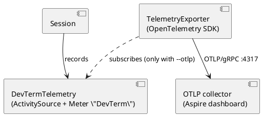

# Observability

dev-term can export its own traces and metrics (not the device's data; that is session logging, see
[session-logging.md](session-logging.md)) to an OpenTelemetry collector. It is **off unless asked**: pass
`--otlp <url>` (or `--otlp true` for `http://localhost:4317`), or set `Otlp` in a profile / `DEVTERM_OTLP`.

## Design

- `DevTerm.Core` always records into one `ActivitySource` and one `Meter`, both named `DevTerm`
  (`DevTermTelemetry`). With no listener these are close to free, so there is no flag in the engine itself.
- `DevTerm.Observability` is the only project that references the OpenTelemetry SDK. `TelemetryExporter.Start`
  subscribes a tracer and a meter provider to those names and exports over OTLP/gRPC. It is best effort: an
  unreachable collector never throws or slows a connection.
- `AddDevTermFrontEnd` starts it (so the console, WPF and web hosts all behave the same). It is not a hosted
  service because the console and WPF hosts are built but never started; the exporter flushes on process exit.



## What is recorded

| Name | Kind | Tags |
|---|---|---|
| `devterm.session.open` | span around the transport open | `devterm.transport`; `error.type` and Error status on failure |
| `devterm.session.opened` | counter | `devterm.transport` |
| `devterm.session.closed` | counter | `devterm.requested` (user asked or not), `error.type` |
| `devterm.bytes.sent` / `devterm.bytes.received` | counter, bytes | |

## Trying it

```bash
docker compose -f containers/docker-compose.yml up -d aspire-dashboard
dotnet run --project src/DevTerm.Console -- --transport loopback --otlp true --cli true
# open http://localhost:18888
```

## Status

Built 2026-10-02: instrumentation, exporter, option and validation, container. Unit-tested (listener-based tests on
`Session`, option parsing); checked 2026-10-02 against a local listener: the open span arrives as gRPC (metrics export on a 60 s interval or at exit, not seen in that short run). Not built: logs (`ILogger`) export,
per-transport spans, presenter/frame metrics.
