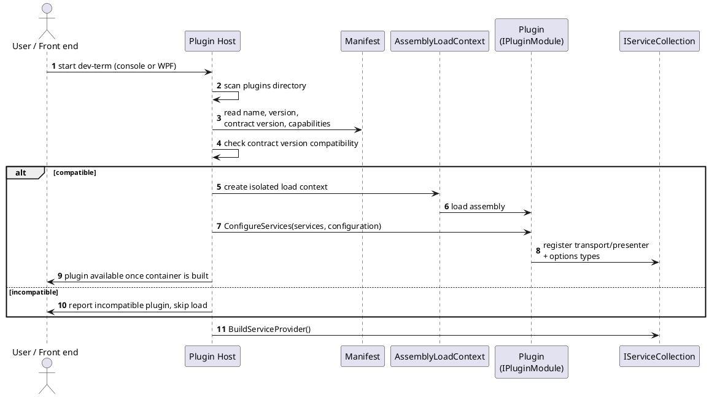

# Plugin Model

## Purpose

Describes how transports, presenters, and decoders are packaged, discovered, and loaded so the core and front ends never need to know about a specific plugin at compile time.

## Plugin contracts

Extension points, each a small interface package with no dependency on the core engine's internals or on any specific front end:

- Transport contract (see [transports.md](transports.md)).
- Presenter/decoder contract, including the optional renderable, exportable, composite, and mappable capabilities (see [presenters.md](presenters.md)).
- Control surface contract, for device control modules that need to declare outbound commands/parameters generically (see [device-control-modules.md](device-control-modules.md)). A device control module plugin typically registers a control surface alongside one or more presenters.
- (Possible future) front-end widget contract, if the GUI/TUI need plugin-supplied custom views beyond what the shared drawing/canvas model and the control-surface metadata cover.

## Packaging & discovery

- Each plugin ships as one or more .NET assemblies plus a small manifest (name, version, contract version(s) implemented, declared capabilities — e.g., "renders", "exports: svg,png,jpg") so the host can validate compatibility before loading.
- Plugins are discovered from a known plugins directory (and, later, potentially a plugin registry/feed) at startup, before the DI container is built — see [platform.md](platform.md) for the DI/hosting model this plugs into.
- Rather than the host manually instantiating plugin types, each plugin exposes a small entry point (e.g., an `IPluginModule` implementation) whose job is to register its own services — transport/presenter implementations, and their options types — into the host's `IServiceCollection`. Discovery therefore ends with the plugin contributing to the container, not with the host holding a bag of loose instances; from then on, everything (core and plugin services alike) is resolved through DI like any other service.

## Isolation & versioning

- Candidate approach: load each plugin in its own `AssemblyLoadContext` so plugins can be added/removed/updated without recompiling the host, and a misbehaving plugin's dependencies don't collide with the host's or another plugin's.
- Contracts are versioned independently of the plugin implementations; the host declares which contract versions it supports, and refuses (with a clear message) to load a plugin built against an incompatible contract version.

## Built-in vs. plugin

The initial text-encoding and numeric-base presenters, and the initial transports (serial, TCP, and eventually UDP/USB HID/BLE), ship in-box but are implemented against the exact same contracts as third-party plugins — the core makes no distinction between "built-in" and "external" beyond how they're distributed. This is descriptive of intent, not current fact: dynamic plugin loading itself isn't built yet (see open questions below and `TODO.md`) — today's built-in transports/presenters are wired by hand in each front end's `Program.cs`, against the same `ITransport`/`IPresenter` contracts a real plugin would use, but not actually loaded as plugins. An HPGL-style rendering presenter is expected to be an ordinary plugin, not a special case, once loading exists.

## Open questions

- In-process vs. out-of-process plugin hosting (isolation/crash-resilience vs. complexity/perf).
- Signing/trust model for third-party plugins, if any.
- Whether plugins can be authored in languages other than C#/.NET (e.g., via a process/IPC boundary) for teams that want to write a decoder in Python/Rust.
