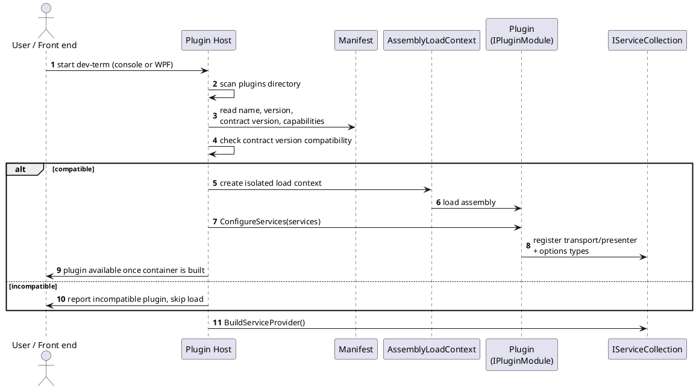
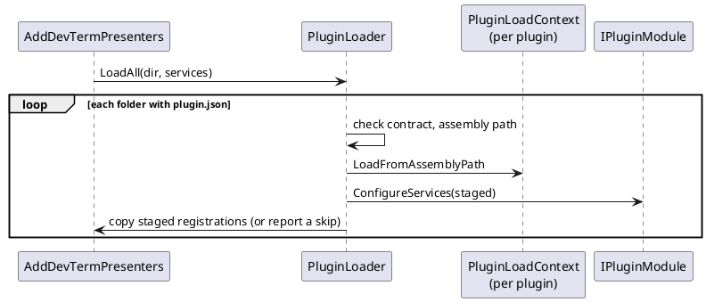

# Plugin Model

## Purpose

Describes how transports, presenters, and decoders are packaged, discovered, and loaded so the core and front ends never need to know about a specific plugin at compile time.

## Plugin contracts

Extension points, each a small interface package with no dependency on the core engine's internals or on any specific front end:

- Transport contract (see [transports.md](transports.md)).
- Presenter/decoder contract, including the optional renderable, exportable, composite, and mappable capabilities (see [presenters.md](presenters.md)).
- Control surface contract, for device control modules that need to declare outbound commands/parameters generically (see [device-control-modules.md](device-control-modules.md)). A device control module plugin typically registers a control surface alongside one or more presenters.
- (Possible future) front-end widget contract, if the GUI/TUI need plugin-supplied custom views beyond what the shared drawing/canvas model and the control-surface metadata cover.

## Packaging & discovery

- Each plugin ships as one or more .NET assemblies plus a small manifest (name, version, contract version(s) implemented, declared capabilities — e.g., "renders", "exports: svg,png,jpg") so the host can validate compatibility before loading.
- Plugins are discovered from a known plugins directory (a plugin registry/feed is not built) at startup, before the DI container is built — see [platform.md](platform.md) for the DI/hosting model this plugs into.
- Rather than the host manually instantiating plugin types, each plugin exposes a small entry point (e.g., an `IPluginModule` implementation) whose job is to register its own services — transport/presenter implementations, and their options types — into the host's `IServiceCollection`. Discovery therefore ends with the plugin contributing to the container, not with the host holding a bag of loose instances; from then on, everything (core and plugin services alike) is resolved through DI like any other service.

```plantuml
@startuml
autonumber
actor "User / Front end" as User
participant "Plugin Host" as Host
participant "Manifest" as Manifest
participant "AssemblyLoadContext" as ALC
participant "Plugin\n(IPluginModule)" as Plugin
participant "IServiceCollection" as Services

User -> Host: start dev-term (console or WPF)
Host -> Host: scan plugins directory
Host -> Manifest: read name, version,\ncontract version, capabilities
Host -> Host: check contract version compatibility

alt compatible
  Host -> ALC: create isolated load context
  ALC -> Plugin: load assembly
  Host -> Plugin: ConfigureServices(services)
  Plugin -> Services: register transport/presenter\n+ options types
  Host -> User: plugin available once container is built
else incompatible
  Host -> User: report incompatible plugin, skip load
end

Host -> Services: BuildServiceProvider()
@enduml
```

## Isolation & versioning

- Candidate approach: load each plugin in its own `AssemblyLoadContext` so plugins can be added/removed/updated without recompiling the host, and a misbehaving plugin's dependencies don't collide with the host's or another plugin's.
- Contracts are versioned independently of the plugin implementations; the host declares which contract versions it supports, and refuses (with a clear message) to load a plugin built against an incompatible contract version.

## Built-in vs. plugin

The initial text-encoding and numeric-base presenters and the core transports (serial, TCP, USB HID, USBTMC, BLE, RFC 2217, VXI-11, MQTT/AMQP/STOMP, loopback) ship in-box, referenced directly by the front ends and wired by `AddDevTermFrontEnd`, but are implemented against the same `ITransport`/`IPresenter` contracts as third-party plugins. The device modules (`DevTerm.Devices.*`: K8055, Busylight, DE-5000, RadexOne, ZoomH4n, NMEA, SCPI, Demo) are real plugins: each has a `plugin.json` and an `IPluginModule`, and is copied into `plugins/<name>/` next to the app by the build (`BundleDevicePlugins`), so the core and front ends reference none of them. An HPGL-style rendering presenter is expected to be an ordinary plugin, not a special case.

A separate, no-code path exists alongside this one for simple devices: see [device-manifests.md](device-manifests.md) — a declarative JSON manifest (or folder/zip of one) rather than a compiled plugin. The two aren't competing mechanisms; a device manifest is for gear simple enough not to need real code at all, and is loaded by dev-term's own manifest loader rather than this plugin loader.

## Status

Built 2026-10-03 (the loading mechanism), since used by the device modules and by out-of-process plugins:

- `DevTerm.Core.Plugins`: `IPluginModule`, `PluginManifest` (`plugin.json`: `name`, `version`, `contract`, `assembly`),
  `PluginLoader.LoadAll(dir, services)`. Contract version is `PluginLoader.ContractVersion` (1).
- Layout: `<plugins>/<name>/plugin.json` plus the plugin's assemblies. Each plugin gets its own `AssemblyLoadContext`; an
  assembly the host already loaded (`DevTerm.Core` and the BCL) is never loaded twice, so `IPresenter` in the plugin is the
  host's own type.
- A plugin is skipped and reported (never thrown) for a bad or missing manifest, another contract version, an assembly outside
  its folder, or no `IPluginModule`. A module's registrations are staged and only added if the whole module configures, so a
  half-registered plugin can't leak in. Skips print to stderr in the console app.
- Where: `plugins` next to the app, or `--plugins <folder>` (`CliOptions.Plugins`, also `DEVTERM_PLUGINS`). Loaded from
  `AddDevTermPresenters`, so playback sees presenters from plugins too.
- Second example, `src/DevTerm.Plugins.KeyValue`: a "keyvalue" presenter that decodes `name=value [unit]` lines into a `StructuredMessage` (try it on the loopback `STATUS?`). Template and test fixture: `src/DevTerm.Plugins.Sample` (a "sample" presenter). Checked end to end through the console
  with `--plugins <folder> --presenter sample`.
- Not built: unloading (the context isn't collectible, so a loaded DLL stays locked until exit), signing, a plugin
  registry. (The built-in decoders now ship as plugin folders, and the TUI and WPF have a Plugins... item under their menus.)
- `--listplugins true` (optionally with `--plugins <folder>`) prints each plugin folder as loaded or skipped with the reason, then exits (2026-10-03). A folder with no `plugin.json` isn't a plugin and is not listed.

```plantuml
@startuml
participant "AddDevTermPresenters" as A
participant PluginLoader as L
participant "PluginLoadContext\n(per plugin)" as C
participant IPluginModule as M
A -> L : LoadAll(dir, services)
loop each folder with plugin.json
  L -> L : check contract, assembly path
  L -> C : LoadFromAssemblyPath
  L -> M : ConfigureServices(staged)
  L -> A : copy staged registrations (or report a skip)
end
@enduml
```

## Open questions

- ~~In-process vs. out-of-process plugin hosting~~ Both exist: in-process via an AssemblyLoadContext (IPluginModule), out-of-process via a process entry in plugin.json (ExternalProcessPresenter, stdin/stdout JSON lines).
- ~~Signing/trust model for third-party plugins, if any.~~ **Decided 2026-10-03:** third-party plugins run **out of process** and only after the user approves them; the user may optionally approve once per hash so an unchanged plugin isn't asked about again. No signing infrastructure. **Built 2026-10-03** for out-of-process plugins (`PluginTrust`; see the proposal). In-process plugins stay as they are.
- ~~Whether plugins can be authored in languages other than C#/.NET~~ Yes, through the out-of-process path; Python, Java and Go examples live under examples/
