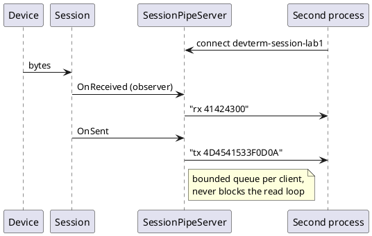
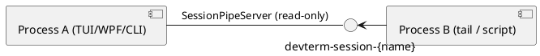

# Cross-process session channel (named pipe)

Owner direction (2026-10-03): sharing session state across processes is wanted, over a **named pipe or a
localhost-only web service**. Use cases: tail a live session from a second terminal, let a script or another
front end watch (later: drive) a device that one process already has open.

## Shape

- **One pipe per session**, named `devterm-session-{name}`, local machine only (named pipes on Windows are
  not network-reachable by default; on Unix they are a socket file in the temp folder).
- **Phase 1, read-only (built):** `SessionPipeServer` is an `ISessionObserver`, so attaching it changes nothing
  any presenter sees. It writes one UTF-8 line per event: `open`, `rx <hex>`, `tx <hex>`, `closed <reason>`.
  Clients can only read; nothing they write is acted on.
- **Never blocks the session:** every client has a bounded queue (1000 lines, drop-oldest) and its own writer
  task, so a slow or stalled client loses lines instead of stalling the read loop. (A zero-size pipe buffer
  makes a synchronous write block until the client reads, which is why the first prototype hung.)
- **Phase 2, read-write (built 2026-10-07):** `--control <name>` opens `devterm-control-{name}`, a duplex pipe limited
  to the current OS user. A client writes `send <text>` (encoded with the host's parser and line ending),
  `sendhex <HEX>` or `ping`, one per line, and gets `ok` or `error <why>` back; the same `open`/`rx`/`tx`/`closed`
  event lines stream on the same pipe. `presenter add/remove` is not built.
- **Localhost web service alternative:** the same line events fit Server-Sent Events or a WebSocket on
  `127.0.0.1`. It reaches browsers and non-.NET tools more easily, at the cost of a port and a
  same-machine-user trust model to design. The pipe is the simpler first step.

## Open questions

- Naming: is the session name the profile name, a tab title, or generated? Discovery of live sessions
  (list the pipes) is not designed.
- Web service versus pipe for browsers and non-.NET clients.

## Completion checklist

- [x] Read-only pipe server (`SessionPipeServer`) with an Integration test over a real local named pipe
- [x] CLI flag `--pipe <name>` publishes the session (console CLI mode)
- [x] `--pipe` in the TUI and WPF front ends (first tab's session only)
- [x] A `tail` client mode (`--attach <name>`, prints `open`/`rx`/`tx`/`closed` lines with the ASCII beside each)
- [x] Read-write named-pipe channel (`SessionControlPipeServer`, `--control <name>`, console CLI mode; decided 2026-10-07: current OS user only via `PipeOptions.CurrentUserOnly`, sends interleave through `Session.SendAsync`)
- [x] `--control` in the TUI and WPF front ends (first tab's session only; not exercised by a front-end test)
- [x] A client mode: `--controlclient <name>` reads commands from stdin and prints replies and events (checked across two real processes with the loopback transport, 2026-10-07)
- [x] Localhost web-service variant (`--controlhttp <port>`, `SessionHttpControlServer`: 127.0.0.1 only, bearer token, `POST /command`, `GET /events` as SSE, `GET /ping`)

## Status

Phase 1 built 2026-10-03 (`DevTerm.Core.Sessions.SessionPipeServer`, `SessionPipeServerTests`). `--pipe <name>` (console CLI
mode) and `--attach <name>` (`SessionPipeClient`) added the same day and checked across two real processes with the
loopback transport: the attach side printed the `tx`, `rx` and `closed` lines of the host's session, and an unknown name
exits 1 with a hint. A client sees only traffic from when it connects (no replay of `open`). The TUI and WPF front ends also
accept `--pipe`, publishing the first tab's session only (tabs added later are not published); not exercised by a
front-end test.
