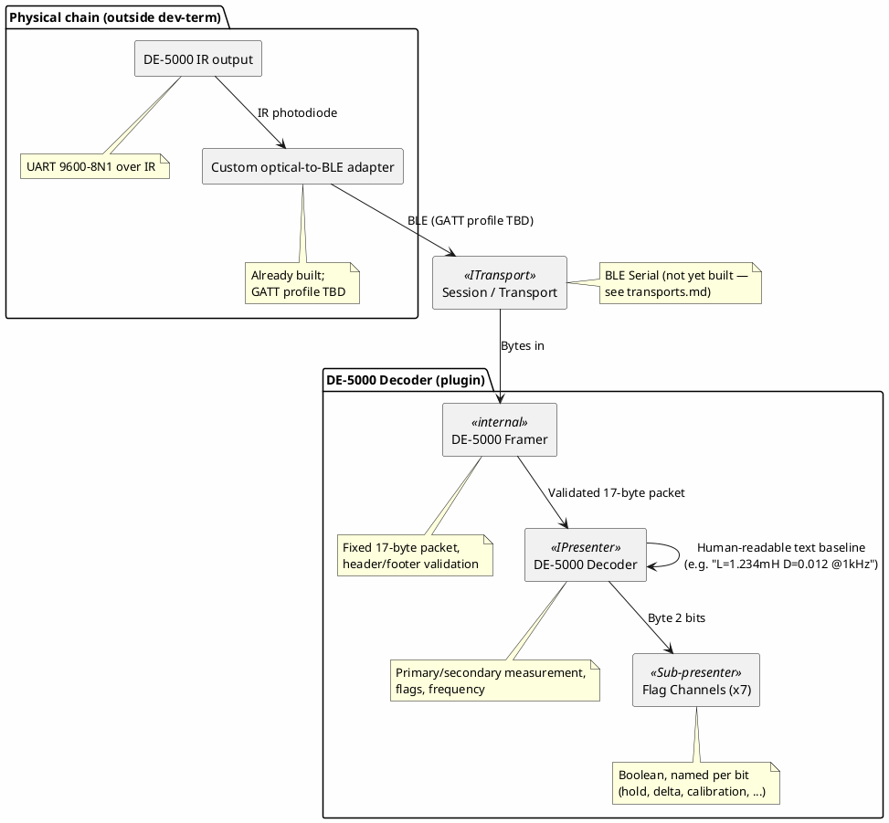

# Proposal: DER EE DE-5000 LCR Meter — Optical-UART-over-BLE Decoder

## Source

Unlike the other three proposals in this directory, this one isn't sourced from
`mwwhited-notes/shared` prior art — it's reverse-engineered by the wider hobbyist community and
independently verified here (2026-09-15) via web research:

- [4x1md/de5000_lcr_py](https://github.com/4x1md/de5000_lcr_py) — Python library with a full
  byte-by-byte protocol breakdown; the primary source for the packet format below.
- [EEVblog: "Decoding DER EE LCR Meter DE-5000 serial bitstream"](https://www.eevblog.com/forum/testgear/decoding-der-ee-lcr-meter-de-5000-serial-bitstream/) —
  the original community reverse-engineering thread.
- The meter uses the **Cyrustek ES51919** chipset, also used in other rebadged LCR meters — the
  decoder below is arguably a decoder for that chipset's output format, not just this one branded
  unit, the same "one decoder, many devices" shape SCPI and Radex One's framing already have.

The DE-5000 is already in the local equipment inventory (`shared/.personal/incoming/test-equipment.md`)
alongside two other handheld LCR meters (Holdpeak HP-4070L, Altnux LCR Meter) that show no
documented computer interface — this is the one of the three that actually has one.

## Device

[DER EE DE-5000](https://www.deree.com.tw/de-5000-lcr-meter.html) — a handheld LCR meter with a
**fully isolated optical (IR) output**, not a wired port: the meter transmits UART frames over IR,
requiring an IR photodiode/phototransistor receiver in the physical chain (either DER EE's own
IR-to-USB adapter, or a self-built one — see below). Serial parameters at the UART level: 9600
baud, 8-N-1.

## Physical/transport chain (the part that makes this proposal unusual)

This isn't "plug in a cable" — three link-layer hops sit between the meter and dev-term:

1. **DE-5000 optical output** — UART frames, 9600-8N1, transmitted via IR.
2. **A custom-built optical-to-BLE adapter** (already built) — receives the IR UART stream and
   re-transmits it over BLE. Exactly which GATT profile it exposes (Nordic UART Service, per
   [transports.md](../transports.md)'s "BLE Serial" default, or a custom one) is **not yet known**
   here and needs confirming before the BLE Serial transport can be pointed at it.
2. **dev-term's BLE transport** ("BLE Serial" mode — see [transports.md](../transports.md)),
   itself not yet built.
3. **This decoder** — parses the same ES51919 UART frame the meter always sent; nothing about the
   frame format changes because it arrived over BLE instead of a direct wired UART. The decoder is
   transport-agnostic by construction (same pattern as every other presenter in this project — see
   [architecture.md](../architecture.md)), so it would work identically if the meter were ever
   connected via a direct wired IR-to-USB adapter instead.

This means the proposal is gated on the **BLE Serial transport** (backlog, cross-platform,
adapter-seam design already decided) being built first — see `BACKLOG.md`. Unlike Radex One (gated on
a transport not yet designed in any real detail) and Favero (gated on hardware access that's gone),
this one is gated on a transport that's already scoped and has real target hardware pushing for it.

## Why this is a good decoder candidate

- **Fully specified, fixed-size, checksum-free framing** — a constant 17-byte packet with known
  header (`0x00 0x0D`) and footer bytes, no length field to parse, no variable extension. About as
  simple as binary framing gets.
- **A mirrored sub-structure worth naming as its own concept**: the primary measurement
  (quantity/value/decimal-multiplier-and-units/display-status, bytes 5–9) and secondary measurement
  (D/Q/ESR-RP/phase-angle, same shape, bytes 10–14) are the *same* 5-byte record type appearing
  twice per packet — a reasonable candidate for a small shared "measurement record" sub-parser
  reused twice, rather than two independent field-by-field parses.
- **Chipset-level reuse**: because the format belongs to the ES51919 chipset rather than
  DER EE specifically, this decoder plausibly works unmodified against other rebadged meters using
  the same chip, without knowing all of them in advance.

## Protocol summary (full detail in the source repo)

**Packet shape** — fixed 17 bytes, no checksum:

```
Byte 0      : Header, always 0x00
Byte 1      : Header, always 0x0D
Byte 2      : Flags — bit0 hold, bit1 delta-reference-shown, bit2 delta mode, bit3 calibration
              mode, bit4 sorting mode, bit5 LCR-auto mode, bit6 auto-range mode, bit7 parallel
              measurement
Byte 3      : Config — bits 5-7 encode test frequency (100Hz/120Hz/1kHz/10kHz/100kHz/DC)
Byte 4      : Sorting-mode tolerance (0-10 -> ±0.25% .. -20/+80%)
Byte 5      : Primary measured quantity (L/C/R/DCR)
Bytes 6-7   : Primary value, MSB/LSB
Byte 8      : Primary — bits 0-2 decimal-point multiplier (10^-val), bits 3-7 units
Byte 9      : Primary display status (normal/blank/lines/OL/PASS/FAIL/...)
Byte 10     : Secondary measured quantity (D/Q/ESR-RP/angle)
Bytes 11-12 : Secondary value, MSB/LSB
Byte 13     : Secondary — same multiplier/units shape as byte 8
Byte 14     : Secondary display status
Bytes 15-16 : Footer — reported as 0x0D 0x0D in the source README's own summary line, but as
              (0x0D, 0x0A) in that same source's byte-by-byte table — see open questions, this
              needs resolving against the actual reference implementation's code, not just its
              prose, before trusting either.
```

**Value calculation** (both measurements): `(MSB * 0x10000 + LSB) * 10^-multiplier`.

## Proposed shape



## Open questions

- **What GATT profile the custom BLE adapter exposes** — Nordic UART Service (the default
  `transports.md`'s BLE Serial mode assumes) or a custom one. Needed before the BLE Serial
  transport can actually be pointed at this specific adapter, even once that transport exists.
- **The footer-byte discrepancy above** (`0x0D 0x0D` vs `0x0D 0x0A` in the same source project) —
  resolve against the actual parsing code, not just the README prose, before implementing the
  framer's footer check.
- Whether the primary/secondary "measurement record" (value + multiplier/units + display status)
  is worth a small shared sub-parser used twice, or whether that's over-engineering a 5-byte field
  group that's simple enough to just parse twice inline.
- Whether other ES51919-based meters (rebadged under other brands) are worth explicitly supporting
  via the same decoder, or left as "probably works, not verified" until one shows up.
