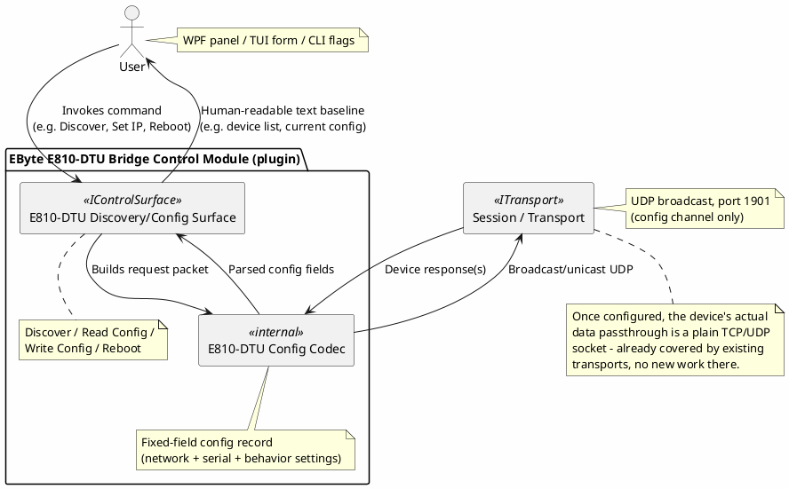
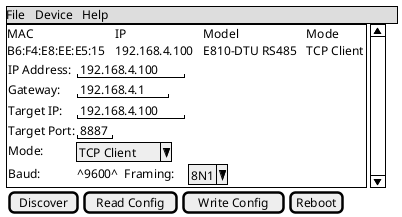

# Proposal: EByte E810-DTU(RS485) — Ethernet-to-Serial Bridge Configuration Protocol

## Source

Unlike the other proposals in this directory (sourced from `mwwhited-notes/shared`), this one comes
from a different personal project — a local binary-protocol-decoder library:

- `C:\repo\oobdev\dotex\Incoming\BinaryDecoders\src\OoBDev.EByteElectronicTechnology\e810dturs485_notes.txt` —
  raw reverse-engineering notes (UDP packet captures + a hand-annotated field table), not a
  finished writeup like [Radex One](radex-one-protocol.md)'s source — treat the field table below
  as a working hypothesis to verify against a fresh capture, not a settled spec (see "Open
  questions" — a byte-count check against the notes' own example already turned up a discrepancy).

## Device

[EByte E810-DTU(RS485)](https://www.cdebyte.com/) (model code `0x03` in its own config response,
firmware `0x16`) — an Ethernet-to-serial bridge, conceptually the same role as the
[USR-TCP232-302](https://shop.usriot.com/1-port-rs232-to-ethernet-converters-usr-tcp232-302.html)
already used in this project (see the top-level [README](../../../README.md) and the vendor-variance
caveat in [rfc2217.md](../rfc2217.md)), but a different manufacturer (Ebyte/`cdebyte.com`, Chinese)
with an entirely different, non-RFC2217, non-USR configuration protocol. Bridges Ethernet to
RS-485 (and possibly RS-422 electrically — the notes only cover the RS485 model variant).

## Why this is a distinct case from the USR-TCP232-302 already in dev-term

The USR device's actual *data* passthrough already works today via the plain TCP transport — no
protocol work was needed there, only picking the right port/mode (see the README's status notes).
This device is different in one specific way: **its configuration is a whole separate protocol**,
not something dev-term has needed to touch before:

- **Data passthrough** (once configured): presumably a plain raw TCP/UDP socket mirroring the
  RS-485 bytes, same as the USR device — no new transport work implied, whatever's actually wired
  to the RS-485 port is a separate, device-specific decoder concern for later.
- **Configuration** (this proposal's actual subject): a **UDP broadcast protocol on port 1901** —
  discover devices, read/write their network+serial+behavior settings, and reboot them. This is a
  genuinely new category for dev-term: not decoding telemetry from an instrument, but *configuring
  a piece of network infrastructure* (the bridge itself) — closer in spirit to
  [device-control-modules.md](../device-control-modules.md)'s `IControlSurface` concept, but aimed
  at the bridge hardware rather than a measurement instrument. If dev-term ever wants a "find and
  set up my serial-to-Ethernet bridges" feature, this is what it would look like.

## Protocol summary (from the source notes — see caveats above)

All UDP, broadcast to port 1901 unless noted:

- **Discovery**: broadcast the literal ASCII payload `www.cdebyte.comwww.cdebyte.com` (the magic
  string, doubled) to `255.255.255.255:1901`. Every E810-DTU on the network replies with its full
  config (see below).
- **Reboot**: broadcast `FE03` + 6-byte target MAC to port 1901.
- **Read/write config**: the notes state the 2-byte command is `FD00` = Read, `FE00` = Write, but
  the actual captures include a distinct `FD01` too (see open questions — this needs resolving,
  not guessing).

**Config packet fields** (as documented in the source notes, in order):

```
Command          : 2 bytes  (FD00=Read, FE00=Write per the notes; FD01 also observed - unresolved)
MAC address       : 6 bytes
Address type      : 1 byte   (0x00=static, 0x01=DHCP)
IP address        : 4 bytes
Gateway           : 4 bytes
Subnet mask       : 4 bytes
Primary DNS       : 4 bytes
Secondary DNS     : 4 bytes
Local port        : 2 bytes
Target type       : 1 byte   (0x00=remote IP, 0x01=DNS name)
Target IP/name    : 60 bytes (ASCII, zero-padded)
Target port       : 2 bytes
Connection type   : 1 byte   (0x00=TCP client, 0x01=TCP server, 0x02=UDP client, 0x03=UDP server)
Serial framing    : 1 byte   (0x00=8N1, 0x01=8O1, 0x02=8E1)
Baud rate         : 3 bytes
Short link switch : 1 byte   (meaning unclear - marked "?" in the source notes themselves)
Timeout           : 2 bytes
Wipe cache        : 1 byte   (0x00=closed, 0x01=open)
Custom-registry type   : 1 byte  (0=off, 1=send MAC on connect, 2=send custom on connect, 3=send MAC every packet, 4=send custom every packet)
Custom registry        : 40 bytes (ASCII, zero-padded)
Custom registry length : 1 byte
Heartbeat type          : 1 byte  (0=network, 1=serial)
Heartbeat message       : 40 bytes (ASCII, zero-padded)
Heartbeat length        : 1 byte
Heartbeat time          : 2 bytes
MTU                     : 2 bytes
Model                   : 1 byte  (0x03 = E810-DTU RS485)
Firmware version        : 1 byte
Unknown                 : 6 bytes (marked "???" in the source notes - not yet decoded)
```

## Proposed shape



- **This needs the not-yet-built UDP transport** (see `docs/design/transports.md`) to send/receive
  broadcast datagrams — the config protocol is entirely UDP, unlike the USR device's Telnet-ish
  config approach.
- **Broadcast discovery is itself a distinct capability** dev-term doesn't have a pattern for yet:
  send one datagram, collect replies from an a-priori-unknown number of devices within some window,
  rather than a single request/response pair. Worth deciding whether this is a generic
  `IControlSurface` "discovery" concept or specific glue in this module.

A "find and configure my bridges" feature is a genuinely GUI-shaped task — a scannable device list
plus a settings form reads far better than a CLI flag dump:



## Open questions

- **Byte-count discrepancy**: summing the documented field widths above gives 197 bytes after the
  2-byte command (199 total), but the actual captured example packet in the source notes is 203
  bytes. Something in the field table is under-counted by 4 bytes — needs resolving against a
  fresh, carefully-annotated capture before implementing, not guessed at.
- **`FD00` vs `FD01`**: the notes' own summary says the command is `FD00=Read` or `FE00=Write`, but
  the captures include `FD01` too, unexplained. Possibly a third state, or a copy/paste artifact in
  the notes — needs a fresh capture to resolve.
- Several fields are explicitly marked as not understood in the source notes themselves: the
  "short link switch" byte, and a trailing 6-byte "other???" block. These aren't safe to write
  blindly (a config protocol has real, immediate consequences on real hardware if a write gets an
  unknown field wrong) — read-only support (discovery + reading current config) is the safer first
  slice; treat write support as needing the unresolved fields nailed down first.
- Whether RS-422 variants of the E810-DTU family share this exact config format (the notes only
  cover the RS485 model) — worth checking if/when an RS-422 unit is in hand.
