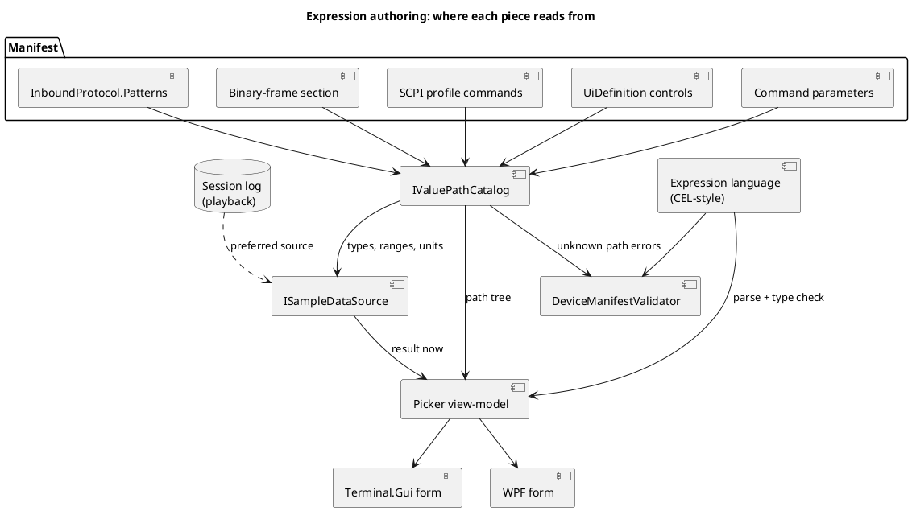
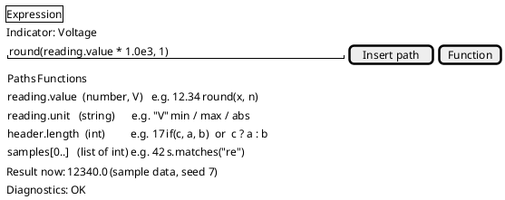

# Expression picker, value-path catalog, sample data, and a CEL-style language

Requested 2026-10-02 as the next step of [the manifest expression builder](manifest-editor-expression-builder.md).
Three asks, in priority order: (1) at minimum, enumerate the **valid parameter paths** an expression may reference
and **generate realistic sample data** so previews look real; (2) a **picker control** that builds valid expressions
by choosing values, not typing; (3) a small **programming language**, ideally close to Google's
[Common Expression Language (CEL)](https://github.com/google/cel-spec).

## Problem

Today an author types `{id}` references by memory into a text box. Nothing lists which ids exist (decoder values,
control ids, command parameters), nothing knows their type or range, and the manifest editor's live preview has no
data to show unless a device is connected. Regex captures and binary-frame fields (see `TODO.md`) will add nested and
repeated values that `{id}` cannot name. Expressions are also limited to arithmetic, comparison and `if`, so string
tests, regex matching and list handling are impossible.

## Design

### 1. Value-path catalog (build first)

**The catalog works off the device profile, never a `.ksy` file.** `IValuePathCatalog.Enumerate(profile)` takes a
device manifest or a SCPI device profile (`Profiles/*.json`) and returns every path an expression can legally read, each as a
`ValuePath { Path, Type, Unit?, Min?, Max?, Choices?, Source, Example }`. Sources, all derivable from the manifest
without a device:

| Source | Paths produced |
|---|---|
| `InboundProtocol.Patterns` | each named capture group, or the pattern's id for group 1 (type inferred from a numeric/format hint, else string) |
| profile's binary-frame section | field names, dotted for nested (`header.length`) and indexed for repeated (`samples[0]`); present only if the profile declares one |
| SCPI profile commands | each query command's reply as a value (type from the profile's response hint), each command's parameters |
| UI controls | each control's current value by id (slider/numeric: range; toggle: bool; choice: its options) |
| command parameters | `ParameterExpressions` targets |

The catalog is also what the validator uses to reject an unknown path with a precise message, replacing the
unresolved-`{id}` checks scattered today.

### 2. Sample-data generator

`ISampleDataSource` produces a values dictionary (and a short time series) for a manifest from the catalog: numeric
paths follow their `Min`/`Max`/`Unit` (a smooth walk plus noise, not uniform random), choices cycle, strings come
from the pattern's own example if it has one, and a pattern with a regex gets a string it actually matches.
Preference order: a real recorded session log (the Playback feature), then the manifest's declared examples, then
generated values. Deterministic by seed so screenshots and tests are stable. It drives the editor's preview, the
picker's "result now" readout, and the loopback transport's scripted device.

### 3. Picker control (both front ends)

An expression editor with: a searchable path tree (from the catalog, showing type/unit/example), a function and
operator list filtered by the types in play, insert-at-caret, live parse/type diagnostics, and a result readout
evaluated against sample data. It can also build structurally (pick a path, an operator, a value) for authors who
never type. One view-model in a shared library, rendered by Terminal.Gui and WPF like the other editor forms.

### 4. Language: a CEL-style dialect

CEL fits: side-effect-free, non-Turing-complete, typed, with `&&`/`||`/`?:`, `in`, `size()`, `has()`, string
functions, and `matches()` for regex, plus maps and lists that map onto dotted and indexed paths. Two routes:

- **A. Extend our own `Expression`** to a CEL subset (same grammar family; `{id}` kept as sugar for `values.id`).
  No dependency, and load-time validation and the picker's type information stay under our control. Recommended start.
- **B. Adopt a .NET CEL library.** Full spec compliance, but a new dependency, and the picker and validator would
  need its type-checker API. Only worth it if a maintained library passes a spike.

**Spike result (2026-10-02): build A.** The two candidates on NuGet are `Cel` 0.3.3 (telus-oss/cel-net, Apache-2.0, pre-1.0)
and `Cel.NET` (rayokota, which also pulls Avro). Tried `Cel` in a throwaway console project: it parses and evaluates
well (arithmetic, `?:`, `&&`, `has()`, `size()`, dotted map access, double*int in non-strict mode), reports a parse
error with line/column, and throws `CelUndeclaredReferenceException` for an unknown name. But it has no type-check API
(`CelEnvironment.Parse` hands back a raw ANTLR `StartContext`), no way to list its functions or their signatures, and it
drags in `Google.Protobuf` and the ANTLR runtime. The picker needs exactly the pieces it lacks (type information before
evaluating, a function list), so route B would mean wrapping the parse tree ourselves anyway. Extend our own
`Expression`.

Decision: spike B briefly against the picker's needs (type-check without evaluating, enumerate functions); otherwise
build A. Either way the language stays non-Turing-complete: no loops, no assignment, bounded evaluation.

## Order of work

1. Path catalog (patterns, controls, parameters); the validator uses it. Smallest useful piece, unblocks the rest.
2. Sample-data generator, wired into the manifest editor preview.
3. Picker view-model plus TUI and WPF forms (with `docs/specs/` and `docs/user-guide/` entries when it ships).
4. CEL spike (done: build our own), then the language extension (regex `matches()`, strings, lists, `has()`, dotted/indexed paths).
5. Binary-frame paths join the catalog once a profile can declare a binary-frame section. A `.ksy` is never read by the
   catalog: the `.ksy` importer (`TODO.md`) only generates that section into a profile, and the catalog reads the profile.

## Open questions

- Keep `{id}` as the canonical syntax or migrate manifests to bare CEL identifiers? Proposed: accept both, write
  bare, with a one-time load-time upgrade.
- Time-series sample data needs a notion of sample rate; reuse [loopback sample rate](../features/loopback-sample-rate.md) (now built, so a paced loopback stream can feed it).
- Does the picker need to build regex (a tester pane with a sample line), or only insert `matches()`?

## Status

**Step 1 built (2026-10-02):** `ValuePathCatalog` (`DevTerm.DeviceManifests`) enumerates paths from response patterns (name
plus named capture groups, type inferred from the group's regex), query reply ids and panel controls (range, unit,
choices), and `DeviceManifestValidator` warns on an expression reading an unpublished id. Covered by
`ValuePathCatalogTests`; not yet checked against real hardware (no device-side behavior). SCPI profiles are read
through `Enumerate(UiDefinition)` over `ScpiUiDefinitionBuilder.Build(profile)` (a `{command}.reply` per query, a
`{command}.{parameter}` per parameter; `ScpiValuePathTests`), so there is no SCPI project dependency. **Step 2 generator built (2026-10-02):** `SampleDataGenerator` (`Values`/`Value`/`Text`; seeded, FNV-1a hash so it is stable across
processes; numbers walk smoothly inside Minimum/Maximum, booleans alternate, choices cycle, text is omitted because
`Expression` reads only numbers; `SampleDataGeneratorTests`). Wired into both editors' preview (2026-10-02); the
recording tier is built, with a button in the manifest editor in both front ends. **Recording tier built (2026-10-02):** `RecordedSamples.FromSessionLog(manifest, log)` runs a session log's received (`rx`) records through the manifest's own reply and frame presenters and keeps every value they publish, per path, in order; `SampleDataGenerator.Value/Values/TextValues` take an optional `RecordedSamples` and prefer it (numbers read the leading number of the recorded text, steps wrap at the end), and `ExpressionPickerViewModel.Recording` evaluates against one. Paths the log lacks still use the example, then generation. The manifest editor's **Log** (TUI) / **Use recording...** (WPF) button picks the log; it applies to the preview and every picker, and isn't saved with the manifest. **Declared-example tier built (2026-10-02):** `ResponsePattern.Example` (an optional sample reply line) is run through the pattern, `ValuePath.Example` carries each capture, and `SampleDataGenerator` starts there (step 0 is the example, text keeps it, numbers wander a few percent); the validator warns when an example doesn't match its regex. **Picker built (2026-10-02):** `ExpressionPickerViewModel`
(`ExpressionPickerViewModelTests`) with a TUI `ExpressionPickerDialog` and WPF `ExpressionPickerWindow`, reached from **Pick...**
beside an indicator's Expression field ([spec](../../specs/expression-picker.md)); Pick... was extended the same day to chart Channels, button Parameter expressions, vector/color ids and visible-when.
**Language extension, first part built (2026-10-02):** `Expression` now has string values (single- or double-quoted literals, `+` concatenation, ordinal comparisons), `matches(text, regex)` (a literal pattern is compiled at parse time, so a bad one is a parse error; a computed bad pattern or a 100 ms timeout evaluates to false), `contains`/`startsWith`/`endsWith`, `size`, `number`, `string`, `has({id})`, `!` and `cond ? a : b`, via `Evaluate(numbers, text)`; `Evaluate(numbers)` is unchanged (`ExpressionTextTests`). **Lists built (2026-10-02):** `[a, b]`, `x[i]`, `x in list`, `split`/`join`, `size` and `contains` on lists, bare and dotted identifiers (the same as `{id}`, which stays what the picker inserts) and `true`/`false` (`ExpressionListTests`). Not built: binary-frame paths (`header.length`, `samples[0]` as catalog entries, which needs a profile that declares a frame), a regex tester pane in the picker, function buttons for the other new functions. **Regex helper (2026-10-02):** the picker has a `matches` button that inserts `matches(, '')` with the caret on the text argument; a literal regex is checked live by the existing diagnostics. Decision: the picker inserts and checks `matches()` rather than hosting a separate tester pane, since the editor's Pattern form already has a sample-line tester. Live displays now pass the published text: `LiveDisplayState` keeps each referenced id's raw text, so an indicator can show `matches({model}, '^KA') ? 'Korad' : 'Other'` (`IndicatorStateTests`); a bar/strip channel reads text, and a strip chart adds a sample for an expression channel when only its text changes. The picker preview gets sample text for text paths (`SampleDataGenerator.TextValues`) and button parameter expressions see each sibling control's text. Scope decision (2026-10-02): profiles, not `.ksy`
files, are the input. Related:
[expression builder](manifest-editor-expression-builder.md), [schema files](format-schema-files.md).
