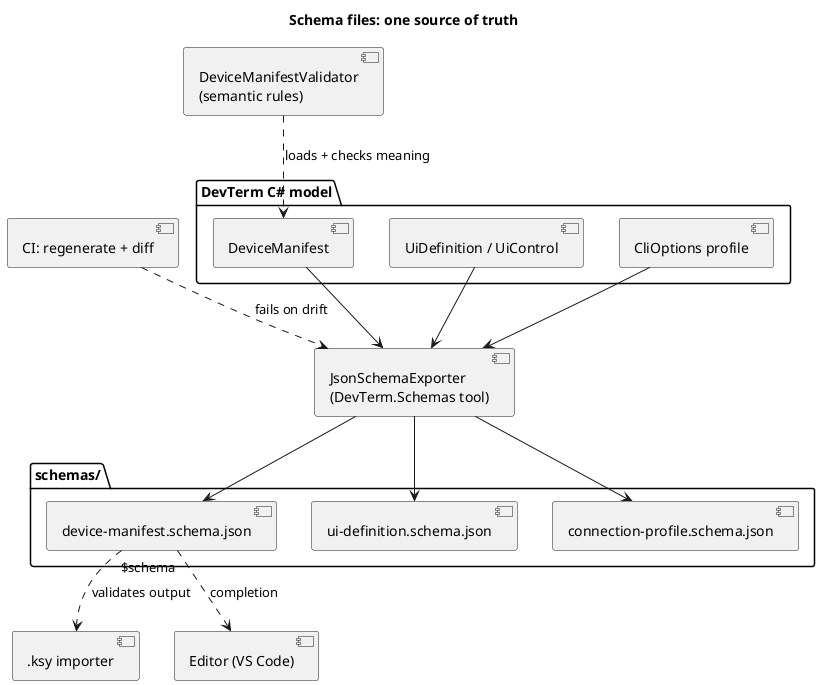
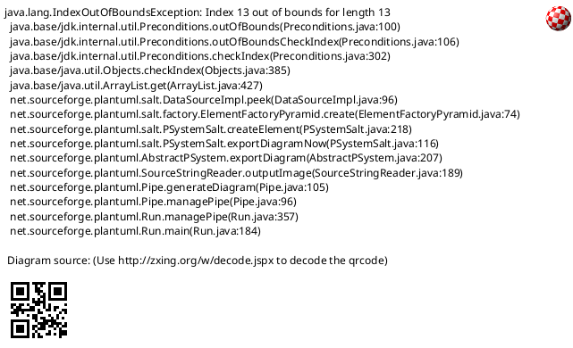

# Schema files for dev-term's custom formats

Raised 2026-10-02 alongside the `.ksy` work ([manifest expression builder follow-up](../features/manifest-editor-expression-builder.md)):
dev-term now has several hand-authored, no-code file formats, and none has a machine-readable schema. The
planned `.ksy` importer will also emit one of them, so a generated file and a hand-written one need to
be checked against the same definition.

## Problem

The formats people actually write or generate:

| Format | Where it lives | Shape today |
|---|---|---|
| Device manifest | `DevTerm.DeviceManifests` (`device.json`, folder, or `.zip`) | `DeviceManifest` class, JSON or XML |
| UI definition | `DevTerm.UiDefinitions` (inline in a manifest or `UiFile`) | `UiDefinition` -> sections -> polymorphic `UiControl` (`kind` discriminator), JSON or XML |
| SCPI device profile | `src/DevTerm.Devices.Scpi/Profiles/*.json` | command list plus `Notes`, `Terminator` |
| Connection profile | `appsettings.Local.json` / `CliOptions` | per-transport keys, written by `DevTermConfiguration.ToProfileJson` |
| Binary-frame schema (planned) | new, produced from a `.ksy` | fields, offsets, types, scale |

Each is defined only by its C# class plus `DeviceManifestValidator`. That means: no editor completion or
inline errors when hand-writing JSON, no way for the `.ksy` importer or an external tool to validate its
output without loading dev-term, and the polymorphic `kind` controls are the hardest to get right by
memory. A bad file is reported only at load time, after the user has already tried to use it.

## Design

Publish a **JSON Schema (draft 2020-12) per format**, checked into `schemas/` and referenced from files
with a `$schema` property, so editors (VS Code etc.) validate and complete as the user types.

- **Generated from the C# model, not hand-written.** `System.Text.Json.Schema.JsonSchemaExporter`
  (built into .NET 10) exports a schema from the same types the serializers use, so the schema cannot
  drift from the code. A small `DevTerm.Schemas` tool project (or a `dotnet run` mode of an existing
  tool) writes `schemas/*.schema.json`; CI regenerates and fails on a diff, the same way screenshots are
  kept honest. Hand-edited additions (descriptions, examples, the `kind` discriminator mapping) go in
  attributes/XML doc comments on the model so they survive regeneration.
- **`DeviceManifestValidator` stays authoritative** for rules a schema cannot express (a regex that must
  compile, every `{id}` in an expression resolving to a control, a `UiFile` path existing). The schema
  covers structure and types; the validator covers meaning. The loader does not need to run the schema.
- **XML**: `XmlSerializer` is also supported for manifests and UI definitions. XSD can be produced with
  `xsd.exe`/`XmlSchemaExporter`, but only if XML authoring is real in practice. Defer; JSON first.
- **The `.ksy` importer targets the schema**: its generated manifest section is validated against the same
  schema in its tests, and its "unsupported `.ksy` construct" report is separate from schema errors.
- **Not in scope**: a schema for `.ksy` itself (Kaitai publishes one), and a schema for the expression
  grammar (a string; the parser owns it).

## Open questions

- Where do schemas get published for `$schema` URLs: a relative path into the repo is enough for now; a
  stable hosted URL is only worth it if manifests are shared outside the repo.
- Does the SCPI device profile format (`Profiles/*.json`) stay separate from `DeviceManifest`, or get
  folded in later? The schema work should not decide that; it just describes both as they are.
- Polymorphic `UiControl` (`kind`): confirm `JsonSchemaExporter` emits a usable `oneOf` with the
  discriminator, otherwise that one schema needs a hand-written overlay.

## Completion checklist

What is needed before this proposal can be closed. Tick items as they land, in the same change.

- [ ] Spike `JsonSchemaExporter` on `DeviceManifest`; check the `UiControl` discriminator output
- [ ] Decide whether the schema is generated at build time or checked in
- [ ] Generate the schema for `DeviceManifest` / `UiDefinition`
- [ ] Generate the schema for the `.ksy`-derived frame (see `ksy-importer.md`)
- [ ] A test that fails when the schema drifts from the types
- [ ] Reference the schema from manifest docs and editors

## Status

**Proposal, not started.** Nothing generated yet. First step: spike `JsonSchemaExporter` on `DeviceManifest`
and check the `UiControl` discriminator output.
