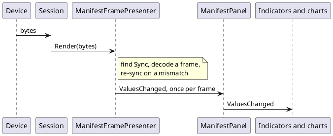

# `.ksy` importer and binary frames

## Why

`InboundProtocol.Patterns` turns a text line into named values with regexes. A binary device has no lines, so
nothing published values for it. This adds the binary counterpart: a **frame** declared in the manifest, and an
importer that produces one from a Kaitai Struct (`.ksy`) file. Decided 2026-10-02: our own small reading of `.ksy`,
framed as a *transformation* into dev-term's manifest format, not a Kaitai runtime.

## Model

`Inbound.Frame` is a `FrameSchema`: optional `Sync` hex bytes, a default `Endian`, and ordered `Fields`. A field has a
`Name`, `Type` (`u1 u2 u4 u8 s1 s2 s4 s8 f4 f8 str bytes skip`), optional per-field `Endian`, `Size` (for `str`/`bytes`/
`skip`), `Scale`/`Offset`, `Unit`, `Label`, `Minimum`/`Maximum`, and `Expect` (hex bytes the field must equal).
Offsets are implied by the fields before. Numbers publish formatted like a text reply, so existing expressions,
indicators and charts read them unchanged.

```plantuml
@startuml
class FrameSchema { Sync; Endian; Fields }
class FrameField { Name; Type; Endian; Size; Scale; Offset; Expect }
class FrameDecoder { TryDecode(bytes, values) }
class ManifestFramePresenter { Render(bytes) }
class ManifestPanel
class ValuePathCatalog
class KsyImporter { Import(ksy) }
FrameSchema "1" *-- "many" FrameField
FrameDecoder --> FrameSchema
ManifestFramePresenter --> FrameDecoder
ManifestPanel --> ManifestFramePresenter : forwards ValuesChanged
ValuePathCatalog ..> FrameSchema : lists fields
KsyImporter ..> FrameSchema : produces
@enduml
```



## Decoding rules

- With `Sync`, the presenter searches for it, so garbage before a frame is skipped; without it, a mismatched `Expect`
  drops one byte and retries.
- Partial frames wait for more bytes, including across reads. The buffer is capped (64 KB) against a wedged stream.
- One `ValuesChanged` per decoded frame, so a chart sees every sample of a burst.
- Never throws on wire data.

## Importer

`KsyImporter.Import(text)` returns a `FrameSchema` and warnings. Handled: `meta.endian`, `seq` attributes of numeric
types (with `le`/`be` suffix), `str` with `size`, untyped `size` byte runs, `contents` magic (becomes `Expect`; leading
magic also becomes `Sync`), and `doc` as the label. A user type from `types` is flattened into dotted names (`header.length`, up to 8 levels
deep), and `repeat: expr` with a literal count (1 to 256) becomes indexed names (`samples[0]`, `points[1].x`). Both
read in expressions as `{header.length}` / `{samples[0]}`. A dynamic attribute (`repeat-until`, `repeat: eos`, a
computed repeat count, `if`, `switch-on`, `size-eos`) ends the frame there with a warning, since later offsets are unknown. Uses YamlDotNet for the YAML.

## Status

Built 2026-10-02: model, decoder, presenter, panel wiring, catalog paths (`ValuePathSource.Frame`), validator checks,
JSON/XML round trip, importer, and (2026-10-02) the manifest editors' **Binary frame** outline entry with field forms and an **Import** button in both front ends ([spec](../../specs/manifest-editor.md)). Unit- and screenshot-tested only; **no real device has been used**. Not built:

- bit fields, length-prefixed or variable-size frames, checksums;
- a generated JSON Schema for the frame (see [format-schema-files.md](format-schema-files.md)).
