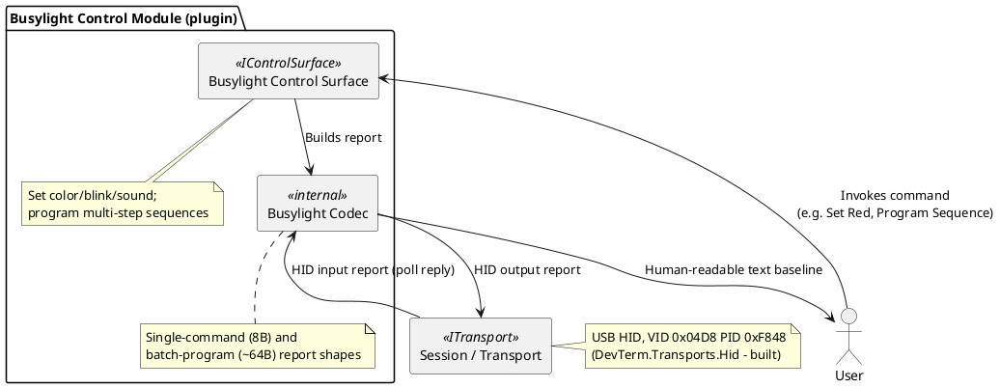
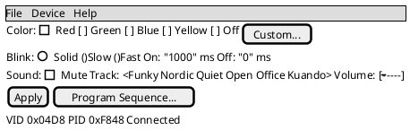

# Proposal: Kuando Busylight — USB HID Status Light Control + Test Device

## Source

- `C:\repo\oobdev\dotex\Incoming\BinaryDecoders\src\OoBDev.Kuando.Busylight\` — a working prior C#
  implementation (structs for the wire format, a real USB trace with request/response pairs), from
  the same local `dotex/Incoming/BinaryDecoders` project as the [EByte proposal](ebyte-e810-dtu-config-protocol.md).

## Device

[Kuando Busylight](https://www.plenom.com/) — a USB RGB status-light device (the kind used to show
Slack/Teams presence), USB HID, VID `0x04D8` PID `0xF848`.

## Why this is a good test device for the new HID transport specifically

This wasn't primarily proposed as a decoder to build — it started as a **real, low-risk device to
verify `DevTerm.Transports.Hid`'s read *and* write paths against**, which was, at the time of
writing, the one thing not yet verified against real hardware (open/write/close had been verified
against a different device; no real inbound HID report had been confirmed flowing through
`HidReadStream`'s background-thread/channel handoff yet, and no write had been confirmed to
actually change anything on a device). **Update, same day — verified live against the plugged-in
device**:

- **Read path**: the poll request below (pre-verified against the source trace's checksum) was
  sent via `dotnet run ... --transport hid --hidvendorid 1240 --hidproductid 63560 --presenter
  hex`, and the device's real ASCII identification reply came back through the full pipeline
  (`HidReadStream`'s background thread → `Channel<byte[]>` → `StreamToPipePump` → `Session` → the
  hex presenter → stdout), byte-for-byte matching the source trace's own reply:

  ```
  > 8f0000...00 060455ffffff03eb   (poll request, 64 bytes, zero-padded)
  < 0001504c454e4f4d3030303030313030303030303031444153414e30303032303131303831373030...
    (ASCII: "0001PLENOM0000010000000 1DASAN0002011081700...") - confirmed live, byte-for-byte
  ```

- **Write path**: the 64-byte batch-program report (also pre-verified against the source trace's
  checksum, "set green" per the source's own comment) sent without error but **visibly did nothing**
  — a real finding, not a transport bug: a report the transport accepts isn't the same as a report
  the device's firmware acts on, and this specific batch/program-mode shape is apparently not
  sufficient on its own (see open questions). The simpler **single-command 8-byte struct**, sent as
  a 9-byte write (report ID `0x00` + the 8 struct bytes, matching the source's own `Class1.cs`
  convention), *did* work — confirmed by directly watching the light change color three times in a
  row (green → blue → correctly back to green → red), with the R/G/B byte order exactly matching
  the documented struct (an 0x00 0x00 0xFF instead of 0x00 0xFF 0x00 genuinely came out blue, not
  green, confirming the byte order rather than a coincidence).

## Protocol summary

**Single-command mode** (8-byte struct, sent as a 9-byte write with a leading `0x00` report-ID
byte — **confirmed working live**, including the R/G/B byte order):

```
NextStep : 1 byte
Repeat   : 1 byte
Color    : 3 bytes (R, G, B)
On       : 1 byte  (on-time, unit unconfirmed)
Off      : 1 byte  (off-time, unit unconfirmed)
Audio    : 1 byte  (packed - see below)
```

**Audio byte packing** (matches the source's own `BusylightAudio` struct exactly):

```
Bit 7   : Play/Mute
Bits 6-3: Track select (0-15; devices vary in how many tracks they support)
Bits 2-0: Volume level (0-7)
```

**Batch/program mode** (64-byte reports, from the real trace): up to six 8-byte step records (each
shaped like the single-command struct above, minus the leading report-ID byte) packed back-to-back,
followed by a trailing 8-byte "commit" record (`06 04 55 ff ff ff <checksum, 2 bytes>`). **Verified**
(not just eyeballed) against four independent trace examples: the checksum is the plain additive
sum of all 62 preceding bytes, stored big-endian — e.g. one example sums to `0x04ED`, and its
trailing two bytes are literally `04 ed`; three other examples with different payloads each check
out the same way.

## Proposed shape



- **No new transport work** — `DevTerm.Transports.Hid` already exists; this is purely a decoder +
  control-surface exercise, and specifically a real-hardware verification opportunity for the read
  path.
- **Two report shapes for one device** (single-command vs. batch-program) is a smaller-scale
  version of the same "one envelope, multiple message shapes" pattern already noted for
  [Radex One](radex-one-protocol.md) and the [EByte proposal](ebyte-e810-dtu-config-protocol.md).

A status light is one of the few devices in this batch where a real GUI control genuinely beats a
text baseline — picking a color by typing R/G/B bytes is exactly the kind of thing a color swatch
does better:



## Open questions

- **Why the batch/program-mode write had no visible effect** despite matching the source trace's
  own checksummed example byte-for-byte and not erroring — plausible explanations: the batch
  format needs a separate "start sequence" trigger the trace didn't capture, the six-steps-plus-gap
  layout assumed here is wrong, or this device/firmware revision simply doesn't support that mode
  the way the source's trace (captured from a possibly different unit) suggests. Needs more
  real-device experimentation before trusting this mode for anything.
- On/Off time units aren't documented in the source — needs a real device to measure against
  (confirmed only that `On=0x01, Off=0x00` produces a solid, non-blinking color).
- Whether the ASCII poll reply's fields (what looks like two concatenated strings, "PLENOM..." and
  "DASAN...") are meaningful device/vendor identifiers worth surfacing, or just fixed firmware
  strings not worth decoding further.
