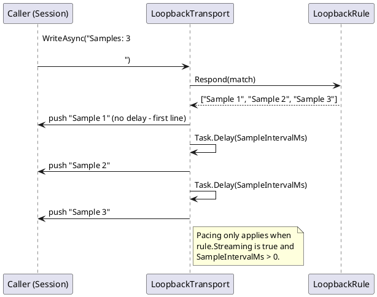

# Loopback sample rate control

Sourced from `BACKLOG.md`'s "Proposed Ideas" section (added 2026-09-30): "for the loopback device,
add a parameter for setting the sample rate to control how fast stream samples are generated."

## Problem

[The Loopback transport](../transports.md#loopback) pushes its `MEAS?`/`Samples: N` responses (and
every other scripted response) back as separate writes with no artificial delay between them — useful
for exercising the UI end-to-end with no hardware, but it means anything that wants to visually verify
*live-arriving* behavior (a `StripChartControl` scrolling in as samples arrive, a Stream Monitor
capture appearing incrementally, a screen recording for the user guide showing a device "streaming")
gets every sample at once instead of at a believable device cadence.

## Design

`LoopbackTransportOptions` is already documented as "currently empty... purely as the natural
extension point for that later" (`transports.md`'s Loopback section) — this proposal is exactly that
"later": add a `SampleIntervalMs` (default `0`, preserving today's instant-delivery behavior so no
existing test or documented behavior changes unless a profile opts in) that the transport's `Samples:
N`/`MEAS?` handling awaits between each pushed line.

- **Surfaced in both front ends' connection editors** as a numeric field, visible only when the
  selected transport is `loopback` — the same transport-conditional `VisibleWhen` section pattern the
  Connection Editor already uses for every other transport's fields (see
  [ui-definitions.md](../ui-definitions.md)'s "Forms from one definition" section, settled answer #1:
  "each transport's fields are one section with a visibility condition").
- **CLI**: a `--loopbacksampleintervalms <N>` flag (or the equivalent `CliOptions` property name),
  following the existing "property names double as CLI flag names" convention
  (`CLAUDE.md`'s Configuration section).
- No change to the transport's command surface (`hello`, `Send Stream:`, `Send Events:`, `MEAS?`,
  `Samples:`, `help`) — this only affects the pacing of already-scripted output, not what's produced.

## Resolved questions

- **The interval paces only naturally multi-line/streaming responses, not every reply.**
  `LoopbackRule` carries a `Streaming` flag; `LoopbackTransport.WriteAsync` only awaits
  `Task.Delay(SampleIntervalMs, ...)` between lines of a rule where `Streaming` is `true` (the
  `Samples: N`/`Send Events: N` rules in `LoopbackScript.Default()`), and never before the first line
  or after the last — a single-line reply like `hello` is never delayed, matching the open question's
  concern.
- **No jitter.** The pacing is a plain, deterministic `Task.Delay` per line — no `Random` involved,
  consistent with the rest of the loopback demo data staying deterministic for screenshot/test
  reproducibility.

## Sequence

## Status

**Implemented (2026-10-01).** `LoopbackTransportOptions.SampleIntervalMs` (default `0`, preserving
instant delivery) paces each pushed line of a `LoopbackRule.Streaming`-flagged response via
`Task.Delay` in `LoopbackTransport.WriteAsync` — never before the first line, never after the last.
Wired end-to-end: `CliOptions.LoopbackSampleIntervalMs` (`--loopbacksampleintervalms`) →
`CliOptionsValidator` (rejects negative values) → `ServiceCollectionExtensions.AddDevTermFrontEnd`
(configures `IOptions<LoopbackTransportOptions>`) → `ConnectionEditorViewModel`'s "Loopback" form
section (a numeric "Sample interval (ms)" field, visible only when `Transport = loopback`) →
`DevTermConfiguration.ToProfileJson` (persisted only when non-zero) → `ConnectionDescription.For()`
(shown as `Loopback (N ms/sample)` in the status bar/window title when set).

Verified by unit tests only (`LoopbackTransportOptionsValidatorTests`, `LoopbackTransportTests`,
`CliOptionsValidatorTests`, `ServiceCollectionExtensionsTests`, `ConnectionEditorFormTests`,
`ConnectionEditorViewModelTests`) — ascertaining this needs no real hardware, since the loopback
transport has none. Not yet verified via a live screen recording/Stream Monitor capture showing the
paced arrival visually (the motivating use case) — that remains a follow-up if/when the user-guide
walkthrough wants a real captured example.
