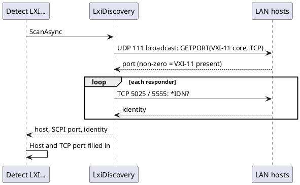

# LXI support

Sourced from `BACKLOG.md`'s "Proposed Ideas" section (added 2026-09-30): "LXI support."

LXI (LAN eXtensions for Instrumentation) is the network-connected-bench-equipment counterpart to
USBTMC/GPIB — most LXI instruments expose raw SCPI over a TCP socket (conventionally port 5025,
sometimes a Telnet-style 5024), VXI-11 (an ONC-RPC-based protocol) for discovery and control, and/or
the newer HiSLIP; discovery is typically mDNS-based (the LXI Discovery Protocol) or VXI-11's own RPC
broadcast.

## What dev-term already covers, unmodified

The common case — an instrument that just speaks SCPI over a raw TCP socket — needs **no new
transport**. [Transports.md](../transports.md)'s existing TCP client mode plus
[`DevTerm.Devices.Scpi`](../features/scpi-instrument-control.md) already do exactly this: connect out
to `host:5025`, send `*IDN?`/whatever profile commands, get a line back. This is the same shape as
GPIB-via-Prologix (`transports.md`'s "Extensibility" section): "most inexpensive adapters... layer a
simple protocol over what the OS sees as a plain serial port or plain TCP socket, so the existing
transports already do the I/O." An LXI instrument with a raw-socket SCPI port is, from dev-term's
point of view, already supported today via `--transport tcp --host <ip> --port 5025` plus an SCPI
profile — this proposal is about the parts that aren't covered yet.

## What's actually new

1. **LXI discovery** — an mDNS-based scan (`_lxi._tcp` service type) or a VXI-11 RPC broadcast, so an
   LXI instrument shows up in a "Detect..." picker the way BLE/HID/USBTMC devices already do
   (`transports.md`'s BLE section: "a live 'Detect...' device picker... populated by a front end
   calling a scanner"), instead of the user needing to already know the instrument's IP. This is the
   highest-value, lowest-risk piece — it only ever populates the *existing* TCP transport's host/port
   fields, touching no I/O path that isn't already shipped and tested.
2. **VXI-11 client support** — for instruments that don't expose (or don't default to) a plain
   raw-socket SCPI port and instead require the ONC-RPC-based VXI-11 protocol for command/response.
   This is a genuinely new, heavier protocol implementation — a Sun RPC client, VXI-11's own framing
   for `device_write`/`device_read` — comparable in shape (a from-scratch binary protocol
   implementation, not a thin wrapper over an existing transport) to the USBTMC transport's own
   dedicated framing work (`usbtmc-transport.md`), just over the network instead of raw USB.

## Recommended phasing

- **Phase 1**: LXI discovery only, feeding the existing TCP transport + SCPI module as-is. No new
  `ITransport`, no new protocol codec — just a scanner and a picker, the smallest possible slice that
  delivers real value (no more manually-typed IPs for LXI gear).
- **Phase 2**: a VXI-11 client, only if/when a real instrument on hand actually needs it rather than
  supporting the simpler raw-socket mode — matching this project's consistent preference for building
  against confirmed real hardware rather than a hypothetical protocol variant (see, e.g., the BYTECC
  proposal's explicit caution about the same, and USBTMC's per-VID:PID quirks table being built only
  from what real hardware actually demanded).

## Open questions

- Whether any of the project's existing bench instruments (currently profiled over serial/USBTMC —
  Rigol/Tektronix/HP gear) actually has a LAN interface at all; none of the existing SCPI profiles
  target one. Needs a real LXI-capable instrument confirmed on hand before Phase 2 is worth starting,
  per this project's real-hardware-grounding convention.
- Whether LXI discovery belongs in `DevTerm.Transports.Tcp` itself or as a separate optional scanner
  component the TCP transport doesn't depend on (mirroring how BLE's scanner is a separate,
  on-demand-invoked piece rather than baked into `BleTransport` itself).

## Completion checklist

What is needed before this proposal can be closed. Tick items as they land, in the same change.

- [x] Confirm a real LXI instrument on the bench: Rigol DG1062Z at 192.168.0.87 (2026-10-02)
- [x] Phase 1: LXI discovery scanner and picker feeding the existing TCP transport and SCPI module (2026-10-03)
- [x] Phase 2: VXI-11 client deliberately not built (2026-10-03): the only LXI instrument on hand speaks raw SCPI; add it when one needs it
- [x] Both front ends, plus `docs/specs/` and `docs/user-guide/` entries (Phase 1 picker)
- [x] Real-hardware pass: see the latest `docs/test/` report for the DG1062Z (discovery plus read-only SCPI over TCP, 2026-10-03)

## Status

**Done 2026-10-03: Phase 1 built; Phase 2 (VXI-11) deliberately deferred until an instrument needs it.** A VXI-11 client would add device_clear, the status byte, SRQs, locking and explicit end-of-message framing; none has been needed on the bench. Discovery is `DevTerm.Transports.Tcp.LxiDiscovery`: it broadcasts an
ONC-RPC portmapper `GETPORT` for the VXI-11 core program to UDP 111 on every up IPv4 interface and keeps hosts that answer with
a non-zero port, then asks each for `*IDN?` on raw ports 5025 and 5555. mDNS (`_lxi._tcp`) was tried first and the DG1062Z
never answered it, so it is not used. Run against the bench network it found the DG1062Z
(`192.168.0.87:5555  Rigol Technologies,DG1062Z,DG1ZA232603118,03.01.12`) and ignored a second host at 192.168.0.67 whose
portmapper answered port 0 (no VXI-11). Surfaces: `--listlxidevices true`, a "Detect LXI..." picker under the TCP section in the
TUI and WPF Connection Editor (`LxiDeviceScanner`, `ConnectionEditorViewModel.SelectedLxiDevice` fills Host and TCP port). Unit
tests cover the request bytes, the real captured reply and the rejects; the scan itself is only hardware-verified.

Earlier note, before Phase 1 (2026-10-02): the Rigol DG1062Z
(`TCPIP0::192.168.0.87::INSTR`, LXI logo on its Utility screen). Probed from the dev machine: **TCP 5555
answers raw SCPI** (`*IDN?` -> `Rigol Technologies,DG1062Z,DG1ZA232603118,03.01.12`), so the existing TCP
transport plus the DG1062Z profile already covers it (`--transport tcp --host 192.168.0.87 --port 5555`);
Rigol uses 5555, not the conventional 5025. TCP 111 (ONC-RPC portmapper, i.e. VXI-11) and 80 (web) are
also open, so a Phase 2 VXI-11 client has a real target. No VXI-11 code exists, by decision.
