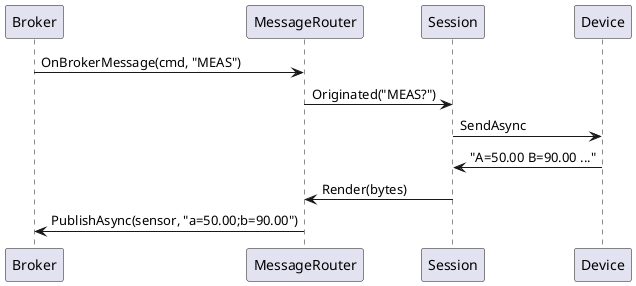
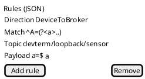

# MQTT / AMQP / STOMP protocol support

Sourced from `BACKLOG.md`'s "Proposed Ideas" section (added 2026-09-30): "Add MQTT, AMQP, STOMP
protocol support — this should enable the ability to receive/route outbound messages but also have
the ability to trigger outbound events on to external services."

## Problem / shape mismatch with today's model

Every transport dev-term has today (serial, TCP, UDP, HID, BLE, and Loopback) is, from `Session`'s
point of view, one connection to one peer producing one byte/message stream (per
[architecture.md](../architecture.md)). MQTT/AMQP/STOMP are message-**broker** protocols instead: one
connection to a broker, N independently-addressable topics/queues/exchanges subscribed at once, each
producing its own stream of discrete messages. This is closer to UDP/BLE's "preserve message
boundaries, don't flatten into one undifferentiated byte stream" precedent
([transports.md](../transports.md)) than to a raw serial/TCP byte stream, but adds a dimension
neither of those has: per-message **topic addressing**, not just message boundaries.

## Design sketch

- **One transport plugin per protocol** (`DevTerm.Transports.Mqtt`, `.Amqp`, `.Stomp`), not one shared
  "broker" abstraction — each protocol's own wire framing, auth model, and addressing concept (MQTT
  topic filters + QoS; AMQP exchange/routing-key/queue; STOMP destination) is different enough that
  collapsing them into one generic `ITransport` would either lose real protocol-specific config or
  need its own leaky abstraction. This matches the existing precedent of one project per transport
  even where two transports are conceptually similar (Serial vs. TCP, or BLE's per-OS adapters behind
  one contract rather than one grab-bag settings type).
- **Inbound** ("receive/route inbound messages"): each subscribed topic's incoming payload is
  delivered to the presenter pipeline as a discrete message carrying its topic/routing key alongside
  the payload bytes — the existing `IPresenter.Render(ReadOnlySequence<byte>)` shape has no place for
  a topic today, so this likely needs either a topic-prefixed text convention (simplest, no interface
  change) or a genuine `Session`/`Pipeline` extension carrying message metadata (bigger change — see
  Open questions).
- **Outbound** ("trigger outbound events... to external services"): publish-to-topic is dev-term's
  existing "send" path, reused as-is (`IPresenterInput`/`TypedInput.TryEncode`, per CLAUDE.md's send
  constraints) with the target topic coming from the profile's default-publish-topic setting or a
  per-command override. Read together with
  [device-control-modules.md](../device-control-modules.md)'s `IControlSurface`, this is really
  "pair a broker transport with the existing control-surface/`UiDefinition` pattern" — a control
  panel's button publishes to a topic instead of writing bytes to a directly-attached instrument — not
  a new interaction pattern, just a new transport underneath the existing one.
- **Library choice** (recommendation, not a commitment): MQTT → `MQTTnet` (mature, widely used .NET
  client); AMQP → depends on which AMQP the target broker actually speaks — 0-9-1 (RabbitMQ's classic
  protocol, `RabbitMQ.Client`) and 1.0 (the OASIS-standardized version, a different wire protocol
  despite the shared name) are not interchangeable, so this needs a confirmed target broker before
  picking a library, not before; STOMP → few strong .NET client options exist, and STOMP's frame
  format is simple enough (text headers + a body, `\x00`-terminated) that a small hand-rolled client
  may be the pragmatic choice, similar in spirit to this project's preference for owning small
  protocols directly (see `device-control-modules.md`'s SCPI-schema rationale) rather than taking a
  dependency for a genuinely small wire format.

## Open questions

- ~~Does topic-addressed traffic need a `Pipeline`/`Session` change?~~ **No** (resolved 2026-10-02): topic-prefixed text, see Status.
- ~~No concrete target broker.~~ **Resolved**: the `containers/` Mosquitto and RabbitMQ brokers; a real device is not needed.
- ~~Are all three protocols wanted?~~ **Built** (MQTT 2026-10-02; AMQP and STOMP 2026-10-03).
- **Owner direction 2026-10-03 (proof of concept built, see "Routing proxy"):** this is meant as a **routing proxy**, not only a device interface. A device message that matches a rule is published to a broker, and an inbound broker message can trigger a device action, with mapping rules in both directions. Presenters must be addable and removable **without reconnecting** the device. It is a proof of concept: no real hardware is needed, and it counts as complete once a message detected over the loopback transport is published to a broker (and the reverse), with the mapping shaped so other profiles can plug in later. Message history across several channels should share one timecode (the clock tick when the message was posted).

## Routing proxy (proof of concept, 2026-10-03)

`DevTerm.Core.Routing` adds a `MessageRouter`: an `IOriginatingPresenter` added to a **live** `Session` (no reconnect). Rules are JSON:

```json
{ "rules": [
  { "direction": "DeviceToBroker", "match": "^A=(?<a>[0-9.]+) B=(?<b>[0-9.]+)", "topic": "devterm/loopback/sensor", "payload": "a=${a};b=${b}" },
  { "direction": "BrokerToDevice", "topic": "devterm/loopback/cmd", "match": "^(?<cmd>[A-Za-z]+)$", "send": "${cmd}?" }
] }
```

- **Device to broker:** `match` is a regex over each device line; named groups fill `${name}` in `topic` and `payload` (default payload: the whole line). The first matching rule publishes through an `IMessageSink`.
- **Broker to device:** `topic` is an exact topic or a trailing-`#` prefix; `match` runs over the payload text; `send` (plus the terminator) goes to the device via `Originated`.
- **Timecode:** every routed message lands in `MessageRouter.History` stamped from one `TimeProvider`, so channels share a clock.
- **Tested** over the loopback transport with an in-memory broker (`MessageRouterTests`): a broker `MEAS` becomes a device `MEAS?`, and the sample reply is published back. Not yet wired to the real MQTT/AMQP/STOMP connections or a front-end UI.





## Completion checklist

What is needed before this proposal can be closed. Tick items as they land, in the same change.

- [x] Identify a concrete target for MQTT (the `containers/` Mosquitto broker; no real device yet)
- [x] Resolve the per-topic routing question for MQTT: topic-prefixed text (`topic<TAB>payload`), no `Session`/`Pipeline` change
- [x] MQTT transport design and unit tests (`DevTerm.Transports.Mqtt`, 10 unit tests)
- [x] MQTT in both front ends, plus `docs/specs/` and `docs/user-guide/` entries
- [x] MQTT real-broker verification (Mosquitto container: an automated Integration test and a CLI round trip)
- [x] AMQP 0-9-1 and STOMP 1.2 (`DevTerm.Transports.Brokers`, one project for both; reuse the generic `--subscribe`/`--publish`/`--username`/`--password` options), verified against the Docker RabbitMQ
- [x] Routing proxy proof of concept over loopback (rules, router, live add, shared timecode)
- [ ] Wire the router to a real broker connection and a front-end rule editor
- [ ] A real device or home-automation broker check for MQTT

## Status

**MQTT implemented 2026-10-02; AMQP and STOMP implemented 2026-10-03.** `DevTerm.Transports.Mqtt` (MQTTnet 5.x) turns each
inbound message into one `topic<TAB>payload` line and publishes a typed line to `--publish`, or to its own topic when
typed as `topic<TAB>payload`, so no `Session`/`Pipeline` change was needed. Verified against the `containers/`
Mosquitto broker (Integration test plus a CLI round trip); no real device or TLS broker yet. The connection options
are deliberately unprefixed (`--subscribe`, `--publish`, `--username`, `--password`) so AMQP and STOMP reuse them.
The password is command-line/environment only: never saved to a profile or shown in the editor. Not yet built: TLS,
MQTT 5 properties, retained/will messages.

**AMQP and STOMP** share `DevTerm.Transports.Brokers` (one project rather than the one-plugin-per-protocol split proposed
above, because both reduce to the same `IBrokerConnection` shape: connect, subscribe to an address, publish to an
address). The same `address<TAB>payload` line model applies: the address is an AMQP routing key (bound to the
`amq.topic` exchange through a private auto-delete queue) or a STOMP destination (`/topic/x`, `/queue/x`). AMQP uses
RabbitMQ.Client 7 (0-9-1 only; AMQP 1.0 is not supported). STOMP is a small hand-written 1.2 client (`StompFrame`
encoder/parser, no heart-beats, auto-ack) since no maintained .NET client was worth a dependency. Verified against the
`containers/` RabbitMQ: Integration tests for both, a wrong STOMP password failing the open, and a CLI round trip each.
TLS (`--tls true`, optional `--cacertificate <file>` for a private CA) is built for both and verified against the
`containers/` RabbitMQ's TLS listeners (AMQPS 5671, STOMP 21614) with a generated CA: a client trusting the CA connects,
one that does not is refused. Not built: TLS for MQTT, STOMP heart-beating and client acks, AMQP 1.0, durable queues.
