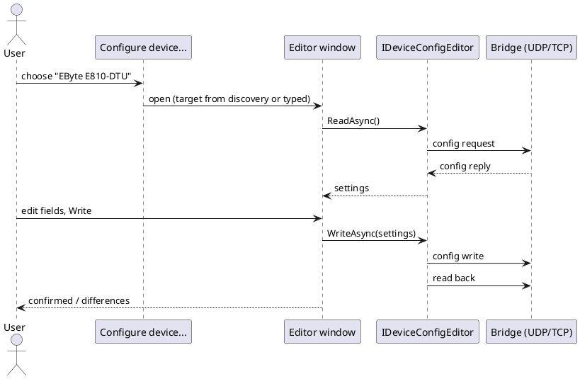
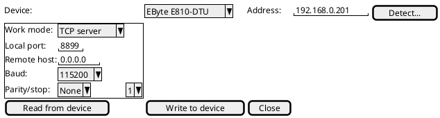

# Proposal: In-app configuration editors for network bridges (USR-TCP232-302, EByte E810-DTU)

## Problem

Changing a bridge's own settings (its IP, work mode, serial baud/parity, remote host/port, heartbeat) currently needs
the vendor's Windows tool. The EByte E810-DTU's UDP configuration protocol is documented in
[ebyte-e810-dtu-config-protocol.md](ebyte-e810-dtu-config-protocol.md) and the USR-TCP232-302 is used daily.

## Direction (2026-10-03)

- A **Device > Configure device...** menu (WPF and TUI) lists the available configuration editors, *USR-TCP232-302*
  and *EByte E810-DTU*, built on one `IDeviceConfigEditor` seam (`ReadAsync` returning a typed settings object,
  `WriteAsync(settings)`, validation, a "reboot required" flag) so more devices can plug in.
- Each editor is a generated form (`DevTerm.UiDefinitions`, the same machinery as the control panel) with **Read from
  device**, **Write to device** and **Reload**. Writes are never automatic; the form shows what changed first.
- The target comes from [network discovery](network-device-discovery.md) or a typed address, and is independent of any
  open session (the EByte protocol is UDP).
- Safety: a write that changes the device's IP, or the port dev-term is connected through, warns that the connection
  will drop; a read-back after the write confirms the change.
- Verification: each editor is unverified until read and written against the real bridge (the 192.168.0.110 USR bridge,
  and an E810 when one is on the bench), logged under `docs/test/`.

## Open questions

- The USR-TCP232-302's configuration channel (its setup protocol versus the HTTP page) and which to use.
- The E810's byte-count discrepancy noted in its proposal must be settled against a fresh capture before writing.
- Whether editors live in `DevTerm.Devices.*` projects or as device manifests with a config UI.

## Completion checklist

- [x] `IDeviceConfigEditor` seam and the shared read/review/write/read-back flow (`DeviceConfigSession`, `DevTerm.Core.Control`, 2026-10-08, unit-tested with a fake editor)
- [x] Device > Configure device... menu (WPF + TUI); it lists registered editors (built 2026-10-09, tested with a fake editor, no real editor yet)
- [ ] EByte E810-DTU editor
- [ ] USR-TCP232-302 editor
- [ ] Spec + user guide with real captures; bench report under `docs/test/`

## Status

Proposed 2026-10-03. 2026-10-08: the seam is built (`IDeviceConfigEditor`, `DeviceConfigSession`: values as id-keyed strings, change list shown before any write, IP/port-change connection-drop warning, validation, read-back comparison); no editor yet, blocked on a fresh capture of each device. 2026-10-09: the web Profiles page has the Configure device section (read, review changes, write, read-back check) driven by any registered editor, tested with a fake one; the TUI and WPF Device > Configure device... screens are built too, over a shared `DeviceConfigViewModel`, tested with the fake editor.
