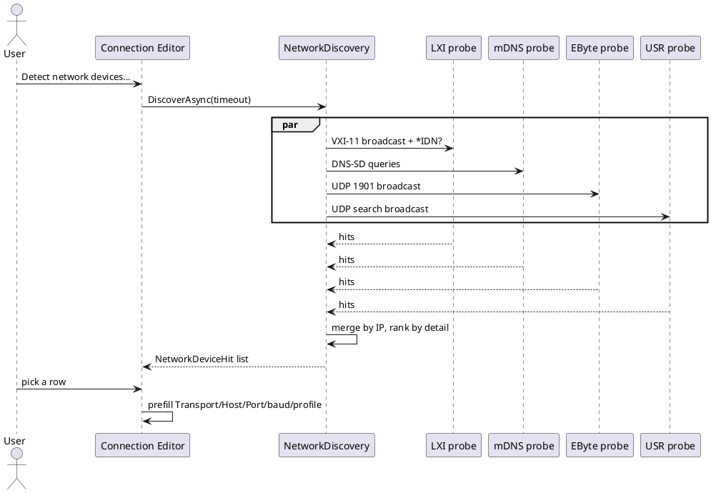
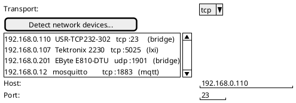

# Proposal: Network device discovery ("Detect network devices")

## Problem

The Connection Editor's TCP **Detect LXI...** button finds only LXI instruments (VXI-11 portmapper broadcast, then
`*IDN?` on raw ports 5025/5555; see [lxi-support.md](../features/lxi-support.md)). The network also holds
serial-to-Ethernet bridges (USR-TCP232-302, EByte E810-DTU), RFC 2217 servers, MQTT/AMQP brokers and anything that
announces itself over mDNS/DNS-SD or SSDP. The button should list any network device it can identify, and picking one
should pre-fill what was learned.

## Direction (2026-10-03)

- One **Detect network devices...** action replaces **Detect LXI...**. It runs a set of pluggable probes in parallel
  and merges the answers by IP address into one list.
- Each probe implements `INetworkDeviceProbe` and returns `NetworkDeviceHit` records: address, optional hostname,
  service/port, a kind (`lxi`, `usr-tcp232`, `ebyte-e810`, `rfc2217`, `mqtt`, `unknown`), a display name, and a
  suggested transport + values (host, port, baud, profile/device manifest).
- Probes: the existing LXI one (VXI-11 + raw SCPI `*IDN?`); **mDNS/DNS-SD** (`_scpi-raw._tcp`, `_lxi._tcp`,
  `_http._tcp`, `_telnet._tcp`, ...); **SSDP**; the **EByte UDP broadcast** (port 1901, see
  [ebyte-e810-dtu-config-protocol.md](ebyte-e810-dtu-config-protocol.md)); the **USR search broadcast** (the vendor
  tool's UDP "search" packet, to be confirmed against a capture); and an optional TCP port sweep of a chosen subnet
  (off by default: slow and noisy).
- Probes that need a real device to verify (USR, EByte) ship **unverified** until a capture or bench run confirms
  them. mDNS got no reply from the real LXI instruments earlier, so its value is per-network; it is one probe among
  several, not the only one.
- Choosing a hit pre-fills the editor: Transport, Host, Port and, where known, baud/parity (from the bridge's own
  config), the device manifest/SCPI profile (from `*IDN?`), and the profile name. Nothing is written until Save.
- CLI: `--listnetworkdevices true` (`--listlxidevices` stays as the LXI-only subset).

## Open questions

- Which of mDNS/SSDP/USR-search answer on the bench devices at all (each probe records what it verified).
- Subnet choice when several adapters exist (default: every up, non-loopback IPv4 adapter).
- Whether a hit with several services (a bridge with HTTP and a data port) is one row or several.

## Completion checklist

- [x] `INetworkDeviceProbe`/`NetworkDeviceHit` in a shared library; LXI discovery wrapped as the first probe (2026-10-08, `DevTerm.Configuration.Discovery`)
- [x] mDNS/DNS-SD probe (2026-10-08, fake-response tests only)
- [x] SSDP probe (2026-10-08, fake-response tests only)
- [ ] EByte UDP probe (needs a fresh capture first)
- [ ] USR search probe (needs a capture first)
- [x] `--listnetworkdevices true` in the CLI (2026-10-08)
- [x] Connection Editor: "Detect network devices..." in WPF and TUI (2026-10-08); it fills Host and Port only, the transport stays `tcp`, so the richer per-kind prefill (vxi11 transport, USR/EByte settings) is still open
- [ ] Spec (`docs/specs/connection-editor.md`) and user guide updated with real captures

## Status

Proposed 2026-10-03. Built 2026-10-08: the probe interface, LXI/mDNS/SSDP probes, merge-by-IP and `--listnetworkdevices`. Run on the bench LAN it listed a Brother printer and a NAS (mDNS) and the DG1062Z (LXI); the DG1062Z answered neither mDNS nor SSDP, and SSDP found nothing. Not yet built: the Connection Editor button, the EByte and USR probes. Replaces the LXI-only button when built.
