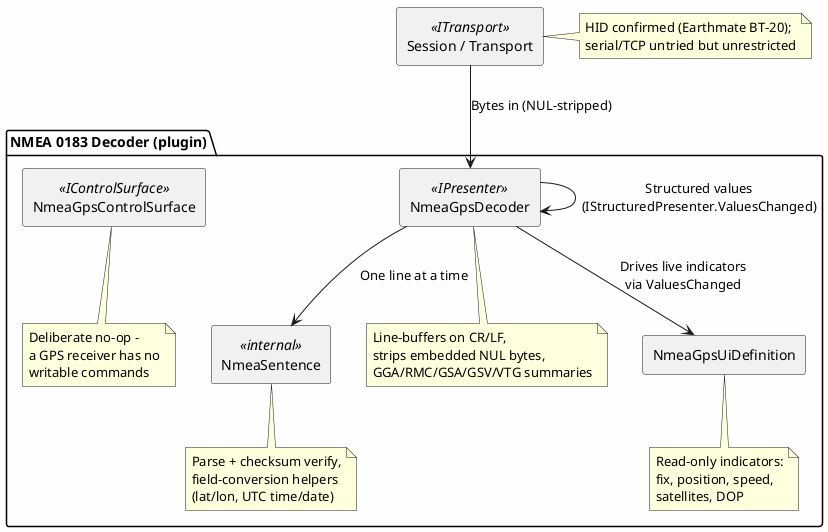

# Proposal: NMEA 0183 GPS Sentence Decoder

## Source

Unlike the other proposals in this directory, this one has no `mwwhited-notes/shared` prior-art
entry — NMEA 0183 is a decades-old, openly published marine/GPS electronics standard, not a
reverse-engineered protocol. The one physical unit this repo currently targets is a DeLorme
Earthmate GPS BT-20 (USB HID, VID 0x1163/PID 0x0200) — real-world facts (VID/PID, 12-channel,
NMEA 2.0-compliant) confirmed via web search; the exact HID report framing was not (no unit was on
the bench this session — see "Status" below).

## Device / protocol

NMEA 0183 is a plain-ASCII, line-based sentence protocol, not tied to any one receiver or
transport — many GPS units (serial, USB HID, Bluetooth SPP) emit the exact same sentence shapes.
**The decoder itself is deliberately generic protocol logic, not device-specific code** — the
DeLorme Earthmate GPS BT-20 is only the one confirmed-compatible physical unit; nothing in
`NmeaSentence`/`NmeaGpsDecoder` assumes anything about it beyond "emits standard NMEA 0183
sentences." The only device-specific part anywhere in this codebase is the VID/PID gate that
decides when the Device menu offers the panel (`DevicePanels.Nmea0183`, `src/DevTerm.Configuration/
DevicePanels.cs`) — the decoder, control surface, and UI definition would work unmodified against
any other NMEA 0183 GPS receiver.

**Sentence shape**: `$<talker><type>,<field>,<field>,...*<checksum>\r\n` — a `$`, a two-letter
talker id (`GP` for GPS) plus a three-letter sentence type, comma-separated fields, an optional
`*<hh>` checksum (XOR of every character between `$` and `*`, as two uppercase hex digits), then
CR/LF. This proposal covers five well-known sentence types: GGA (fix data), RMC (recommended
minimum: position/speed/course/date), GSA (DOP and active satellites), GSV (satellites in view),
VTG (course/speed over ground). Any other sentence type is passed through as raw
`<type>: <fields>` text rather than dropped.

## Why this is a good decoder candidate

- **Pure printable ASCII, self-delimiting on CR/LF** — no binary framing, no length field, easy to
  buffer/resync a line at a time the same way `AsciiPresenter` already does for plain text devices.
- **A real, independently checkable checksum** — unlike DE-5000's checksum-free framing, a mismatch
  is detectable and surfaced (`[checksum mismatch]` suffix) rather than silently trusted.
- **One decoder, arbitrarily many receivers** — the same "protocol, not device" shape as Radex One
  and DE-5000's chipset-level reuse, but even more general here since NMEA 0183 itself, not just one
  chipset's output, is the open standard.

## Proposed shape

## Status

Implemented (2026-09-26): `DevTerm.Devices.Nmea` — `NmeaSentence` (internal parse/checksum/field-
conversion helpers), `NmeaGpsDecoder` (`IPresenter`/`IStructuredPresenter`, GGA/RMC/GSA/GSV/VTG
summaries plus structured values for a control panel's live indicators), `NmeaGpsControlSurface`
(a deliberate no-op — read-only device), and `NmeaGpsUiDefinition` (read-only indicators: fix
quality/type, position, speed, course, satellite counts, DOP). Wired into both front ends' Device
menu ("NMEA 0183..."), gated on the confirmed VID/PID (`DevicePanels.Nmea0183`). Unit-tested
(`tests/DevTerm.Devices.Nmea.Tests`) against real, independently-computed-checksum sentence
literals; **not yet verified against the real Earthmate BT-20** — an opt-in
`RealHardwareEarthmateBt20Tests` exists (`TestCategory=Integration,Hid,Delorme_EarthmateBt20,
Hardware`) but no unit was available to run it this session.

## Open questions

- **The Earthmate BT-20's exact HID report framing** (report length, whether byte 0 is a constant
  report-ID byte the way it is for `K8055Decoder`/`BusylightDecoder`) is unconfirmed. The decoder
  defensively strips every `0x00` byte before line-buffering rather than assuming a specific report
  length or fixed report-ID position (NMEA sentences are pure printable ASCII, so an embedded NUL
  can only be HID padding) — see `NmeaGpsDecoder`'s remarks. This needs a real capture to confirm;
  until then it's a reasoned assumption, not a verified fact.
- Whether a serial- or TCP-attached NMEA receiver is worth its own `DevicePanels` gate (currently
  only the HID VID/PID path is gated) once one is available to confirm against — the decoder itself
  needs no change either way.
- `NmeaSentence.FormatUtcDate`'s `ddmmyy -> 20yy-mm-dd` conversion always assumes the 21st century;
  this is a known, documented simplification (NMEA 0183's two-digit year has no other information
  to disambiguate), not a bug to fix.
