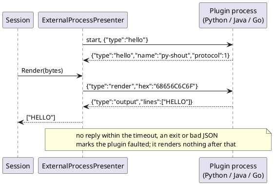
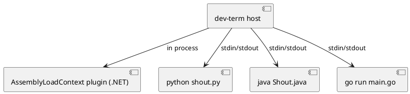

# Out-of-process plugins (any language)

Owner direction (2026-10-03): plugin isolation should allow plugins written in other languages, hosted out of process.
The in-process `AssemblyLoadContext` loader ([plugin-model.md](../plugin-model.md)) stays for .NET plugins; this is
the second path for everything else.

## Shape

- A plugin is a **program**: the host starts it as a child process and talks JSON lines over its stdin/stdout. Stdio
  was chosen for the prototype because every language can do it with no library and no port; the named-pipe and
  localhost-web-service options in [cross-process-control-channel.md](cross-process-control-channel.md) remain open
  for plugins that outlive one host.
- **Protocol 1** (one JSON object per line, one reply per request):
  - `{"type":"hello"}` is answered by `{"type":"hello","name":"...","protocol":1}`.
  - `{"type":"render","hex":"414243"}` (the received bytes) is answered by `{"type":"output","lines":["..."]}`.
- **The host never trusts the child.** Every request waits at most the reply timeout. A child that will not start,
  stays silent, exits, or answers malformed JSON is marked faulted (`FaultReason`) and renders nothing from then on;
  the session and the other presenters carry on. A failed handshake throws from `StartAsync`.
- stderr is the plugin's own log and is drained so it can never block the child.
- Today only presenters are covered (`ExternalProcessPresenter : IPresenter`). Transports and device modules over the
  same protocol are not designed.

## Examples

`examples/plugins/python/shout.py` (upper-cases text), `examples/plugins/java/Shout.java` (single-file, counts bytes),
`examples/plugins/go/main.go` (reverses text).

## Open questions

- Trust and signing for third-party programs: an out-of-process plugin runs with the user's rights, isolation only
  protects the host's stability, not the machine.
- Discovery and packaging: a `plugin.json` naming the command line, next to the existing in-process manifests.
- Render is synchronous on the session's read loop, so a slow plugin delays reading up to the reply timeout; a
  per-plugin timeout default and an async path are undecided.
- Binary or high-rate plugins: JSON-with-hex is fine for text devices, wasteful for bulk streams.

## Completion checklist

- [x] Host presenter (`ExternalProcessPresenter`) with handshake, reply timeout and fault handling
- [x] Python and Java examples verified through the host; tests for a silent and a dying plugin
- [ ] Go example run (needs a working `go`; the one on this machine is a container shim)
- [ ] `plugin.json` discovery of out-of-process plugins in `PluginLoader`
- [ ] Transport and device-module variants
- [ ] Signing and trust model

## Status

Built 2026-10-03 and tested against real child processes (`ExternalProcessPresenterTests`, Integration): Python and
Java pass; the Go case is Inconclusive here, so the Go example is written but unrun. Not yet loaded through
`PluginLoader` or selectable from a front end.
