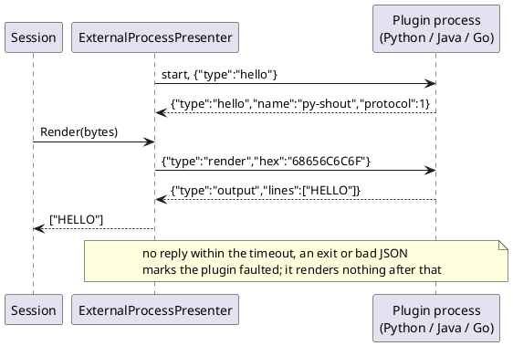
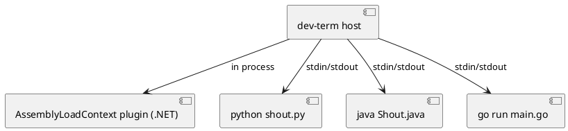

# Out-of-process plugins (any language)

Owner direction (2026-10-03): plugin isolation should allow plugins written in other languages, hosted out of process.
The in-process `AssemblyLoadContext` loader ([plugin-model.md](../plugin-model.md)) stays for .NET plugins; this is
the second path for everything else.

## Shape

- A plugin is a **program**: the host starts it as a child process and talks JSON lines over its stdin/stdout. Stdio
  was chosen for the prototype because every language can do it with no library and no port; the named-pipe and
  localhost-web-service options in [cross-process-control-channel.md](cross-process-control-channel.md) remain open
  for plugins that outlive one host.
- **Protocol 1** (one JSON object per line, one reply per request):
  - `{"type":"hello"}` is answered by `{"type":"hello","name":"...","protocol":1}`.
  - `{"type":"render","hex":"414243"}` (the received bytes) is answered by `{"type":"output","lines":["..."]}`.
- **The host never trusts the child.** Every request waits at most the reply timeout. A child that will not start,
  stays silent, exits, or answers malformed JSON is marked faulted (`FaultReason`) and renders nothing from then on;
  the session and the other presenters carry on. A failed handshake throws from `StartAsync`.
- stderr is the plugin's own log and is drained so it can never block the child.
- Today only presenters are covered (`ExternalProcessPresenter : IPresenter`). Transports and device modules over the
  same protocol are not designed.

## Examples

`examples/python/out-of-process-plugin/` (upper-cases text), `examples/java/out-of-process-plugin/` (single-file, counts
bytes), `examples/go/out-of-process-plugin/` (reverses text); each folder has a README.

## Open questions

- Trust and signing for third-party programs: an out-of-process plugin runs with the user's rights, isolation only
  protects the host's stability, not the machine.
- Discovery and packaging: a `plugin.json` naming the command line, next to the existing in-process manifests.
- Render is synchronous on the session's read loop, so a slow plugin delays reading up to the reply timeout; a
  per-plugin timeout default and an async path are undecided.
- Binary or high-rate plugins: JSON-with-hex is fine for text devices, wasteful for bulk streams.

## Completion checklist

- [x] Host presenter (`ExternalProcessPresenter`) with handshake, reply timeout and fault handling
- [x] Python, Java and Go examples verified through the host; tests for a silent and a dying plugin
- [x] Go example run through the host (go 1.27.1, 2026-10-03)
- [x] `plugin.json` discovery of out-of-process plugins in `PluginLoader` (a `process` entry instead of an `assembly`; 2026-10-03)
- [ ] Transport and device-module variants
- [x] Trust model: user approval before a plugin program runs, optionally remembered per content hash (no signing; 2026-10-03)

## Status

Built 2026-10-03 and tested against real child processes (`ExternalProcessPresenterTests`, Integration): Python, Java
and Go all pass (Go run with go 1.27.1 once installed; each case is Inconclusive when its toolchain is missing). Also found by
`PluginLoader` (2026-10-03): a `plugin.json` with a `process` entry (`command`, `arguments`, `replyTimeoutMs`; `{folder}` expands to the plugin folder)
registers a presenter that starts its program lazily on first use (`LazyExternalPresenter`). It runs only after approval (`PluginTrust`): the console asks
`y`/`a`/`N` before the UI starts (never when input is redirected), WPF asks in a dialog (Yes = always, No = this time, Cancel = don't run). "Always" stores a SHA-256
of every file in the plugin folder in `plugin-approvals.json` under the dev-term home, so an unchanged plugin isn't asked about again and any edit asks again.
With no approver (a script) only remembered approvals run, and `--listplugins` shows "needs your approval". Covered by `PluginTrustTests` (unit) and a real
Python run through the loader (`PluginTrustProcessTests`, Integration). Example: `examples/python/out-of-process-plugin/plugin.json`. Not built: the TUI has no
in-app prompt (it uses the console one at startup), a screen to review or revoke approvals, and transport/device-module variants.
