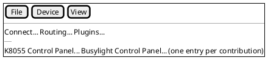

# Plugin-contributed control panels and menu entries

The in-process plugin loader ([plugin-model.md](../plugin-model.md)) lets a plugin register presenters and transports, but
nothing else. The device projects (K8055, Busylight, SCPI, De5000, ZoomH4n, RadexOne, NMEA) stay compiled into the core
because `TuiMode`, `MainWindow` and `WebHost` reference them directly for their control-panel menu items. Until a plugin
can contribute a panel, those decoders cannot move into plugin folders (`TODO.md` item 5).

## Shape

`IPluginModule` gains an optional second contract, registered through DI like everything else, so a module that only adds
presenters is unchanged:

```csharp
public interface IDevicePanelContribution
{
    string Id { get; }              // "k8055"
    string MenuTitle { get; }       // "_K8055 Control Panel..."
    string PresenterName { get; }   // the structured presenter that feeds indicators ("k8055")
    UiDefinition BuildDefinition();
    IControlSurface CreateSurface(Session session);
}
```

Front ends resolve `IEnumerable<IDevicePanelContribution>` and build the Device menu from it instead of one hand-written
menu item per device. The panel itself is already generic (`UiDefinition` rendered by `ControlPanelMode`,
`ControlPanelWindow` and `/panel`), so nothing else in the front ends changes.

```plantuml
@startuml
interface IPluginModule
interface IDevicePanelContribution {
  Id; MenuTitle; PresenterName
  BuildDefinition(): UiDefinition
  CreateSurface(Session): IControlSurface
}
component "K8055 plugin folder" as K
component "PluginLoader" as L
component "TuiMode / MainWindow / WebHost" as F
K ..|> IPluginModule
K --> IDevicePanelContribution : registers
L --> K : loads
F --> IDevicePanelContribution : menu + panel
@enduml
```



## Open questions

- ~~Does a contribution also carry its `ScpiInstrumentPicker`-style dialogs, or is that a second contract?~~ Decided 2026-10-08: a second contract, `IInstrumentPanelProvider` (a data-driven picker with auto-detect and generic choices), and SCPI moved to a plugin through it.
- Plugin folders are loaded per profile or globally? Today it is global (`--plugins`); a panel menu entry for a plugin
  whose device is not selected would be noise, so likely filter by the selected presenter.

## Completion checklist

- [x] `IDevicePanelContribution` in `DevTerm.Core` with unit tests for the menu build (`TuiPluginPanelsTests`, `MainWindowPluginPanelsTests`).
- [x] TUI, WPF and web resolve contributions instead of naming device projects (verified 2026-10-08: no hand-written K8055/Busylight items remain; the TUI and WPF list every registered contribution). Web `Web:Panel` also accepts a contribution id (resolved in `WebHost.Build`).
- [x] K8055 and Busylight moved to plugin folders as the first two cases. Half done: each device project now registers an `IDevicePanelContribution` (`K8055PanelContribution`, `BusylightPanelContribution`) and the web host resolves them by id instead of naming the device projects; the TUI and WPF hand-written K8055/Busylight items are gone and both front ends list every contribution, so the remaining step is only moving the projects into plugin folders.
- [x] Remaining decoders moved; core, Configuration and the front ends no longer reference any `DevTerm.Devices.*` project (SCPI was last, 2026-10-08, as `IInstrumentPanelProvider` in `plugins/scpi`).
- [x] Specs and user guide updated for the menu (`tui-main-screen.md`, `wpf-main-window.md`, `device-control-panels.md`).

## Status

Update 2026-10-08: SCPI is now a plugin (`plugins/scpi`) behind `IInstrumentPanelProvider`; the TUI, WPF and CLI reach it through `InstrumentPanelProviders`/DI, and core, Configuration and the front ends reference no `DevTerm.Devices.*` project. Unit-tested (`ScpiInstrumentPanelProviderTests`, TUI and WPF menu tests); not re-run against the real instruments.

Contract built; TUI and WPF add one Device-menu entry per registered contribution, enabled when connected and `IsAvailable(transport, vendorId, productId)` is true. Verified by unit tests only (a sample contribution wrapping the K8055 panel); no real plugin folder ships a contribution yet, and the web path is untested with a real contribution (no plugin DLL in the test setup). Built-in panels are untouched.
