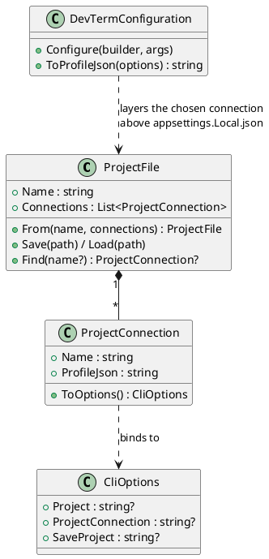
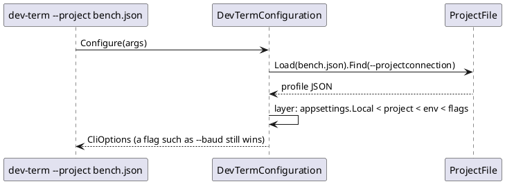

# Project (workspace) state: save and restore connections

**Decided 2026-10-03:** a project holds connection state only (each connection's profile, which already carries the
presenter and parser choices), and is reopened only when asked. Nothing restores automatically on launch.

## Shape

A project is one JSON file: a name and a list of connections, each a name plus the same connection-relevant profile JSON
a saved profile holds (`DevTermConfiguration.ToProfileJson`). Reusing that shape means every transport, presenter
choice and line ending already round-trips, and a connection can be pasted between a profile file and a project.

```json
{ "Name": "Bench", "Connections": [ { "Name": "Scope", "Profile": { "Transport": "tcp", "Host": "192.168.0.110", "Port": "23", "Presenter": ["ascii"] } } ] }
```





## Status

Built 2026-10-03, verified with unit tests and a real console run:

- `ProjectFile`/`ProjectConnection` (`DevTerm.Configuration`), with round-trip, lookup, bad-input and layering tests.
- `--project <file> [--projectconnection <name>]` opens one connection of a project (the first by default) in every
  front end, as a layer under environment variables and flags. A missing or invalid file is reported at startup.
- `--saveproject <file>` writes this run's connection as a one-connection project and exits.

## Completion checklist

- [x] File format and library (`ProjectFile`)
- [x] `--project` / `--projectconnection` / `--saveproject`
- [ ] TUI and WPF **File > Save Project...** and **Open Project...**, saving every open session tab (the multi-session UI exists; this opens one tab per connection)
- [ ] Send history, Stream Monitor/log settings and window layout in the file (connection-only for now)
- [ ] Web host: use the same file as its connection set (see [web-tunnel-blazor-frontend.md](web-tunnel-blazor-frontend.md))
