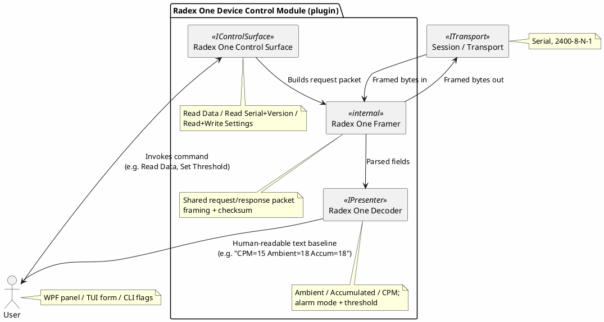

# Proposal: Radex One Geiger Counter — Protocol Decoder + Control Surface

## Source

This proposal is derived from an existing (separate) project tracked in the
[`mwwhited-notes/shared`](https://github.com/mwwhited-notes/shared) repository — Matt's personal
technical notebook, a git submodule of the `notes` wrapper repo, unrelated to this codebase except
as prior art:

- [`shared/projects/radex-one-protocol-reverse-engineering/README.md`](https://github.com/mwwhited-notes/shared/tree/main/projects/radex-one-protocol-reverse-engineering) — complete, finished protocol reverse-engineering writeup (status: **Completed**)

Unlike the SCPI proposal (planning-stage, no wire format yet), this source project is a finished
reverse-engineering effort with a fully documented binary framing, checksum, and four command
types — it can be implemented directly against the spec below without further protocol research.

## Device

[Radex One](https://quartarad.com/product/radex-one/) — a portable USB geiger counter from
Quarta, exposed as a USB virtual COM port. Serial parameters: 2400 baud, 8-N-1.

## Why this is a good first protocol decoder

- **Fully specified, symmetric framing** — request and response share one packet shape
  (prefix, type, length, packet number, reserved, checksum, variable extension), just with
  different prefix bytes (`7B FF` outbound, `7A FF` inbound) and type codes. A single framing
  parser covers both directions.
- **Both halves of a device control module already exist in the source**: a decoder (Read Data,
  Read Serial/Version) *and* a control surface (Write Settings — alarm mode + threshold), so this
  doubles as a second worked example for [device-control-modules.md](../device-control-modules.md)
  alongside the SCPI proposal, but for a genuinely binary, non-textual protocol.
- **Small and self-contained** — four command types, no chaining, no composite/multi-channel
  demuxing needed — a reasonable first real (non-toy) protocol decoder to validate the
  `IPresenter`/decoder contract shape against, before tackling something as involved as Favero's
  bitfield-packed telemetry (see the sibling proposal) or a standard like Modbus.

## Protocol summary (full detail in the source doc)

**Packet shape** (both directions):

```
Prefix          : 2 bytes  (0x7B 0xFF outbound / 0x7A 0xFF inbound)
Type            : 2 bytes  (request/response code, little-endian pair)
Extension Length: 2 bytes  (LE)
Packet Number   : 2 bytes  (LE)
Reserved        : 2 bytes  (0x00 0x00)
Checksum        : 2 bytes  (FFFF - sum(Prefix..Reserved) % FFFF)
Extension       : variable, per command type
```

**Command types:**

| Code | Name | Direction | Notes |
|---|---|---|---|
| `0x00,0x08` | Read Data | Query → reply | Returns ambient, accumulated, CPM (all LE 16-bit) |
| `0x01,0x00` | Read Serial/Version | Query → reply | Variable-length reply, e.g. `SN: 180620-0840-008344 v1.8` |
| `0x02,0x08` | Write Settings | Command → ack | Sets alarm mode (vibration/audio) + threshold; **must be sent 3× for the device to accept it** |
| `0x01,0x08` | Read Settings | Query → reply | Reads back current alarm mode + threshold |

The 3×-repeat-to-confirm quirk on Write Settings is the kind of real-device gotcha worth carrying
into the control-surface implementation directly (a naive one-shot "Set Threshold" command would
silently not take effect).

## Proposed shape



- **Framer is shared, not duplicated per command** — request/response packets share one
  prefix+type+length+packetnum+reserved+checksum shape; a single internal framer parses/builds
  that envelope, with each of the four command types supplying just its own extension
  layout — this is the same "shared envelope, per-message extension" shape a lot of binary device
  protocols have, so it's a reasonable candidate for whatever generic binary-framing helper
  emerges in `DevTerm.Core` as more decoders are added (currently none exists — decoders haven't
  been built yet).
- **Checksum validation belongs in the framer**, not the decoder — a response failing checksum
  should surface as a transport-level anomaly (dropped/garbled bytes), not get to the decoder as
  malformed data.
- Whether this maps to [Kaitai Struct](https://kaitai.io/) for the binary layout (mentioned as a
  candidate direction in [presenters.md](../presenters.md)'s open questions, via
  [device-control-modules.md](../device-control-modules.md)) is worth prototyping here first — the
  format is simple and fully known, so it's a low-risk place to try a `.ksy` definition against a
  real device before committing to that tooling more broadly.

## Open questions

- Whether the 3×-repeat-on-write behavior should be handled generically (an `IControlSurface`
  "repeat N times, no reply-based confirmation" command mode) or is Radex-One-specific glue inside
  this module — it's plausible other simple embedded devices have similar no-ack-just-retry
  command patterns.
- Whether "Read Data" should be a one-shot query (as the source protocol treats it) or polled on
  an interval to behave like a live telemetry stream for a future rendering presenter/plot — the
  device itself doesn't push data unsolicited, so any "live" view means dev-term driving the polling.
