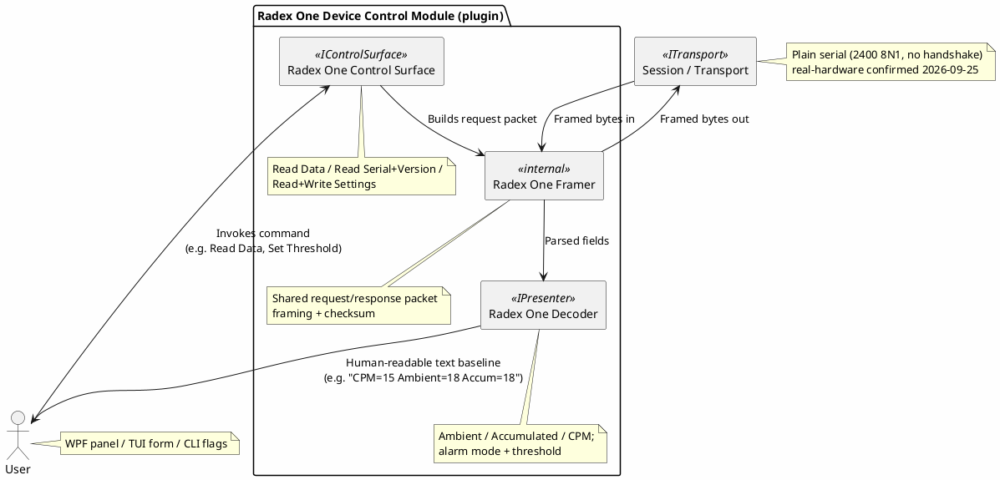

# Proposal: Radex One Geiger Counter — Protocol Decoder + Control Surface

## Source

This proposal is derived from an existing (separate) project tracked in the
[`mwwhited-notes/shared`](https://github.com/mwwhited-notes/shared) repository — Matt's personal
technical notebook, a git submodule of the `notes` wrapper repo, unrelated to this codebase except
as prior art:

- [`shared/projects/radex-one-protocol-reverse-engineering/README.md`](https://github.com/mwwhited-notes/shared/tree/main/projects/radex-one-protocol-reverse-engineering) — complete, finished protocol reverse-engineering writeup (status: **Completed**)

This source project is a finished reverse-engineering effort with a fully documented binary
framing, checksum, and four command types. **2026-09-25: confirmed against a real device on
COM8 that the source doc's original transport claim (a plain virtual COM port, 2400 8-N-1) was
right all along** — see "Device" below for how an earlier draft of this doc got that backwards.

## Device

[Radex One](https://quartarad.com/product/radex-one/) — a portable USB geiger counter from
Quarta. It enumerates as a **plain virtual COM port** (2400 baud, 8 data bits, no parity, 1 stop
bit, no handshake) — real-hardware confirmed 2026-09-25 on COM8. An earlier draft of this doc
claimed it was "confirmed directly" as a USB HID device instead and built the whole module (HID
transport, a `RadexOneHidFraming` report wrapper) around that claim; that claim was never actually
checked against a real device and turned out to be wrong. Once a real unit turned up as a COM
port, `RadexOneHidFraming` was deleted and the module rebuilt on `DevTerm.Transports.Serial`
instead — no report wrapping is needed at all.

The underlying USB-serial bridge chip reports **VID `0xABBA` / PID `0xA011`** (Windows Device
Manager, 2026-09-25) — not usable for HID matching, since the device isn't HID, but recorded here
in case COM8 auto-detection (matching the bridge chip's id rather than relying on a fixed port
number) is worth adding later.

## Why this needed re-scoping (now resolved)

This was originally proposed as the best first decoder to build, on the assumption it needed only
the already-built serial transport. A later (incorrect) draft of this doc claimed the device was
actually HID, deferring the work behind the USB HID transport; [SCPI](scpi-instrument-control.md)
became the first target built instead. That HID claim has since been shown wrong — the device
really is plain serial, so the original assumption was right the whole time.

What's still true and still worth keeping about this protocol:

- **Fully specified, symmetric framing** — request and response share one packet shape
  (prefix, type, length, packet number, reserved, checksum, variable extension), just with
  different prefix bytes (`7B FF` outbound, `7A FF` inbound) and type codes. A single framing
  parser covers both directions (modulo the HID-wrapping question above).
- **Both halves of a device control module already exist in the source**: a decoder (Read Data,
  Read Serial/Version) *and* a control surface (Write Settings — alarm mode + threshold), so this
  doubles as a worked example for [device-control-modules.md](../device-control-modules.md) for a
  genuinely binary, non-textual protocol.
- **Small and self-contained** — four command types, no chaining, no composite/multi-channel
  demuxing needed.

## Protocol summary

**Corrected 2026-09-25** against the source doc's own raw example traces, by manually re-deriving
several of them byte-for-byte — the summary below reflects that, not the source doc's prose field
list, which disagrees with its own traces in two places (see the corrections list right after).

**Outer envelope** (both directions — the framer's job, `RadexOneFramer`):

```
Prefix          : 2 bytes  (0x7B 0xFF outbound / 0x7A 0xFF inbound)
Type            : 2 bytes  (LE) — a CONSTANT marker, 0x0020 outbound / 0x8020 inbound,
                                  the same on every command (not a per-command code)
Extension Length: 2 bytes  (LE)
Packet Number   : 2 bytes  (LE)
Reserved        : 2 bytes  (0x00 0x00)
Checksum        : 2 bytes  (LE) — see "Checksum" below, covers Prefix..Reserved
Extension       : variable, per command type — see "Command extensions" below
```

**Checksum** (shared by the outer header and every command extension's own trailing checksum):
read the covered byte range as consecutive little-endian 16-bit words, sum them, then
`0xFFFF - (sum % 0xFFFF)`, written back little-endian. The `% 0xFFFF` is *not* a no-op — confirmed
against a real trace whose outer-header word-sum exceeds 0xFFFF and only matches the trace's actual
checksum bytes once the modulo is applied.

**Two corrections from an earlier draft of this doc**, both found by checksum-verifying real trace
examples byte-for-byte rather than trusting the prose field list:

1. The outer header's Type field is the constant marker above, not a per-command code as the
   source doc's prose implies — the real command code is the *first word of the Extension itself*.
2. The checksum is a word-sum (16-bit words), not a byte-sum — a byte-sum's much smaller maximum
   total made the doc's own `% FFFF` look like it could never matter, but it does once the covered
   range is summed as words.

**Command codes** (the Extension's own first word — `RadexOneCommand`):

| Code | Name | Direction | Notes |
|---|---|---|---|
| `0x0800` | Read Data | Query → reply | Returns ambient, accumulated, CPM (all LE 16-bit) |
| `0x0001` | Read Serial/Version | Query → reply | Variable-length reply, e.g. `SN: 180620-0840-008344 v1.8` |
| `0x0802` | Write Settings | Command → ack | Sets alarm mode (vibration/audio) + threshold; **must be sent 3× for the device to accept it** |
| `0x0801` | Read Settings | Query → reply | Reads back current alarm mode + threshold |

The 3×-repeat-to-confirm quirk on Write Settings is the kind of real-device gotcha worth carrying
into the control-surface implementation directly (a naive one-shot "Set Threshold" command would
silently not take effect).

**Command extensions** (`RadexOneExtensionCodec`), each verified byte-for-byte against a real
trace except where noted:

- **Query request** (Read Data / Read Serial+Version / Read Settings), 6 bytes:
  `CommandCode(2) + Reserved(2, 0x000C) + Checksum(2)`.
- **Write Settings request**, 16 bytes:
  `CommandCode(2) + Reserved(2, 0x000E) + TargetValue(2, 0x0005) + ZeroReserved(2) +
  AlarmSetting(1) + Threshold(2, LE, byte-unaligned) + ZeroReserved(3) + Checksum(2)`.
- **Read Data response**, 22 bytes:
  `CommandCode(2) + Reserved(2) + Reserved(2, 0x000C) + Reserved(2) + Ambient(2) + Reserved(2) +
  Accumulated(2) + Reserved(2) + CPM(2) + Reserved(2) + Checksum(2)`.
- **Write Settings ack**, 6 bytes: `CommandCode(2) echo + ZeroReserved(2) + Checksum(2)`.
- **Read Settings response**, 16 bytes — same shape as the Write Settings request, minus the
  leading `0x000E` field (replaced by a zero word).
- **Read Serial/Version response** — partially unresolved: the source doc's own reserved-byte
  content past the first 4 bytes doesn't fully reconcile against its prose field list (one reserved
  word is off by 10 decimal from what the doc's own worked checksum implies — likely a
  transcription error in the source notes, which have visible typos elsewhere, e.g. "Prefix
  `[0x7a, 0x00]`" instead of `0xFF`, and "`_C00`" instead of "`0C00`"). Rather than guess at the
  exact reserved-byte layout, `RadexOneExtensionCodec.ReadSerialVersionPayload` extracts the
  payload leniently (skip the first 4 bytes, drop the trailing 2-byte checksum) without
  re-validating this one extension's own inner checksum — the outer framer's checksum already
  guarantees the packet arrived intact.

## Proposed shape



- **Framer is shared, not duplicated per command** — request/response packets share one
  prefix+type+length+packetnum+reserved+checksum shape; a single internal framer parses/builds
  that envelope, with each of the four command types supplying just its own extension
  layout — this is the same "shared envelope, per-message extension" shape a lot of binary device
  protocols have, so it's a reasonable candidate for whatever generic binary-framing helper
  emerges in `DevTerm.Core` as more decoders are added (currently none exists — decoders haven't
  been built yet).
- **Checksum validation belongs in the framer**, not the decoder — a response failing checksum
  should surface as a transport-level anomaly (dropped/garbled bytes), not get to the decoder as
  malformed data.
- Whether this maps to [Kaitai Struct](https://kaitai.io/) for the binary layout (mentioned as a
  candidate direction in [presenters.md](../presenters.md)'s open questions, via
  [device-control-modules.md](../device-control-modules.md)) is worth prototyping here first — the
  format is simple and fully known, so it's a low-risk place to try a `.ksy` definition against a
  real device before committing to that tooling more broadly.

## Status

**Implemented, 2026-09-25; protocol corrected the same day** (`DevTerm.Devices.RadexOne`): framer
(`RadexOneFramer`, outer envelope only — constant type marker, word-sum checksum), a new
`RadexOneExtensionCodec` (per-command extension build/parse, the layer that actually carries the
command code), decoder (`RadexOneDecoder`, all four reply types), control surface
(`RadexOneControlSurface`, including the 3×-repeat-on-write quirk), `UiDefinition`
(`RadexOneUiDefinition`), and menu wiring in both the TUI and WPF Device menus, following the same
shape as `DevTerm.Devices.K8055`/`DevTerm.Devices.Busylight`.

The first implementation that same day got the transport (HID vs. serial), the outer header's Type
field (constant marker vs. per-command code), and the checksum (byte-sum vs. word-sum) all wrong —
none of it checked against real hardware or the source doc's own raw traces, only its prose field
list. Once a real device turned up enumerated as a COM port (not HID), the whole module was
corrected: `RadexOneHidFraming` was deleted, the transport assumption fixed, and the framer/codec
rewritten and checksum-verified byte-for-byte against several of the source doc's real trace
examples (Read Data, Read Settings, Write Settings, both directions) — every one matched, including
one that requires the checksum's modulo to actually wrap. `RealHardwareRadexOneTests` was fixed to
use 2400 baud (was 9600) to match the device's real serial settings.

Unit-tested (`tests/DevTerm.Devices.RadexOne.Tests`, 22 tests, including two that assert exact bytes
against the source doc's own real-hardware trace examples) — full solution builds clean and the
whole `TestCategory=Unit` suite passes. **Still pending: a fresh `RealHardwareRadexOneTests` run
against the actual device on COM8** to confirm it now replies, now that both the transport and the
packet-layout bugs are fixed.

## Open questions

- Whether the 3×-repeat-on-write behavior should be handled generically (an `IControlSurface`
  "repeat N times, no reply-based confirmation" command mode) or is Radex-One-specific glue inside
  this module — it's plausible other simple embedded devices have similar no-ack-just-retry
  command patterns.
- Whether "Read Data" should be a one-shot query (as the source protocol treats it) or polled on
  an interval to behave like a live telemetry stream for a future rendering presenter/plot — the
  device itself doesn't push data unsolicited, so any "live" view means dev-term driving the polling.
- The Read Serial/Version reply's exact reserved-byte layout past its first 4 bytes — see the
  "Command extensions" section above; deliberately not re-validated against its own inner checksum,
  relying on the outer framer's checksum for transport integrity instead.

## Trace Examples

```
	• Radex One
		○ Examples
			// read data request
			>: 7BFF 2000 0600 1800 ____ 4600 0008 0C00 F3F7
			<: 7AFF 2080 1600 1800 ____ 3680 0008 ____ 0C00 ____ 1200 ____ 1200 ____ 1500 ____ BAF7
			
			//read serial number request (SN: 180620-0840-008344 v1.8)
			>: 7BFF 2000 0600 9B0D ____ C2F2 0100 0C00 F2FF
			<: 7AFF 2080 1E00 9B0D ____ AB72 0100 ____ 1400 ____ 11A4 ____ 9820 ____ 1400 0612 0108 4803 0800 ____ D61D
			
			//Write request... repeat three times
			>: 7BFF 2000 1000 FA05 ____ 59FA 0208 0E00 0500 ____ 020A ____ ____ E8ED
			<: 7AFF 2080 0600 FA05 ____ 647A 0208 ____ FDF7
			
			//Read settings request
			>: 7BFF 2000 0600 FD05 ____ 60FA 0108 _C00 F2F7
			<: 7AFF 2080 1000 FD05 ____ 577A 0108 ____ 0500 ____ 020A ____ ____ F7ED

//reset accumulated	
>: 7bff 2000 0600 4e01 0000 0fff 0308 0100 fbf7	
<: 7aff 2080 0600 4e01 0000 107f 0308 0000 fcf7

ResetAccumulatedRequest
		

	§ 
		○ Output
			§ Prefix [0x7b, 0xff]
			§ Request? [0x20, 0x00]
			§ Extension Length? [0xLL, 0xHH]
			§ Packet Number [0xLL, 0XHH]
			§ Zero Reserved [0x00, 0x00]
			§ CheckSum [FFFF - Sum(Prefix…ZeroReserve) % FFFF]
			§ Extensions --- (Number of Bytes referenced by Extension Length)
				□ Request Type 
					® [0x00, 0x08] Request Data Read
						◊ 0c00 Reserved? [0x0c, 0x00]
						◊ CheckSum [FFFF - Sum(Request type…ZeroReserve) % FFFF]
					® [0x01, 0x00] Request Serial Number/Version Read
						◊ 0c00 Reserved? [0x0c, 0x00]
						◊ CheckSum [FFFF - Sum(Request type…ZeroReserve) % FFFF]
					® [0x02, 0x08] Request Write Settings 
						◊ 0e00 Reserved? [0x0e, 0x00]
						◊ Target Value [0x05, 0x00]
						◊ Zero Reserved [0x00, 0x00]
						◊ Alarm Setting [0x03] {0x01 = Vibration, 0x02 = 0 Audio}
						◊ Threshold [0xLL, 0xHH]
						◊ Zero Reserved [0x00, 0x00, 0x00]
						◊ CheckSum [FFFF - Sum(Request type…ZeroReserve) % FFFF]
					® [0x01, 0x08] Request Read Settings
						◊ 0c00 Reserved? [0x0c, 0x00]
						◊ CheckSum [FFFF - Sum(Request type…ZeroReserve) % FFFF]
		○ Inbound
			§ Prefix [0x7a, 0x00]
			§ Response? [0x02, 0x80]
			§ Extension Length? [0xLL, 0xHH]
			§ Packet Number [0xLL, 0XHH]
			§ Zero Reserved [0x00, 0x00]
			§ CheckSum [FFFF - Sum(Prefix…ZeroReserve) % FFFF]
			§ Extensions --- (Number of Bytes referenced by Extension Length)
				□ Response Type 
					® [0x00, 0x08] Return Data ReadZero 
						◊ Reserved [0x00, 0x00]
						◊ 0c00 Reserved? [0x0c, 0x00]
						◊ Reserved [0x00, 0x00]
						◊ 0c00 Reserved? [0xLL, 0xHH] {ambient}
						◊ Reserved [0x00, 0x00]
						◊ 0c00 Reserved? [0xLL, 0xHH] {accumulated}
						◊ Reserved [0x00, 0x00]
						◊ 0c00 Reserved? [0xLL, 0xHH] {cpm}
						◊ Reserved [0x00, 0x00]
						◊ CheckSum [FFFF - Sum(Request type…ZeroReserve) % FFFF]
					® [0x01, 0x00] Return Serial Number/Version Read
						◊ 0c00 Reserved? [0x0c, 0x00]
						◊ CheckSum [FFFF - Sum(Request type…ZeroReserve) % FFFF]
					® [0x02, 0x08] Acknowledge Write Settings 
						◊ Zero Reserved [0x00, 0x00]
						◊ CheckSum [FFFF - Sum(Request type…ZeroReserve) % FFFF]
					® [0x01, 0x08] Return Read Settings
						◊ Zero Reserved [0x00, 0x00]
						◊ Target Value [0x05, 0x00]
						◊ Zero Reserved [0x00, 0x00]
						◊ Alarm Setting [0x03] {0x01 = Vibration, 0x02 = 0 Audio}
						◊ Threshold [0xLL, 0xHH]
						◊ Zero Reserved [0x00, 0x00, 0x00]
						◊ CheckSum [FFFF - Sum(Request type…ZeroReserve) % FFFF]


	// read data request
	<: 7AFF 2080 1600 1800 ____ 3680 0008 ____ 0C00 ____ 1200 ____ 1200 ____ 1500 ____ BAF7
	
	//read serial number request (SN: 180620-0840-008344 v1.8)
	<: 7AFF 2080 1E00 9B0D ____ AB72 0100 ____ 1400 ____ 11A4 ____ 9820 ____ 1400 0612 0108 4803 0800 ____ D61D
		splash	08344-002-06-18; v1.8
		box	83440620 NA
		app	180620-0840-008344; v1.8
		
	//Write request... repeat three times
	<: 7AFF 2080 0600 FA05 ____ 647A 0208 ____ FDF7
	
	//Read settings request
	<: 7AFF 2080 1000 FD05 ____ 577A 0108 ____ 0500 ____ 020A ____ ____ F7ED
```