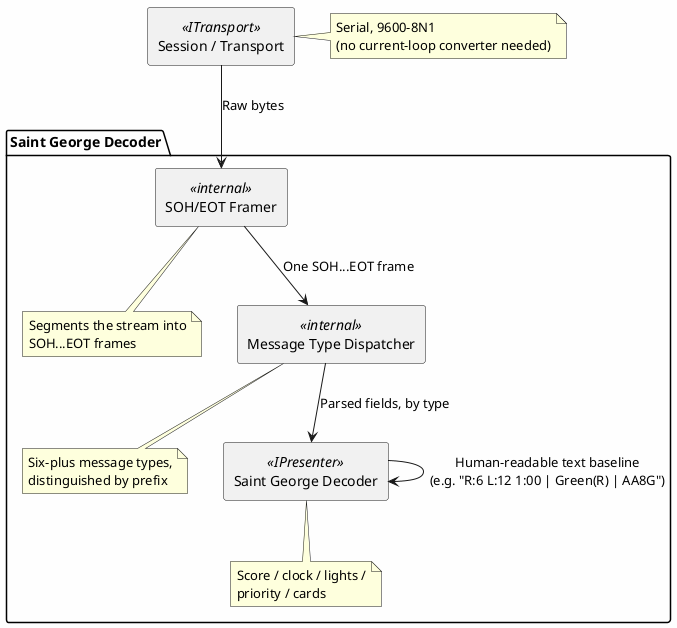

# Proposal: Saint George Fencing Scoring Apparatus — Protocol Decoder

> **Status: deprioritized**, same as [Favero](favero-fencing-protocol.md) — no hardware access to
> test against. Documented properly rather than left as a footnote, since real code and a real
> capture already exist; pick this up if/when fencing-equipment access comes back.

## Source

- `C:\repo\oobdev\dotex\Incoming\BinaryDecoders\src\OoBDev.ElectronicScoringMachines.Fencing\SaintGeorge\` —
  a working prior C# decoder (`SgStateDefinition.cs`, `SgStateParser.cs`) plus a real 53KB serial
  capture (`outfile.bin`), from the same local project as [Favero](favero-fencing-protocol.md) (that
  project bundles production decoders for both apparatus brands under one `Common` state model —
  `Fencer`, `ScoreMachineState`, `Cards`, `Lights`). No separate notes file exists for this one (the
  referenced `SaintGeorge.md` is empty) — everything below comes from reading the parser code
  directly against the real capture.

## Device

"Saint George" fencing scoring apparatus (per the source's own `[Description("Saint George")]`) —
a second, distinct brand from Favero, used in the same production system
([ScoreMachine](https://github.com/mwwhited/scoremachine)). **Plain RS-232**, 9600 baud, 8-N-1 —
notably simpler to physically connect than Favero's 20mA current-loop requirement, no converter
needed.

## Why this is a different (and in some ways more interesting) decoder shape than Favero

Where Favero is one fixed 10-byte binary packet streamed continuously, Saint George is a genuinely
different design: **multiple distinct ASCII-ish message types sharing one control-character
envelope**, each type identified by a short prefix after the envelope start. This is a good second,
contrasting worked example of the "protocol decoder" category once picked up:

- **Envelope**: every message is bounded by `SOH` (`0x01`) ... `EOT` (`0x04`) — confirmed directly
  against the real capture, where messages run back-to-back as `...EOT SOH DC3 "S00:00" EOT SOH
  DC3 "LR0G0W1w1" EOT SOH DC3 "T01:00" EOT ...`.
- **At least six message types** share this envelope, distinguished by what follows the first
  control byte (`DC2`/`DC3`) — from the parser code, confirmed against the capture:

  | Prefix | Example (from the real capture) | Meaning |
  |---|---|---|
  | `DC3 "ST" STX...` | `ST\x02000:000\x02 0000\x02 0000\x02 3\x02 00` | Score (3-digit each side) + green/red cards, `\x02`(STX)-separated sub-fields |
  | `DC3 "LR"..."G"..."W"..."w"` | `LR0G0W1w1` | Touch/off-target lights for both fencers, single-char flags at fixed positions |
  | `DC3 "R_F$" STX...` | `R_F$\x02\x10 0000__:01:00.___` | Match clock, detailed format |
  | `DC2 "P"...` | `P?\x00\x02\x00AA8G` | Priority flags (bit-tested against a fixed mask) |
  | `DC3 "S"...` (not `"ST"`) | `S00:00` | Score, alternate 2-digit-each-side format |
  | `DC3 "T"...` | `T01:00` | Match clock, alternate `mm:ss` format |

- **A seventh message type appears in the real capture that the existing parser doesn't handle**:
  `DC3 "C00:0"` — present repeatedly in `outfile.bin`, but no `else if` branch in `SgStateParser`
  matches a bare `"C"` prefix. Worth resolving what this is before treating the existing decoder as
  complete — it's a real gap, found by checking the parser against its own reference capture, not
  assumed.
- **Two message types encode the same information differently** (`"ST..."` vs. plain `"S..."` for
  score; `"R_F$..."` vs. plain `"T..."` for clock) — the real capture shows both the short and
  detailed forms sent back-to-back for score and clock every cycle, suggesting the device just
  always sends both, not that a decoder needs to choose one. Worth confirming that assumption
  against a real device before relying on only one form being present.

## Proposed shape

- **A cleaner `ICompositeDecoder`/multi-message-type case than Favero's single-packet bitfields** —
  this is "one envelope, several distinct sub-protocols," closer to how EByte's config protocol or
  Radex One's command-type dispatch already work, just ASCII-flavored instead of pure binary.
- **No current-loop converter needed** — plain RS-232, so the physical-layer barrier that exists
  for Favero doesn't apply here, if hardware access ever returns.

## Open questions

- What the unhandled `"C00:0"` message type actually is — needs either the original ScoreMachine
  project's fuller source, a fresh capture with more variety, or a real device to test against.
- Whether the short and detailed score/clock forms are both always sent (as the capture's repeating
  cycle suggests) or situationally different — matters for whether a decoder needs to reconcile two
  sources of the same fact or can just pick one.
- Whether "Saint George" and Favero apparatus ever appear on the same physical bus/session in a
  real ScoreMachine deployment (the source project's shared `Common` state model across both brands
  suggests the production system treats them as interchangeable inputs to one state) — if so,
  whether dev-term's presenter model needs a way to say "these two decoders produce the same
  logical state," not just two independent decoders.
