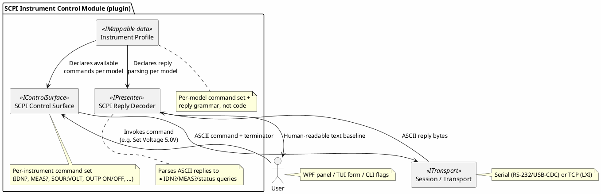

# Proposal: SCPI Bench Instrument Control Module

## Source

This proposal is derived from an existing (separate) project tracked in the
[`mwwhited-notes/shared`](https://github.com/mwwhited-notes/shared) repository — Matt's personal
technical notebook, a git submodule of the `notes` wrapper repo, unrelated to this codebase except
as prior art:

- [`shared/projects/scpi-instrument-control/README.md`](https://github.com/mwwhited-notes/shared/tree/main/projects/scpi-instrument-control) — project overview, status: planning/research
- [`shared/projects/scpi-instrument-control/`](https://github.com/mwwhited-notes/shared/tree/main/projects/scpi-instrument-control) — full project directory (equipment list, architecture sketch, references)

That project's own stated goal (a custom .NET Core VISA driver plus an RS-232/Ethernet gateway
for SCPI bench equipment) substantially overlaps with what dev-term already provides —
serial and TCP transports are built, unit-tested, and verified against real hardware (a bench
oscilloscope, both direct-serial and over a serial-to-Ethernet bridge, per the top-level
[README](../../../README.md)). This proposal reframes that project's goal as a dev-term device
control module rather than a from-scratch driver, per [device-control-modules.md](../device-control-modules.md).

## Purpose

Give dev-term a device control module for SCPI-compatible bench test equipment: a control
surface for outbound commands (set voltage, trigger, query measurement) plus a decoder for
inbound replies/telemetry, bundled as one plugin per [device-control-modules.md](../device-control-modules.md)'s
"Motivating example," which is this exact scenario.

## Target hardware (from the source project)

| Instrument | Interface | Notes |
|---|---|---|
| HP/Agilent/Keysight 34401A | GPIB/RS-232 | 6½-digit bench DMM |
| Rigol DM3058E | USB/RS-232 | 5½-digit bench DMM |
| Rigol DG1022 / DG1022Z (unlocked as DG1062Z) | Built-in display, USB/LAN/GPIB (opt) | Function/arbitrary waveform generator |
| Korad KA3005P / KA6003P | USB/RS-232 | Programmable bench power supplies |

Full current inventory (specs, acquisition dates, status): `shared/.personal/incoming/test-equipment.md`
— gitignored in the source repo (synced from a private submodule per that repo's
`PERSONAL-PROTOCOL.md`), so not directly linkable here; ask for a current export if needed.

## Why SCPI fits the existing contracts cleanly

SCPI is textual, not binary — this is a much softer decoder problem than Radex One or Favero
(see the sibling proposals in this directory):

- **Outbound**: plain ASCII command strings (e.g. `:VOLT 5.0`, `*IDN?`, `:MEAS:VOLT:DC?`) —
  these are exactly `IControlSurface` commands whose "encoding" is just the string itself plus a
  terminator, reusing the existing ASCII presenter's send path (`IPresenterInput`, see
  [presenters.md](../presenters.md)) rather than needing custom binary framing.
- **Inbound**: replies are themselves ASCII (numeric readings, `*IDN?` strings, status bytes) —
  a decoder here is close to a thin wrapper over the existing ASCII/line-buffered presenter,
  with light structure extraction (e.g. parsing a `*IDN?` reply into make/model/serial/firmware
  fields) rather than a from-scratch binary parser.
- **Transport-agnostic**: SCPI instruments show up over GPIB (out of scope — no GPIB transport
  planned), RS-232 (the existing serial transport), USB-CDC (also serial, from the OS's point of
  view), and LAN/LXI (the existing TCP transport) — no new `ITransport` is needed for the RS-232
  and USB-CDC and LAN cases; see [transports.md](../transports.md).

## Proposed shape

- **Command set is per-instrument-family, not per-unit** — a DMM profile (`*IDN?`, `MEAS:VOLT:DC?`,
  `MEAS:CURR:DC?`, ...) and a power-supply profile (`SOUR:VOLT`, `SOUR:CURR`, `OUTP ON`/`OUTP OFF`,
  `MEAS:VOLT?`) cover the 34401A/DM3058E and KA3005P/KA6003P respectively, and a waveform-generator
  profile covers the DG1022/DG1022Z. This is the same "one generic thing, many devices via external
  data" pattern as [presenters.md](../presenters.md)'s mappable presenters (§5) and
  [device-control-modules.md](../device-control-modules.md)'s open question about a declarative
  command/response schema — SCPI is arguably the *best* fit for that declarative schema, since the
  command grammar is standardized enough (IEEE 488.2 common commands, `SCPI-99`) to describe
  generically rather than per-vendor.
- **`*IDN?` as the bootstrap command** — every SCPI instrument responds to `*IDN?` with
  `<manufacturer>,<model>,<serial>,<firmware>`; a control surface can use this to auto-select the
  right instrument profile on connect rather than requiring the user to pick one, similar in
  spirit to how a protocol decoder auto-detects framing.
- **Query/reply pairing matters here more than for streaming telemetry** — SCPI is
  request/response by nature (send `MEAS:VOLT:DC?`, get one line back), which is exactly the "does
  a command declare an expected reply pattern" open question already flagged in
  [device-control-modules.md](../device-control-modules.md). This project is a concrete forcing
  function for resolving that question, not just a hypothetical.

## Relationship to other backlog items

- **LXI (SCPI-over-LAN) instruments** use the RFC 2217-adjacent pattern of "serial protocol,
  network-reachable" but over a real TCP socket (LXI Core uses a raw TCP or VXI-11/RPC transport,
  not Telnet framing) — so this rides on the existing TCP transport directly, not on the RFC 2217
  work in [rfc2217.md](../rfc2217.md). Worth double-checking against a real LXI-capable instrument
  before assuming raw-TCP-SCPI is sufficient (the source project notes this as unverified/planning
  stage).
- The source project's own "RS-232/Ethernet gateway" idea (a Raspberry Pi/BeagleBone bridging a
  GPIB/RS-232-only instrument onto the network) is a **transport-level concern**, not a
  control-module concern — if built, it belongs alongside the RFC 2217 work
  ([rfc2217.md](../rfc2217.md)) rather than inside this module, since a generic serial-over-network
  bridge is useful to every dev-term session, not just SCPI ones.

## Open questions

- Whether a declarative SCPI command/response schema (IEEE 488.2 common commands + per-family
  extensions) should be dev-term's first real instance of the "declarative command set" pattern
  flagged as an open question in [device-control-modules.md](../device-control-modules.md), given
  how standardized the grammar already is.
- Whether GPIB support is ever in scope (none of the transports in [transports.md](../transports.md)
  cover it) — if not, the HP 34401A and other GPIB-only paths are out of reach unless accessed via
  a GPIB-to-USB/Ethernet adapter that presents as serial or TCP to the OS.
- How much of "parse `*IDN?`" and "parse a numeric `MEAS?` reply" is generic enough to live in
  `DevTerm.Core`/a shared SCPI decoder base versus needing a profile per instrument family.
