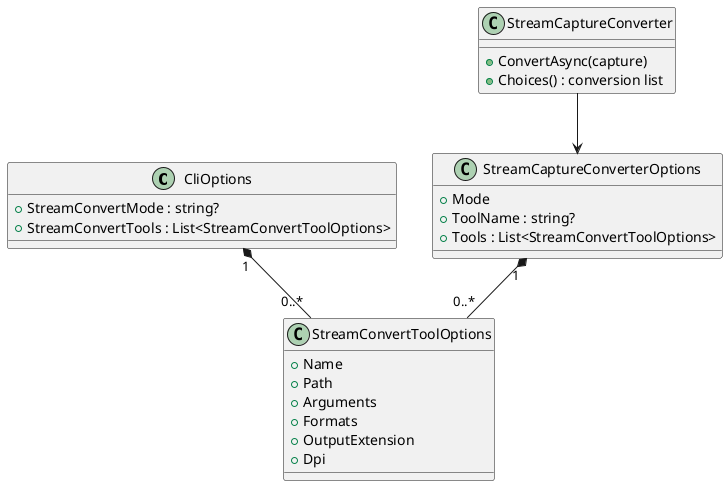
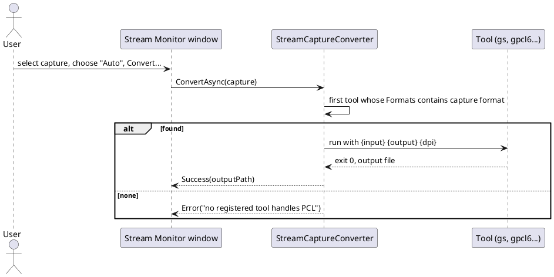

# Registering several converter tools for the Stream Monitor

Proposed and first built 2026-10-02. Extends the single "External tool" mechanism in
[stream-content-detection.md](stream-content-detection.md) so a profile can register more than one
converter, each declaring the capture formats it handles (Ghostscript for PostScript, GhostPCL for PCL 5,
anything else a user has).

## Why

`StreamConvertExternalToolPath/Arguments` holds exactly one program. PostScript and PCL need different
tools, so a user with both had to edit the profile between captures. The
[Ghostscript guide](../../user-guide/ghostscript-conversion.md) lists "one tool at a time" as a limit.

## Shape

A profile gets a list, `StreamConvertTools`, of tool entries (a `List<T>`, never a dictionary, so JSON and XML
both serialize it, see `CLAUDE.md`):

| Field | Meaning |
|---|---|
| `Name` | Shown in the conversion list and used to pick it. Unique, case-insensitive. |
| `Path` | The executable. |
| `Arguments` | Argument template, `{input}` `{output}` `{dpi}`, split on whitespace then substituted per token (unchanged rule). |
| `Formats` | Comma-separated capture formats it accepts (`ps`, `pcl`, `hpgl`, `bmp`...). Empty means any. |
| `OutputExtension` | Extension of the file it writes. Default `png`. |
| `Dpi` | Value for `{dpi}`. Default 150. |

The conversion list offers, in order: **None**, **HP-GL to SVG**, **Auto**, one entry per registered tool (by
`Name`), and (until it is removed) **External tool** / **Web service**. **Auto** runs the first registered tool
whose `Formats` include the selected capture's format, and reports "no registered tool handles X" otherwise.
Picking a tool by name runs it regardless of `Formats`, so a user can force one.

The single-tool settings keep working: `StreamConvertExternalToolPath` still defines the legacy **External tool**
entry, so every existing profile behaves as before. The built-in Web service mode is dropped in the same series
once the tool list is in both profile editors (decided 2026-10-02: a registered script or `curl` covers it).

Selection is stored as `StreamConvertMode`: the existing values, plus `auto` and `tool:<Name>`.

## Status

- **Built 2026-10-02**: the options, `StreamCaptureConverter` selection (Auto and by name), the conversion list
  in both windows, and tests. Real-tool verification is the same open item as the Ghostscript guide.
- **Not built**: the tool-list editor in the WPF/TUI profile forms (tools are set in the profile JSON for now),
  and removing Web service mode.
