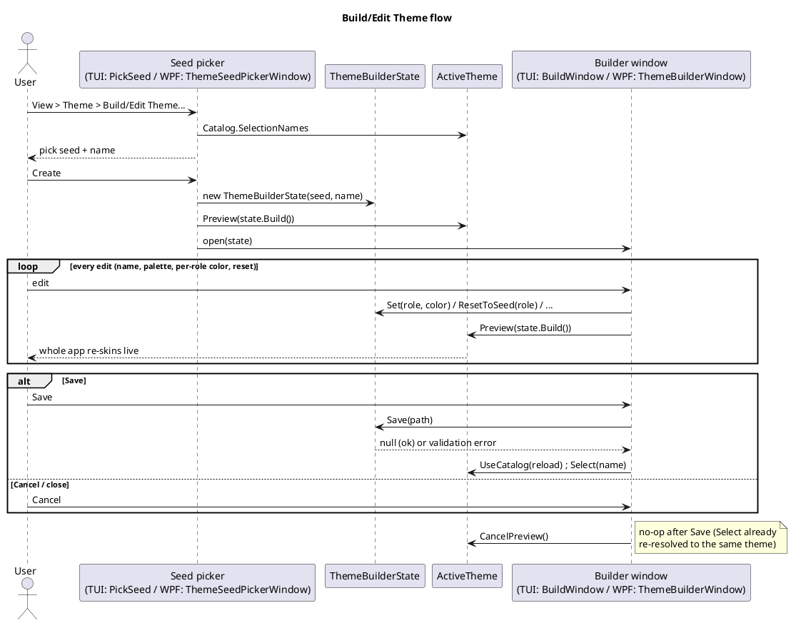
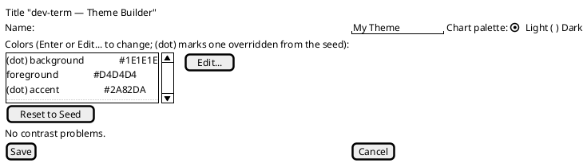

# Theme builder

Sourced from `BACKLOG.md`'s "Proposed Ideas" section (added 2026-09-30): "Have a theme builder —
include color pickers, have ability to save/export/import, store/enumerate from the
`~/.dev-term/themes` folder."

## Problem

[Theming](../theming.md) (implemented 2026-09-25) already has everything a builder would produce or
consume — `ThemeFile` (`~/.dev-term/themes/*.json`), `ThemeCatalog` (enumerates built-ins plus every
valid user theme, reports rejected files/duplicates/contrast warnings), `DevTermTheme.ContrastWarnings()`
(WCAG checks) — but *creating* one today means hand-writing JSON: knowing every `ThemeRole` name,
picking a `#RRGGBB` value with no live preview, and re-running dev-term to see the result. There's no
in-app way to build or edit a theme.

## Design

A new screen (View > Theme > Build/Edit Theme..., alongside the existing theme picker) that edits a
`DevTermTheme` directly against `ThemeRole`'s existing role list, backed entirely by the existing
model — no new persistence format:

- **One row per `ThemeRole`**, grouped roughly the way `theming.md`'s role list already groups them
  (surface colors, control colors, status colors, chart colors) — reusing `UiDefinitions`' existing
  section/control vocabulary (a `UiSection` per group) rather than inventing new layout code, per
  [ui-definitions.md](../ui-definitions.md)'s convention of describing panels declaratively.
- **Live preview**: apply the in-progress theme to the builder window itself (or a small sample panel
  showing a focused field, a menu, a status line, a chart swatch) via the same `ActiveTheme`/
  `TuiTheme`/`WpfTheme` mechanism a real switch uses, not a separate rendering path — so what the
  builder shows is provably what the real theme will look like, not an approximation.
- **Live contrast feedback**: run `DevTermTheme.ContrastWarnings()` on every edit and surface any
  failing pair next to the row that causes it, instead of only discovering a bad contrast ratio after
  saving (today's `ThemeFile` load-time behavior: "for a user theme the failures are reported but not
  rejected").
- **Save/export/import**: save writes a `ThemeFile`-shaped JSON into `~/.dev-term/themes/`
  (`DevTermUserDataPaths.ThemesDirectory`) using `ThemeFile`'s existing optional-field shape
  (`name`, `basedOn`, `chartPalette`, `colors` — only roles that differ from `basedOn` need to be
  written). Export/import are then just a file copy in/out of that directory — no new format to
  design.
- **Enumerate existing themes**: `ThemeCatalog` already does this (built-ins plus every valid file
  under `ThemesDirectory`) — the builder's "open an existing theme to edit" list is that catalog,
  not a new listing mechanism.

## Front-end split

- **WPF** has a native color picker path (a standard `ColorDialog`/a small custom RGB/HSV picker) —
  the Busylight panel already ships a custom RGB/HSV color-picker modal
  ([Kuando Busylight protocol](../features/kuando-busylight-protocol.md)) that's a reasonable
  starting point/reusable component for per-role color entry here.
- **TUI** has no true color-picker widget (Terminal.Gui v2.5.0's built-in controls don't include
  one). Editing a role's color as a `#RRGGBB` text field (validated the same way `ThemeFile` parsing
  already validates a malformed color) is the realistic v1 — matching how the Connection Editor
  already falls back to a plain text field for anything without a richer native widget.

## Open questions — resolved

- **Built-in themes are never edited in place.** The builder always edits a fresh copy (seeded from
  a built-in or an existing user theme's colors via `ThemeBuilderState`); saving always writes a new
  user theme file. `ThemeBuilderState.Save` diffs the fully-built result against whichever of
  `BuiltInThemes.Light`/`Dark` it's closer to (`DevTermTheme.IsDark`), regardless of what the
  builder was seeded from — so only roles that actually differ from that base get written, not every
  role the seed happened to override.
- **Live preview is a scoped concept, not `Select`.** `ActiveTheme.Preview(theme)` sets `Current`
  and raises `Changed` without touching `Selection` or persisting anything;
  `ActiveTheme.CancelPreview()` re-resolves `Selection` and reverts `Current`. `Select` is unchanged
  and still the only path that persists a choice.

## Completion checklist

What is needed before this proposal can be closed. Tick items as they land, in the same change.

- [x] Shared model (`ThemeFile.Save`, `ThemeBuilderState`, `ActiveTheme.Preview`)
- [x] TUI `ThemeBuilderMode`
- [x] WPF seed picker and builder windows
- [x] Unit tests, spec (`docs/specs/theme-builder.md`) and user guide
- [ ] Manual-use pass in both front ends (no device dependency; optional)

## Status

**Implemented 2026-10-01.** Both front ends ship the full flow described above:

- **Shared model** (`DevTerm.Configuration`): `ThemeFile.Save`, `ThemeBuilderState`,
  `ActiveTheme.Preview`/`CancelPreview` — unit-tested in
  `tests/DevTerm.Configuration.Tests/ThemeBuilderStateTests.cs`.
- **TUI**: `DevTerm.Console.ThemeBuilderMode` (`PickSeed`, `BuildWindow`, `EditColor`), wired into
  `TuiMode`'s View menu. Tested in `tests/DevTerm.Console.Tests/ThemeBuilderModeTests.cs`.
- **WPF**: `DevTerm.Wpf.ThemeSeedPickerWindow` and `ThemeBuilderWindow` (per-role editing reuses
  `ColorPickerWindow` instead of a plain hex field, as the front-end split above anticipated), wired
  into `MainWindow`'s View > Theme menu. Tested in `tests/DevTerm.Wpf.Tests/ThemeSeedPickerWindowTests.cs`
  and `ThemeBuilderWindowTests.cs` — every Save/Commit branch (empty name, reserved name, overwrite
  decline/confirm) is directly testable with no blocking real dialog, since both windows expose their
  `MessageBox.Show` calls as injectable delegate properties (`ReportValidationError`,
  `ConfirmOverwrite`) rather than calling `MessageBox.Show` inline — a genuine testability
  improvement over the TUI screen, which needs a nested `Application.Run` to exercise the equivalent
  branches.

Verified: whole-solution `dotnet build` (0 warnings/errors) and `dotnet test --filter
"TestCategory=Unit"` (every project green). **Not yet verified**: no real-hardware/manual-use pass —
this is a pure UI feature with no device dependency, so that verification gap is expected, not a gap
in testing coverage. See `docs/specs/theme-builder.md` for the field/action reference and
`docs/user-guide/themes.md`'s "Building a theme in the app" section for the walkthrough.
