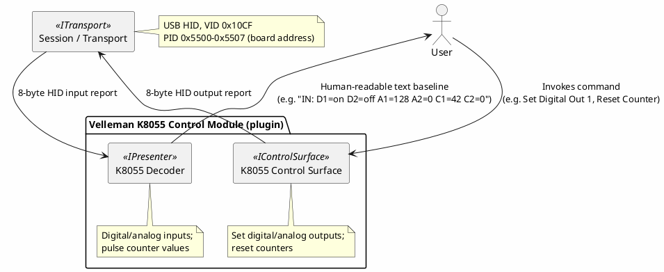
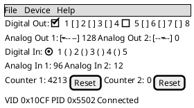

# Proposal: Velleman K8055 — USB HID Digital/Analog I/O Board

## Source

- `C:\repo\oobdev\dotex\Incoming\BinaryDecoders\src\OoBDev.Velleman.K8055\` — a working prior C#
  implementation plus reverse-engineering notes, from the same local `dotex/Incoming/BinaryDecoders`
  project as the [EByte](ebyte-e810-dtu-config-protocol.md) and [Kuando Busylight](kuando-busylight-protocol.md)
  proposals. Cross-references two independent public sources: [rm-hull/k8055](https://github.com/rm-hull/k8055)
  and [libk8055](http://libk8055.sourceforge.net/).

## Device

[Velleman K8055](https://www.velleman.eu/) — a generic USB experimenter I/O board (2 analog
outputs, 8 digital outputs, 5 digital inputs, 2 analog inputs, 2 pulse counters). **Already owned**
— it's in the local equipment inventory (`shared/.personal/incoming/test-equipment.md`, "Data
Acquisition" category). USB HID, VID `0x10CF`; **the board address is a 2-position DIP switch, so
only 4 PIDs are actually selectable in hardware** (`0x5500`–`0x5503`) despite the source code's
product-ID mask (`0x5500` base, `0xFFF8` mask) technically spanning 8 values — the mask is just
broader than what the physical switch can produce, confirmed directly rather than assumed from the
mask alone.

## Why this is a good decoder + control-surface candidate

- **Genuinely bidirectional and stateful in an interesting way**: digital/analog outputs are
  set-and-forget (fire-and-forget commands), while digital/analog inputs and the two pulse counters
  are continuously readable state — a natural `IControlSurface` (outputs) + decoder (inputs)
  pairing, the same shape [device-control-modules.md](../device-control-modules.md)'s motivating
  example describes, but for a generic I/O board rather than a bench instrument.
- **Multiple identical devices via a PID range, not a single VID/PID pair** — `HidTransportOptions`
  today only matches one exact VendorId/ProductId (see `DevTerm.Transports.Hid`); this is a
  concrete, real case for wanting a PID range/mask match if more than one K8055 is ever in play,
  worth keeping in mind as a small future enhancement rather than urgent now (a single board works
  fine with an exact PID today).
- **Small, fully out in the open command set** — three commands, 8-byte reports, no
  checksum/framing complexity at all, unlike the other binary proposals in this directory. A good
  "simplest possible" decoder to pair against something more involved.

## Real-hardware finding (2026-09-15)

Connected via `dotnet run ... --transport hid --hidvendorid 4303 --hidproductid 21762 --presenter
hex` (VID `0x10CF` PID `0x5502` — a different board address than the notes' own `0x5503` example,
confirming the PID-range hypothesis directly). **The device streams its input report continuously
and unprompted** — no `0x06` "read" command needed at all; reports just kept arriving one after
another. A representative pair, back to back:

```
0000034C4C00000000
0000034B4C00000000
```

Both are 9 bytes (not 8 — inbound and outbound report lengths differ). Reading against the known
capabilities (5 digital in, 2 analog in, 2×16-bit counters): byte 2 is a constant `0x03`; byte 3
tracks between `0x4B`/`0x4C` (75/76) across consecutive reports — exactly what an unconnected,
electrically-floating analog input pin looks like — while byte 4 sits constant at `0x4C`; the
trailing four bytes are `00 00 00 00`, consistent with two zeroed 16-bit counters (nothing wired to
count). This reads as `[00, 00, 03, AnalogIn1, AnalogIn2, CounterLo1, CounterHi1, CounterLo2,
CounterHi2]`, though digital-input bit positions weren't exercised (nothing was wired to them) and
byte 0/1's role isn't confirmed beyond "zero when no digital inputs are active." Confirms the
overall shape guessed at below; the `0x06` command's exact role (if it does anything beyond what
the device already sends unprompted) is now the more interesting open question, not the reverse.

## Protocol summary

**8-byte HID reports**, `Commands` enum:

```
0x00 : None
0x03 : Reset Counter 1
0x04 : Reset Counter 2
0x05 : Set Analog/Digital outputs
0x06 : Read (status/inputs) - inferred, marked "? read ?" in the source notes
```

**Set Analog/Digital (`0x05`) report layout** (from the source notes' own examples):

```
Byte 0 : Command (0x05)
Byte 1 : Digital outputs (bitmask, 8 channels)
Byte 2 : Analog output 1 (0-255)
Byte 3 : Analog output 2 (0-255)
Byte 4 : (unused in the examples - always 0x00)
Byte 5 : (unused in the examples - always 0x00)
Byte 6 : Duration/debounce byte A (examples show 0x08, 0x01, 0x58 - unit unconfirmed)
Byte 7 : Duration/debounce byte B (examples show 0x01, 0x58 - unit unconfirmed)
```

## Proposed shape



- **No new transport work** — `DevTerm.Transports.Hid` already exists and this device already
  verified the read path live (see above), the same day as [Kuando Busylight](kuando-busylight-protocol.md).

A generic I/O board is a natural fit for a live GUI panel — toggles/sliders for outputs, indicator
lamps/counters for inputs, all updating in real time rather than reading a text log:



## Open questions

- The exact meaning/units of the two trailing bytes on the Set Analog/Digital command (labeled
  duration/debounce above, per the source notes' own inline comments like "(10ms, 0ms)" — needs
  confirming against the real board, not just the informal notes.
- **Now the more interesting question, given the device streams unprompted**: what `0x06` actually
  does, if anything — request an immediate report out of cycle? Change the streaming rate? Needs a
  real test (send it, see if anything changes) rather than assuming it's a "read command" at all.
- Byte-for-byte confirmation of the input report's first two bytes (digital inputs) — not exercised
  in the real test above since nothing was wired to the digital input pins.
- Whether `HidTransportOptions` should eventually support a PID mask/range (this device is the
  concrete motivating case) — not urgent for a single board, but worth remembering if a second
  device with the same DIP-switch-address pattern shows up.
