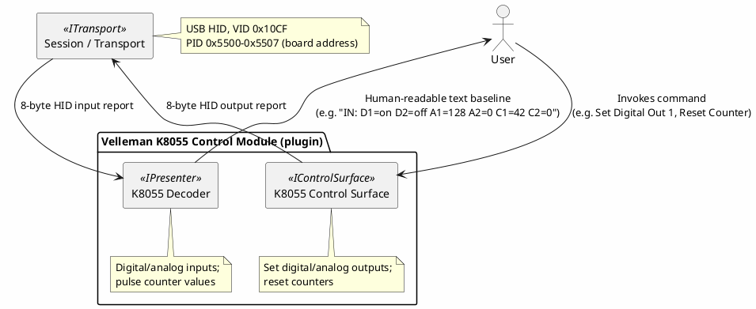

# Proposal: Velleman K8055 — USB HID Digital/Analog I/O Board

## Source

- `C:\repo\oobdev\dotex\Incoming\BinaryDecoders\src\OoBDev.Velleman.K8055\` — a working prior C#
  implementation plus reverse-engineering notes, from the same local `dotex/Incoming/BinaryDecoders`
  project as the [EByte](ebyte-e810-dtu-config-protocol.md) and [Kuando Busylight](kuando-busylight-protocol.md)
  proposals. Cross-references two independent public sources: [rm-hull/k8055](https://github.com/rm-hull/k8055)
  and [libk8055](http://libk8055.sourceforge.net/).

## Device

[Velleman K8055](https://www.velleman.eu/) — a generic USB experimenter I/O board (2 analog
outputs, 8 digital outputs, 5 digital inputs, 2 analog inputs, 2 pulse counters). **Already owned**
— it's in the local equipment inventory (`shared/.personal/incoming/test-equipment.md`, "Data
Acquisition" category). USB HID, VID `0x10CF`, PID `0x5500`–`0x5507` (the low 3 bits are a
DIP-switch-selectable board address, so up to 8 units can coexist on one PC — the source code
matches this with a product-ID mask (`0x5500` base, `0xFFF8` mask) rather than one fixed PID).

## Why this is a good decoder + control-surface candidate

- **Genuinely bidirectional and stateful in an interesting way**: digital/analog outputs are
  set-and-forget (fire-and-forget commands), while digital/analog inputs and the two pulse counters
  are continuously readable state — a natural `IControlSurface` (outputs) + decoder (inputs)
  pairing, the same shape [device-control-modules.md](../device-control-modules.md)'s motivating
  example describes, but for a generic I/O board rather than a bench instrument.
- **Multiple identical devices via a PID range, not a single VID/PID pair** — `HidTransportOptions`
  today only matches one exact VendorId/ProductId (see `DevTerm.Transports.Hid`); this is a
  concrete, real case for wanting a PID range/mask match if more than one K8055 is ever in play,
  worth keeping in mind as a small future enhancement rather than urgent now (a single board works
  fine with an exact PID today).
- **Small, fully out in the open command set** — three commands, 8-byte reports, no
  checksum/framing complexity at all, unlike the other binary proposals in this directory. A good
  "simplest possible" decoder to pair against something more involved.

## Protocol summary

**8-byte HID reports**, `Commands` enum:

```
0x00 : None
0x03 : Reset Counter 1
0x04 : Reset Counter 2
0x05 : Set Analog/Digital outputs
0x06 : Read (status/inputs) - inferred, marked "? read ?" in the source notes
```

**Set Analog/Digital (`0x05`) report layout** (from the source notes' own examples):

```
Byte 0 : Command (0x05)
Byte 1 : Digital outputs (bitmask, 8 channels)
Byte 2 : Analog output 1 (0-255)
Byte 3 : Analog output 2 (0-255)
Byte 4 : (unused in the examples - always 0x00)
Byte 5 : (unused in the examples - always 0x00)
Byte 6 : Duration/debounce byte A (examples show 0x08, 0x01, 0x58 - unit unconfirmed)
Byte 7 : Duration/debounce byte B (examples show 0x01, 0x58 - unit unconfirmed)
```

## Proposed shape



- **No new transport work** — `DevTerm.Transports.Hid` already exists and this is a real,
  currently-owned device to verify it against (alongside [Kuando Busylight](kuando-busylight-protocol.md),
  for the read-path specifically).

A generic I/O board is a natural fit for a live GUI panel — toggles/sliders for outputs, indicator
lamps/counters for inputs, all updating in real time rather than reading a text log:


## Open questions

- The exact meaning/units of the two trailing bytes on the Set Analog/Digital command (labeled
  duration/debounce above, per the source notes' own inline comments like "(10ms, 0ms)" — needs
  confirming against the real board, not just the informal notes.
- The full layout of the `0x06` "read" report/response — the source notes mark this as an inferred
  command, not a confirmed one; needs verifying what a real read response actually contains
  (presumably digital inputs, both analog inputs, and both 16-bit counter values, given the
  device's known capabilities, but not yet confirmed byte-for-byte).
- Whether `HidTransportOptions` should eventually support a PID mask/range (this device is the
  concrete motivating case) — not urgent for a single board, but worth remembering if a second
  device with the same DIP-switch-address pattern shows up.
