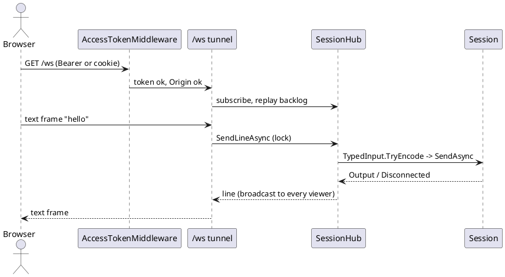
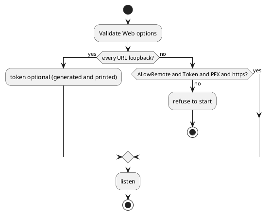

# Web-accessible host service (WebSocket tunnels + Blazor front end)

Sourced from `BACKLOG.md`'s "Proposed Ideas" section (added 2026-09-30): "Create a host service that
makes the tunnels accessible over web-sockets with a blazor based web front end."

This is the least concretely scoped of the ideas added 2026-09-30 — not grounded in a specific piece
of target hardware the way most proposals here are, but in a new front end (a fourth, alongside
CLI/TUI/WPF) and a new, non-local access model. Treat this doc as a starting sketch to refine, not a
committed design.

## Problem

Today, controlling a session (sending commands, watching output, driving a device control panel)
requires running dev-term locally — either the console app or the WPF app, both on the same machine
the transport is physically attached to (or reachable from). There's no way to reach a running
session from a browser, on a different machine, without something in front of it.

## Design sketch

A new front end — `DevTerm.Web` or similar — built on the same composition root every other front end
uses (`AddDevTermFrontEnd`, per [platform.md](../platform.md) and
[architecture.md](../architecture.md)'s "everything resolved through DI" convention), hosting one or
more live `Session`s and exposing them to a browser:

- **Transport, not a new one.** This doesn't need a new `ITransport` — it needs a new consumer of the
  existing `Session`/`Pipeline` output (`Session.Output`, per `architecture.md`'s "read path")
  relayed over a WebSocket to a connected browser, and typed input relayed the other way through the
  same `IPresenterInput`/`TypedInput.TryEncode` path the CLI and TUI already use (see CLAUDE.md's
  "front ends never crash" constraints — `TypedInput.TryEncode` is specifically what any new front end
  must go through, not a bare `IPresenterInput.Parse`).
- **Blazor front end** (Server or WebAssembly — see open questions) rendering the output stream and a
  typed-input box, growing toward the same generic `UiDefinition` rendering both TUI (`ControlPanelMode`/
  `FormRenderer`) and WPF (`ControlPanelWindow`/`FormRenderer`) already do — a third `UiDefinition`
  renderer, reusing the same model rather than inventing a web-specific one (per
  [ui-definitions.md](../ui-definitions.md)'s whole reason for existing: "every front end renders that
  description using its own native widgets").
- **"Tunnels"**: read as "reach a session that isn't otherwise network-accessible" — i.e., this host
  service sits between a browser and a session bound to local hardware (serial/USB/HID on the host
  machine), tunneling it out over WebSockets rather than the browser needing any direct device access
  of its own (which it couldn't have anyway — no serial/HID/BLE from a browser sandbox).

## Security/access control — has to be designed before any implementation

This is a materially different risk profile than every other front end: CLI/TUI/WPF only ever run as
the operating user, on the machine physically attached to the hardware. A web-facing host service is,
by construction, remote-reachable — a real new attack surface onto real physical equipment (bench
power supplies, RF gear, anything with a "send arbitrary bytes" control surface). This needs at
minimum, before real design work starts:

- A default bind scope — the existing precedent in this codebase is
  [RFC 2217 server](../rfc2217.md)'s "binds loopback-only by default," which this should almost
  certainly copy rather than defaulting to any-interface.
- Authentication — nothing in dev-term today has a concept of a user account or credential; this would
  be the first.
- TLS — a plaintext WebSocket carrying device control commands over a real network is not an
  acceptable default.

## Open questions

- Blazor Server (thin client, server-rendered, needs a persistent SignalR-style connection anyway —
  which the WebSocket tunnel requirement already implies) vs. Blazor WebAssembly (heavier initial
  download, runs client-side, doesn't need the server to hold UI state per client) — Server looks like
  the more natural fit given the WebSocket-tunnel requirement is already effectively what Blazor Server
  does under the hood, but this hasn't been evaluated against dev-term's specific needs (multiple
  concurrent sessions, multiple simultaneous viewers of one session, etc.).
- Multi-viewer semantics: can more than one browser watch/control the same `Session` at once, and if
  so, how do concurrent typed-input senders not race each other — a question this codebase hasn't had
  to answer yet, since every existing front end assumes one local operator per session.
- Whether this ever needs its own transport-like "session discovery" (list what's running, attach to
  one) or always starts a session itself from a connection profile the way the other front ends do.

## Decisions (2026-10-02)

- **Loopback by default.** `Web:Urls` defaults to `http://127.0.0.1:5080`. Any other address needs
  `Web:AllowRemote=true`, an explicit `Web:Token`, a `Web:CertificatePath` (PFX) and an `https` URL;
  `AccessPolicy.Validate` refuses to start otherwise. A generated token is only allowed on loopback.
- **Authentication is one shared access token**, not user accounts: `Authorization: Bearer`, the
  `devterm_auth` cookie, or a one-time `?token=` that sets an HttpOnly, SameSite=Strict cookie and
  redirects. Compared in constant time. A browser `Origin` that differs from the request host is
  refused (stops another site's script driving a loopback tunnel).
- **No Blazor yet.** The first cut is a plain `/ws` WebSocket plus a single static page, because the
  tunnel is the real requirement and a Blazor circuit would add a second channel with no gain. Blazor
  remains the route for rendering `UiDefinition` generically later.
- **One profile-started session shared by all viewers.** Output is broadcast (with a replayed backlog for
  late joiners); sends are serialized through one lock, so concurrent senders interleave whole lines.
  Typed input goes through `TypedInput.TryEncode`. No session discovery.

## Completion checklist

What is needed before this proposal can be closed. Tick items as they land, in the same change.

- [x] Answer the security and access-control questions above
- [x] Pick a Blazor hosting model (none yet: WebSocket plus a static page; Blazor later for `UiDefinition`)
- [x] Real design doc (the Decisions section above)
- [x] Prototype, tests, and `docs/specs/` / `docs/user-guide/` entries
- [x] Rendering of a `UiDefinition` control panel (done as JSON at `/api/panel` plus a generic renderer in the page, not a Blazor circuit: no Razor/SignalR dependency for what a small script does; live indicators and charts not shown yet)
- [x] Read-only role (`Web:ReadOnlyToken`)
- [x] TLS served and checked with a generated self-signed certificate (`Https_WithACertificate_ServesOverTls...`)
- [ ] TLS with a CA-issued certificate, a real device through the page, multiple browsers (needs user setup)

## Status

**Implemented (2026-10-02): `DevTerm.Web`** with the decisions above. `AccessPolicyTests` and `WebHostTests`
(13 unit tests, including a real WebSocket round trip against the loopback transport) pass, and a live
run confirmed 401 without a token, a 302 with `?token=`, and a refused non-loopback `http` bind. Not verified:
TLS with a real certificate, a real device through the page, more than one simultaneous browser. Not built:
Blazor, user accounts, read-only viewers.
