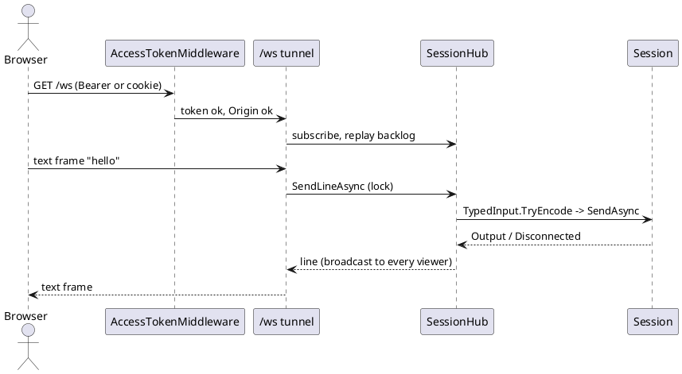
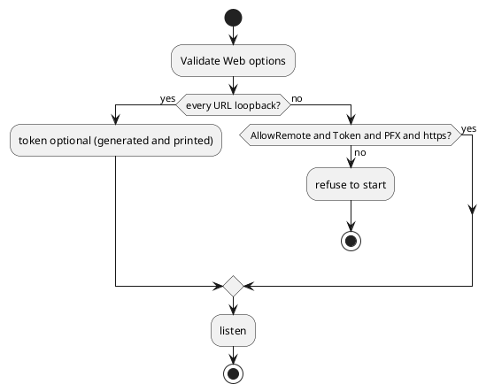
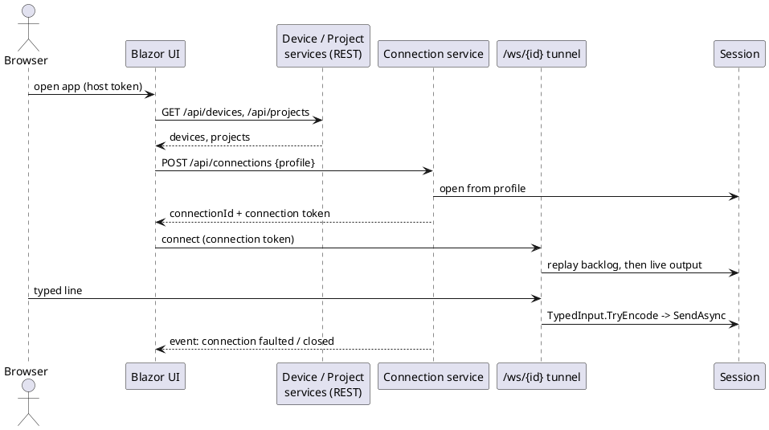
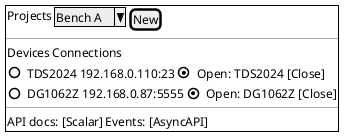

# Web-accessible host service (WebSocket tunnels + Blazor front end)

Sourced from `BACKLOG.md`'s "Proposed Ideas" section (added 2026-09-30): "Create a host service that
makes the tunnels accessible over web-sockets with a blazor based web front end."

This is the least concretely scoped of the ideas added 2026-09-30 — not grounded in a specific piece
of target hardware the way most proposals here are, but in a new front end (a fourth, alongside
CLI/TUI/WPF) and a new, non-local access model. Treat this doc as a starting sketch to refine, not a
committed design.

## Problem

Today, controlling a session (sending commands, watching output, driving a device control panel)
requires running dev-term locally — either the console app or the WPF app, both on the same machine
the transport is physically attached to (or reachable from). There's no way to reach a running
session from a browser, on a different machine, without something in front of it.

## Design sketch

A new front end — `DevTerm.Web` or similar — built on the same composition root every other front end
uses (`AddDevTermFrontEnd`, per [platform.md](../platform.md) and
[architecture.md](../architecture.md)'s "everything resolved through DI" convention), hosting one or
more live `Session`s and exposing them to a browser:

- **Transport, not a new one.** This doesn't need a new `ITransport` — it needs a new consumer of the
  existing `Session`/`Pipeline` output (`Session.Output`, per `architecture.md`'s "read path")
  relayed over a WebSocket to a connected browser, and typed input relayed the other way through the
  same `IPresenterInput`/`TypedInput.TryEncode` path the CLI and TUI already use (see CLAUDE.md's
  "front ends never crash" constraints — `TypedInput.TryEncode` is specifically what any new front end
  must go through, not a bare `IPresenterInput.Parse`).
- **Blazor front end** (Server or WebAssembly — see open questions) rendering the output stream and a
  typed-input box, growing toward the same generic `UiDefinition` rendering both TUI (`ControlPanelMode`/
  `FormRenderer`) and WPF (`ControlPanelWindow`/`FormRenderer`) already do — a third `UiDefinition`
  renderer, reusing the same model rather than inventing a web-specific one (per
  [ui-definitions.md](../ui-definitions.md)'s whole reason for existing: "every front end renders that
  description using its own native widgets").
- **"Tunnels"**: read as "reach a session that isn't otherwise network-accessible" — i.e., this host
  service sits between a browser and a session bound to local hardware (serial/USB/HID on the host
  machine), tunneling it out over WebSockets rather than the browser needing any direct device access
  of its own (which it couldn't have anyway — no serial/HID/BLE from a browser sandbox).

## Security/access control — has to be designed before any implementation

This is a materially different risk profile than every other front end: CLI/TUI/WPF only ever run as
the operating user, on the machine physically attached to the hardware. A web-facing host service is,
by construction, remote-reachable — a real new attack surface onto real physical equipment (bench
power supplies, RF gear, anything with a "send arbitrary bytes" control surface). This needs at
minimum, before real design work starts:

- A default bind scope — the existing precedent in this codebase is
  [RFC 2217 server](../rfc2217.md)'s "binds loopback-only by default," which this should almost
  certainly copy rather than defaulting to any-interface.
- Authentication — nothing in dev-term today has a concept of a user account or credential; this would
  be the first.
- TLS — a plaintext WebSocket carrying device control commands over a real network is not an
  acceptable default.

## Open questions

- ~~Blazor Server versus WebAssembly~~ **Decided 2026-10-03:** Blazor Server (the tunnel already needs a persistent connection), and the UI should behave like the WPF and TUI front ends, rendering `UiDefinition` generically.
- ~~Multi-viewer semantics~~ **Decided 2026-10-02** (see Decisions below).
- ~~Session discovery~~ **Decided 2026-10-02:** none; the host starts one profile session.

## Decisions (2026-10-02)

- **Loopback by default.** `Web:Urls` defaults to `http://127.0.0.1:5080`. Any other address needs
  `Web:AllowRemote=true`, an explicit `Web:Token`, a `Web:CertificatePath` (PFX) and an `https` URL;
  `AccessPolicy.Validate` refuses to start otherwise. A generated token is only allowed on loopback.
- **Authentication is one shared access token**, not user accounts: `Authorization: Bearer`, the
  `devterm_auth` cookie, or a one-time `?token=` that sets an HttpOnly, SameSite=Strict cookie and
  redirects. Compared in constant time. A browser `Origin` that differs from the request host is
  refused (stops another site's script driving a loopback tunnel).
- **No Blazor yet.** The first cut is a plain `/ws` WebSocket plus a single static page, because the
  tunnel is the real requirement and a Blazor circuit would add a second channel with no gain. Blazor
  remains the route for rendering `UiDefinition` generically later.
- **One profile-started session shared by all viewers.** Output is broadcast (with a replayed backlog for
  late joiners); sends are serialized through one lock, so concurrent senders interleave whole lines.
  Typed input goes through `TypedInput.TryEncode`. No session discovery.

## Direction (2026-10-03): connections are made through services, not startup arguments

Today `DevTerm.Web` starts one session from the command line or saved profile, so the host has to be
launched with connection arguments and serves exactly that session. The intended shape is the opposite:
the host starts with **no connection arguments**, and everything is done at runtime through services.

- **Device services** (REST): enumerate what the host can reach (serial ports, HID, USBTMC, LXI, BLE,
  saved profiles, bundled device manifests), reusing the detection that the Connection Editor already
  has.
- **Project services** (REST): create, list, update and delete **projects**, each a named set of
  connection profiles and their state. This is the web counterpart of the backlogged project (workspace)
  state in `BACKLOG.md`, so both should share one model.
- **Connection services**: open and close a connection to a device or profile from a project, and return
  a short-lived **connection token**. The browser then opens `/ws/{connectionId}` presenting that token,
  and the existing tunnel (backlog replay, serialized sends, read-only role) runs per connection, so many
  connections can be open at once. The shared `Web:Token` stays the host-level credential for calling the
  services; connection tokens are scoped to one connection and one role (control or read-only).
- **Events over the WebSocket**: connection opened/closed/faulted, device list changed, project
  changed, published on a host-level events stream, so a front end doesn't poll.
- **Documented contracts**: every service has an **OpenAPI** document served with a **Scalar** UI
  (`/scalar`), and the WebSocket/event channels have an **AsyncAPI** document served with an
  **AsyncAPI** UI, since OpenAPI can't describe message channels. The Blazor front end and any other
  client are generated against or checked against these documents.
- **Blazor front end** for each service (device list, projects, open connection, terminal, control
  panel), a client of the same services rather than a second code path. The earlier decision "no
  Blazor yet" is superseded: a hosting model (Server vs WebAssembly) is to be chosen when this is built.

Projects and configuration are stored server-side, never in the browser (decided 2026-10-03). **Decided 2026-10-03: one shared `Web:Token` for everything, no per-connection tokens** (a read-only token still limits a viewer). Open questions: whether a
how host-side hardware that is already open
locally (WPF running on the same machine) is shared or refused; ~~which of Scalar's and AsyncAPI UI's packages to use~~ (decided 2026-10-08: `Scalar.AspNetCore` for REST; AsyncAPI gets a small hand-written page, no package). ~~Scalar offline~~: its page references only bundled scripts (`scalar.js`, `scalar.aspnetcore.js`) and no external URL (checked 2026-10-08 against a running host; not rendered in a browser with the network cut).

## Completion checklist

What is needed before this proposal can be closed. Tick items as they land, in the same change.

- [x] Answer the security and access-control questions above
- [x] Pick a Blazor hosting model (none yet: WebSocket plus a static page; Blazor later for `UiDefinition`)
- [x] Real design doc (the Decisions section above)
- [x] Prototype, tests, and `docs/specs/` / `docs/user-guide/` entries
- [x] Rendering of a `UiDefinition` control panel (done as JSON at `/api/panel` plus a generic renderer in the page, not a Blazor circuit: no Razor/SignalR dependency for what a small script does; live indicators and charts not shown yet)
- [x] Read-only role (`Web:ReadOnlyToken`)
- [x] TLS served and checked with a generated self-signed certificate (`Https_WithACertificate_ServesOverTls...`)
- [x] TLS with a CA-issued certificate: a generated CA signs the server certificate; a client trusting only that CA connects and one without it is refused (`Https_WithACaIssuedCertificate...`)
- [ ] A real device through the page, multiple browsers (needs user setup)
- [x] `GET /api/devices` lists serial ports and USB HID/USBTMC devices on the host (2026-10-08, `WebHostTests.ApiDevices_...`); `--controlhttp` is honored too
- [x] Project create/replace/remove services: `PUT`/`DELETE /api/project/connections/{name}` (2026-10-08, `WebHostTests.ApiProject_PutAndDelete...`)
- [x] Start with no connection arguments: `Program.cs` no longer exits when no transport, port or host is configured (2026-10-08; checked live with only `--project`, then `POST /api/connections?name=Sim`); a half-configured connection is still refused
- [x] Blazor connections page `/connections` (open/close project connections, live via the events; `ConnectionManager`; 2026-10-08, `WebScreenshotTests.ConnectionsPage_*`)
- [x] API docs: OpenAPI + Scalar for REST, hand-written AsyncAPI for the streams (2026-10-08, `WebHostTests.ApiDocs_...`)
- [x] Host events stream `GET /api/events` (SSE): `connection-opened`, `connection-closed` and `line` events for the main and opened connections (2026-10-08, `WebHostTests.ApiEvents_...`, `HostEventsTests`)
- [x] `/ws/{id}` tunnels, several connections open at once, all under the one shared token: `GET/POST /api/connections?name=`, `DELETE /api/connections/{id}` (POST/DELETE refused for a read-only viewer); built 2026-10-03, tested by `WebHostTests.ApiConnections_OpenFromTheProject_ThenTunnelAndClose`
- [x] ~~Per-connection tokens~~ (decided against)
- [x] OpenAPI + Scalar UI for the services; AsyncAPI document for the WebSocket/event channels (2026-10-08; the JSON is at `/asyncapi.json`, a small built-in page at `/asyncapi`)
- [x] Blazor Server page `/panel` rendering the `UiDefinition` generically (prerendered then interactive; the read-only flag is carried from the request into the circuit; same command ids as the script page; indicators update live from the structured presenter via `PanelHostHolder.Publish`; charts/vectors not shown)
- [ ] Blazor front end for those services

## Status

**Implemented (2026-10-02): `DevTerm.Web`** with the decisions above. `AccessPolicyTests` and `WebHostTests`
(13 unit tests, including a real WebSocket round trip against the loopback transport) pass, and a live
run confirmed 401 without a token, a 302 with `?token=`, and a refused non-loopback `http` bind. Not verified:
a real device through the page, more than one simultaneous browser. Not built:
Blazor, user accounts, read-only viewers.

**Direction change 2026-10-03:** the design above (service-driven connections, Scalar, AsyncAPI, Blazor) is agreed but not started; the implemented host still takes its connection from startup arguments or a profile.
