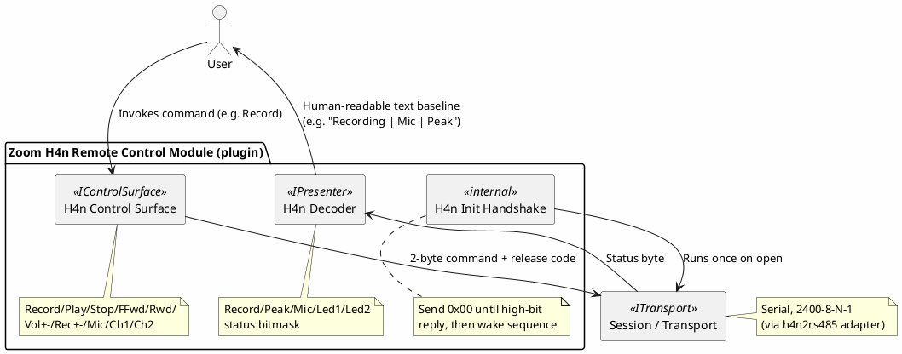
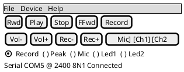

# Proposal: Zoom H4n Remote Control Protocol (Serial)

## Source

- `C:\repo\oobdev\dotex\Incoming\BinaryDecoders\src\OoBDev.Zoom.H4n\` — a working prior C#
  implementation, from the same local `dotex/Incoming/BinaryDecoders` project as the other newly
  added proposals in this directory. Cross-references two independent public reverse-engineering
  writeups: [g7smy.co.uk's H2n remote hack](http://www.g7smy.co.uk/2017/04/hacking-the-zoom-h2n-remote/)
  and a 2012 EasterHegg blog account of decoding the H4n's RC04 remote protocol directly.
- A physical adapter for this already exists: [`h4n2rs485`](https://github.com/mwwhited/EmbeddedBakery/tree/main/circuits/h4n2rs485)
  (referenced directly in the source), the same "build a real adapter first" pattern as the
  [DE-5000 LCR meter proposal](de5000-lcr-meter-protocol.md)'s BLE bridge.

## Device

[Zoom H4n](https://zoomcorp.com/) portable audio recorder, controlled via its **RC04/RC2 remote
port** — a 4-pin 2.5mm TRRS jack (3.3V, RX, TX, GND), not a computer USB/serial port on the
recorder itself; the `h4n2rs485` adapter taps this port and presents it as a normal serial
connection. **Plain RS-232-shaped UART, 2400 baud, 8-N-1** — needs no new transport at all, unlike
every other newly-added proposal in this directory.

## Why this is a good decoder + control-surface candidate

- **Zero new transport work** — the existing serial transport covers this completely, the same
  "already buildable today" story as [SCPI](scpi-instrument-control.md), just for a consumer
  device instead of bench equipment.
- **A genuinely interesting initialization handshake**, worth carrying into the implementation
  directly (the same spirit as Radex One's 3×-repeat-to-confirm quirk): the source's
  `H4nDefinition.InitializeAsync` repeatedly sends `0x00` (up to 1024 times, ~30ms apart) until it
  sees a byte with the high bit set in the reply, then sends a fixed three-byte wake sequence
  (`0xA1`, `0x80`, `0x00`) before normal operation. Skipping this and just opening the port and
  talking immediately would likely get nothing back.
- **Small, symmetric, well-cross-referenced protocol** — two independent public sources (a decade
  apart, different recorder models in the same family) agree on the core command/status shapes,
  which is a real confidence signal this one isn't a shaky reverse-engineering guess.

## Protocol summary

**Outbound (remote → recorder)**: two bytes per button event, then a fixed release code:

```
Record : 0x81 0x00 | 0x80 0x00
Play   : 0x82 0x00 | 0x80 0x00
Stop   : 0x84 0x00 | 0x80 0x00
FFwd   : 0x88 0x00 | 0x80 0x00
Rwd    : 0x90 0x00 | 0x80 0x00
Vol+   : 0x80 0x08 | 0x80 0x00
Vol-   : 0x80 0x10 | 0x80 0x00
Rec+   : 0x80 0x20 | 0x80 0x00
Rec-   : 0x80 0x40 | 0x80 0x00
Mic    : 0x80 0x01 | 0x80 0x00
Ch1    : 0x80 0x02 | 0x80 0x00
Ch2    : 0x80 0x04 | 0x80 0x00
```

**Inbound (recorder → remote)**: a single status byte, a bitmask (matches the source's own
`H4nStatus` flags enum exactly):

```
0x01 : Record (LED)
0x02 : Peak
0x10 : Mic (LED)
0x20 : Led1
0x40 : Led2
```

The two independent public sources go further into per-recording-mode LED timing/blink patterns
(XY Stereo / 2-channel surround / MS Stereo / 4-channel surround each blink slightly differently)
— worth pulling in if a decoder gets built, not reproduced in full here.

## Proposed shape



- **No new transport work** — the existing serial transport already covers this.
- **The init handshake is a per-device-module concern**, not something the core session lifecycle
  needs to know about generically — matches how the Radex One proposal's 3×-repeat quirk was
  already framed as module-specific glue, not a core feature.

A physical remote is easy to mimic as a literal button panel, with the status bitmask driving
indicator lamps rather than a scrolling text log:



## Open questions

- Whether the fuller per-recording-mode LED blink-timing detail (from the two public sources) is
  worth encoding as real decoder logic, or whether the raw status bitmask plus a text note about
  mode-dependent blink timing is enough for a first version.
- Whether other Zoom recorders in the same remote-port family (the sources reference the H2n and
  H4n, and note the RC4 remote likely works across models) should be treated as one shared decoder
  or kept separate until confirmed compatible.
