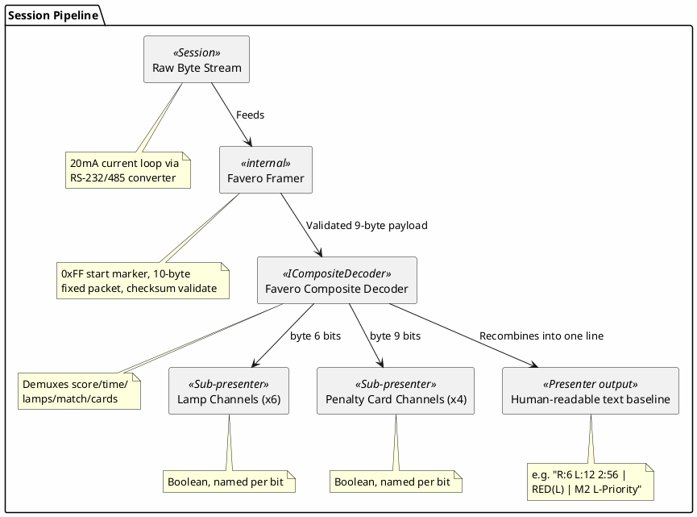

# Proposal: Favero Fencing Scoring Apparatus — Protocol Decoder

> **Status: deprioritized.** No longer have access to a Favero scoring apparatus to test against,
> so this isn't actionable right now — kept as a documented proposal (the protocol is fully
> specified and the composite-decoder design point it makes is still valid) in case hardware access
> comes back, but don't pick it up as active work. See [SCPI](../proposals/scpi-instrument-control.md) instead.

## Source

This proposal is derived from an existing (separate) project tracked in the
[`mwwhited-notes/shared`](https://github.com/mwwhited-notes/shared) repository — Matt's personal
technical notebook, a git submodule of the `notes` wrapper repo, unrelated to this codebase except
as prior art:

- [`shared/projects/scoremachine/favero-protocol.md`](https://github.com/mwwhited-notes/shared/tree/main/projects/scoremachine/favero-protocol.md) — complete protocol specification
- [`shared/projects/scoremachine/`](https://github.com/mwwhited-notes/shared/tree/main/projects/scoremachine) — ScoreMachine, the production system this protocol serves (deployed 2018–present, including the Arnold Fencing Classic and ongoing Royal Arts Fencing Academy events)

The protocol itself has an existing decoder implementation
([BinaryDataDecoders](https://github.com/mwwhited/BinaryDataDecoders), 796K+ NuGet downloads) and
a production consumer ([FencingScoreBoard](https://github.com/mwwhited/FencingScoreBoard),
ASP.NET Core + SignalR) — this proposal is about giving dev-term its own decoder for
observing/debugging the same stream directly, not about replacing either of those.

## Device

Favero Full-Arm-05 fencing scoring apparatus (Favero Electronic Design, Italy). Interface is a
**20mA current loop**, not standard RS-232 — a current-loop-to-RS-232/RS-485 converter is
required in the physical chain; the source repo has [the vendor's own converter schematic](https://github.com/mwwhited-notes/shared/blob/main/projects/scoremachine/reference/favero/opto-rs232interf1.pdf).
Serial parameters: 2400 baud, 8-N-1.

## Why this is a good composite/channelized decoder candidate

This is the most protocol-interesting of the three proposals in this directory: a **continuous,
unidirectional, bitfield-packed** stream, which exercises a different part of the presenter design
than the request/response shape of the SCPI and Radex One proposals.

- **Continuous push, not query/response** — the apparatus streams a fixed 10-byte packet every
  ~42ms (~24 Hz) unprompted. No control surface is needed or possible; per
  [presenters.md](../presenters.md) §2, "a decoder can be receive-only if that doesn't make sense
  for the protocol" — this is that case.
- **Fixed-size, checksum-framed packets** — `0xFF` start marker, 8 payload bytes, 1 checksum byte
  (unweighted sum of bytes 1–9, no carry) — simple enough to frame with a byte-counting parser
  rather than needing delimiter-scanning.
- **Multiple independently-meaningful bitfields packed into single bytes** — this is the
  motivating shape for [presenters.md](../presenters.md) §4's composite/channelized decoders,
  just at the sub-byte level rather than across multiple time-sliced sub-streams: byte 6 alone
  packs 6 independent lamp-state bits (left/right white, red, green, left/right yellow), byte 7
  packs a 2-bit match number plus 2 independent priorité flags, byte 9 packs 4 independent
  penalty-card bits. A composite decoder demultiplexing "byte 6" into six named boolean channels
  (`LampLeftWhite`, `LampRightWhite`, `LampRed`, ...) is a natural, low-risk way to validate the
  `ICompositeDecoder` contract at sub-byte granularity before tackling composite decoders that
  split a stream across multiple *messages* or *time slots* instead.

## Packet format (full detail in the source doc)

| Byte | Field | Notes |
|---|---|---|
| 1 | Start marker | Always `0xFF` |
| 2 | Right score | `0x00`–`0x0F` |
| 3 | Left score | `0x00`–`0x0F` |
| 4 | Seconds | `0x00`–`0x59` |
| 5 | Minutes | `0x00`–`0x09` (units only) |
| 6 | Lamp status | 6-bit bitfield (2 unused) — see below |
| 7 | Match/priorité | 2-bit match number + 2 priorité flags (4 unused) |
| 8 | Reserved | Internal use, not `0xFF` |
| 9 | Penalty cards | 4-bit bitfield (2 variable/ignore, 2 always 0) |
| 10 | Checksum | Sum of bytes 1–9, no carry |

**Byte 6 (lamp status)** — `D0` left white, `D1` right white, `D2` red (left touch), `D3` green
(right touch), `D4` right yellow (off-target), `D5` left yellow (off-target), `D6`–`D7` unused.

**Byte 7 (match/priorité)** — `D0`-`D1` match number (0–3), `D2` right priorité, `D3` left
priorité, `D4`–`D7` unused.

**Byte 9 (penalty cards)** — `D0` red card right, `D1` red card left, `D2` yellow card right,
`D3` yellow card left, `D4`–`D5` variable/ignore, `D6`–`D7` always 0.

## Proposed shape

- **One `IMappable` opportunity**: match-number and priorité/lamp semantics differ slightly
  between weapons (foil, sabre, épée don't all use priorité the same way — the source doc notes
  priorité is "critical in foil and sabre, not épée") — a per-weapon label mapping on top of the
  same generic bitfield decoder is a plausible [presenters.md](../presenters.md) §5 mappable-presenter
  case, though the raw bit semantics stay the same across weapons; only the human labels shown
  would change.
- **Physical layer note for the transport, not the decoder**: since the device is 20mA
  current-loop rather than native RS-232, this decoder assumes a converter is already in the
  physical chain — no dev-term transport work is implied here (the existing serial transport
  handles it once converted), it's called out only so the hardware prerequisite isn't lost.

## Open questions

- Whether this becomes the first real `ICompositeDecoder` implementation (this doc + the Radex
  One proposal are currently dev-term's two best-specified, ready-to-build binary protocols) —
  worth deciding relative ordering against the Radex One proposal, since Radex One is
  request/response (simpler state machine) while this is continuous-push (simpler framing, no
  control surface, but genuinely composite).
- Whether a live scoreboard *rendering* presenter (not just the text baseline) is worth building
  on top of this decoder later, given ScoreMachine already has a production-grade overlay/OBS
  rendering path — dev-term's value-add here is more likely "observe/debug the raw stream
  alongside the production system" than "replace the production renderer."
