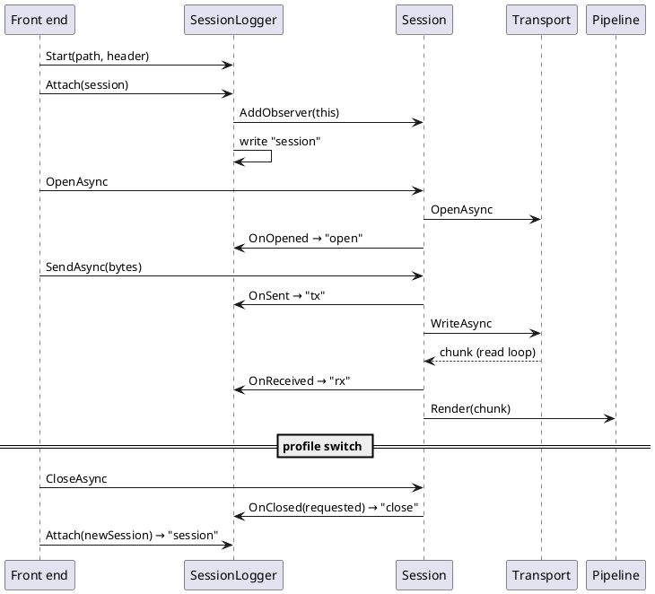

# Session Logging and Playback

## Purpose

Logger mode records everything a session sends and receives, plus its connect and disconnect
events, to a file. Playback replays that file later through any presenters, with transport
controls, trimming and notes. It's for reviewing a device conversation after the fact, sharing one
with someone who doesn't have the device, and reproducing a presenter/decoder bug from a real capture
without the hardware.

It isn't the same as the rendering presenters' export formats (SVG/PNG from a decoded drawing, see
[presenters.md](presenters.md)). A session log is the raw conversation, and anything decoded from it
can be decoded again.

**Status (2026-09-25): implemented** in all three front ends. `DevTerm.Logging` holds the format,
the recorder and the playback engine. `DevTerm.Configuration` holds the front-end glue
(`SessionLogging`, `PlaybackPresenters`). The screens are specified in
[`docs/specs/playback-window.md`](../specs/playback-window.md) and the main-window specs, and shown
in [`docs/user-guide/logging-and-playback.md`](../user-guide/logging-and-playback.md). Nothing has
been verified against real hardware yet: all captures so far are from the loopback transport and
test fakes.

## Requirements this design answers

- **Lossless.** Playback must hand the presenters exactly the bytes, in exactly the chunks, they saw
  live. Stateful presenters make chunk boundaries matter: the ASCII line buffer, a protocol decoder
  mid-frame, and SCPI's query/reply correlation all depend on them.
- **Ordered and timed.** Every record has a sequence number and a timestamp. File order, sequence
  order and time order always agree.
- **Crash-tolerant.** A capture cut short (the app killed, the machine losing power) still loads,
  up to its last complete record.
- **Versioned and forward-compatible.** A newer dev-term can add fields and record types without
  breaking an older reader, and a trim or note saved by an older one never drops what it didn't
  understand.
- **Passive.** Logging never changes what any presenter renders, and a failing log (a full disk)
  never takes the connection down.
- **Isolated.** Playback can never reach a real device.

## The file format (version 1)

**JSON Lines** (`.jsonl`): UTF-8, one JSON object per line, `\n`-terminated. The first line is the
header, and every line after it is one record.

```text
{"type":"header","format":"dev-term-session-log","version":1,"created":"2026-09-25T12:00:00.0000000Z","application":"dev-term 1.0.0 (tui)","connection":"tcp://192.168.0.107:23","profile":"tek2230","transport":"tcp","presenters":["ascii","hex"],"parser":"ascii"}
{"type":"session","seq":1,"t":"2026-09-25T12:00:00.0000000Z","connection":"tcp://192.168.0.107:23","profile":"tek2230","state":"closed"}
{"type":"open","seq":2,"t":"2026-09-25T12:00:00.0400000Z"}
{"type":"tx","seq":3,"t":"2026-09-25T12:00:01.0000000Z","data":"SUQ/DQ=="}
{"type":"rx","seq":4,"t":"2026-09-25T12:00:01.2000000Z","data":"SUQgVEVLLzIyMzAs"}
{"type":"note","t":"2026-09-25T12:00:01.2000000Z","text":"reply looks right"}
{"type":"disconnect","seq":5,"t":"2026-09-25T12:00:09.0000000Z","error":"Connection reset by peer"}
```

### Header

| Field | Required | Meaning |
|---|---|---|
| `type` | yes | Always `"header"`. |
| `format` | yes | Always `"dev-term-session-log"`. This is what identifies the file. A reader rejects anything else. |
| `version` | yes | The format version, `1`. A reader rejects a version newer than it knows. |
| `created` | yes | When logging started (UTC). |
| `application` | no | What wrote it, e.g. `dev-term 1.0.0 (cli)`. Informational only. |
| `connection` | no | The connection definition at the start, the same string the window title uses (`ConnectionDescription.Definition`). |
| `profile` | no | The saved profile's name, when the connection is one. |
| `transport` | no | `tcp`, `serial`, `hid`, `usbtmc` or `loopback`. |
| `presenters` | no | The presenters displaying the traffic. Playback uses these by default. |
| `parser` | no | The send format when logging started. |
| `trimmedFrom` | no | Set on a trimmed log: the file name it was cut from. |

### Records

Every record has `type` and `t`, a UTC timestamp in ISO 8601 with 100 ns precision (`…T12:00:01.2000000Z`).
Captured records also have `seq`, which starts at 1 and goes up by 1 per record in capture order.

| `type` | Extra fields | Written when |
|---|---|---|
| `session` | `connection`, `profile`, `state` (`open`/`closed`) | The logger attaches to a session: when logging starts, and again after a live profile switch. It says what's being logged, even when logging started on a connection that was already open. |
| `open` | none | The transport opened. |
| `close` | none | The connection was closed on request (File > Disconnect, a profile switch, the app closing). |
| `disconnect` | `error` (absent for a clean hang-up) | The session closed itself: a read or send failure, or the device closing the connection. This mirrors `Session.Disconnected`. |
| `tx` | `data` | Bytes handed to the transport. |
| `rx` | `data` | One chunk from the device, exactly as the presenters were given it: one `PipeReader.ReadAsync` result, one record. |
| `note` | `text` | A playback annotation. It has no `seq`, since it isn't a captured event. Its `t` is the previous record's time. |

`data` is the raw bytes, **base64** (RFC 4648, with padding).

### Rules for readers and writers

- Unknown **fields** are ignored.
- An unknown **record type** is kept verbatim (`SessionLogRecordKind.Unknown` holds the original
  line) and written back unchanged by trim and markup. That's why adding a record type doesn't need
  a version bump.
- `version` changes only for an incompatible change. A reader refuses a newer version with a clear
  message rather than misreading it.
- A torn **last** line is skipped with a warning, since that's how a capture that was cut short ends.
  A bad line anywhere else fails the load and names the line number.
- `seq` has gaps in a trimmed log, which keeps the original numbers so a trimmed log can still be
  traced back to its source. A note has no `seq`.
- Timestamps come from a monotonic clock anchored at the start (`created + elapsed`), so they never
  go backwards, even across a wall-clock change. Playback still clamps a negative gap to zero for
  hand-edited files.

### Why this format

- **JSON Lines rather than one JSON document**: each record is written and flushed as it happens,
  and a crash can only damage the last line. A single JSON array can't be appended to, and is
  unreadable until it's closed. It also streams, greps (`grep '"type":"tx"'`), and diffs line by line.
- **JSON rather than a binary container** (pcapng, a custom framing): a session log is small
  compared to what JSON's overhead matters for (a serial console at 115200 baud is about 11 KB/s),
  every language reads it, and the header and notes are readable in any text editor. pcapng is
  built for network packets, and dev-term's traffic isn't packets. It would need a custom link type
  and would make notes and the connection description second-class.
- **Base64 rather than hex or text for `data`**: it's lossless for every byte value (text isn't:
  control bytes, invalid UTF-8, a bare `\r`), and about 33% overhead against hex's 100%. Readability
  comes from playing the log back (`--playback` prints any presenter's view), not from the raw field.
- **Chunks, not lines or bytes**: presenters are fed per read, and some care about boundaries. For
  example, the ASCII presenter's max-length flush and a HID report are both one chunk. Logging
  whole reads is what makes playback exact.
- **`tx` recorded before the write**: a fast device's reply can come back before `WriteAsync` returns.
  Recording the send first keeps request-before-reply order in the file. A send that then fails is
  followed by its `disconnect`.

## Recorder: tapping the session

`Session.AddObserver(ISessionObserver)` (in `DevTerm.Core`) is a passive tap, and it isn't part of
the presenter pipeline:

- `OnReceived(ReadOnlySequence<byte>)` runs on the read loop, just before the pipeline renders the
  same chunk.
- `OnSent(ReadOnlyMemory<byte>)` runs before the transport write, and only while open.
- `OnOpened()` runs before the read loop starts, so it always comes before the first `rx`.
- `OnClosed(requested, error)` runs once per connection that was actually open. `requested` is false
  for a self-disconnect, which is the same event as `Session.Disconnected`.

Each callback is isolated: an observer that throws is logged with `Debug.WriteLine` and ignored.
The types are sequences and memory, never spans, so the interface stays mockable (see CLAUDE.md).

`SessionLogger` implements the observer. It assigns the sequence number and timestamp and writes the
line under a single lock, so the read loop and a sender can't interleave out of order.
`SessionLogWriter` flushes every line. `Attach(session, …)` moves the logger to another session
(detaching from the old one) and writes a `session` record. That's how one log **follows a live
profile switch**: a log is per logging run, not per connection. Stopping the logger (`Dispose`)
detaches it and closes the file.



Where logging is started from:

- **CLI**: `--log <path>`, or `--log true` for a timestamped file under `~/.dev-term/logs`
  (`SessionLogging.ResolveLogPath`). It starts before the connect, so the log begins with `open`.
- **TUI and WPF**: File > Start Logging... (a path prompt, or a save dialog, defaulting to that
  same timestamped path) and Stop Logging. `--log` starts it when the window opens.
- `CliOptions.Log`/`Playback`/`PlaybackSpeed` are run-mode flags. `ToProfileJson` never saves them
  into a profile.

## Playback engine

`PlaybackEngine` replays a `SessionLog` through a `Pipeline` built by a factory. The factory is called
again on every rewind, so no presenter state survives one. It's **pull-driven and single-threaded**:
the front end calls `Tick()` from its own UI timer (Terminal.Gui `AddTimeout`, WPF `DispatcherTimer`,
the CLI's `Task.Delay` loop) and renders the returned `PlaybackBatch`. Nothing raises events on a
background thread. Time comes from an injected `TimeProvider`, so tests are exact
(`DevTerm.Test.Utilities.ManualTimeProvider`).

- **Timing**: playback keeps an anchor, "at clock time C the log was at offset O". Log time moves at
  `Speed` times real time from there. It re-anchors on every play, pause, step, seek and speed
  change, so pausing part-way through a gap resumes with only the rest of the gap, and a speed change
  keeps the progress made so far.
- **Speeds**: 0.25x, 0.5x, 1x, 2x, 10x and Max (`PositiveInfinity`, meaning no waiting).
  `Tick` plays at most 2000 records per call, so Max over a huge log still yields to the UI.
- **Step** plays exactly one record and pauses.
- **Rewind** starts over with fresh presenters.
- **Seek** backward rewinds and replays from the start. Forward plays everything in between
  instantly. Either way the presenters end up exactly where live capture left them.
- **Fast-forward** skips 10 s of log time, and always moves at least one record.
- **Presenter change** (`ChangePipeline`) replays to the current position through the new set.
- **Only `rx` is rendered.** `tx` is shown escaped (`ID?\r`) and never goes through a presenter,
  because live presenters only ever see received bytes. Feeding them sent bytes would change what
  they render.

`PlaybackController` is everything a Playback window does, so the TUI and WPF can't drift:

- presenter choice, starting from the header's presenters limited to what's installed;
- speed;
- trim marks: **Mark In** and **Mark Out** at the current position, then **Save Selection** writes
  records `[in, out)` as a new log with `trimmedFrom` set, and refuses to overwrite the log being
  played;
- notes: **Add Note** inserts a `note` at the current position and **saves the log in place** at once,
  with an atomic temp-file-and-rename;
- the position text.

`PlaybackText` formats played items into the same `{mm:ss.fff} [{source}] {text}` lines for every
front end.

**Isolation**: `PlaybackPresenters` builds its catalog with `AddDevTermPresenters`, which is the core
plus every presenter and **no transport**. `DevTerm.Logging` references `DevTerm.Core` only.
Playback has no way to open a connection.

## Open questions

- A note can't be added to a log that this same process is still recording. The recorder holds the
  file open, so the atomic replace fails and the error is reported. Stop logging first.
- Very large logs are loaded fully into memory (`SessionLog.Load`). That's fine for console-scale
  traffic, and would need an index or seekable reader for long high-rate captures, such as a K8055
  streaming hundreds of reports a second for hours.
- Seeking backward replays from record 0, so its cost grows with the log. Presenter snapshots at
  intervals would fix that, but `IPresenter` has no snapshot/restore contract today.
- No "skip silence" option yet (capping long idle gaps during realtime playback).
- Notes can only be added, not edited or deleted, from the Playback window.
