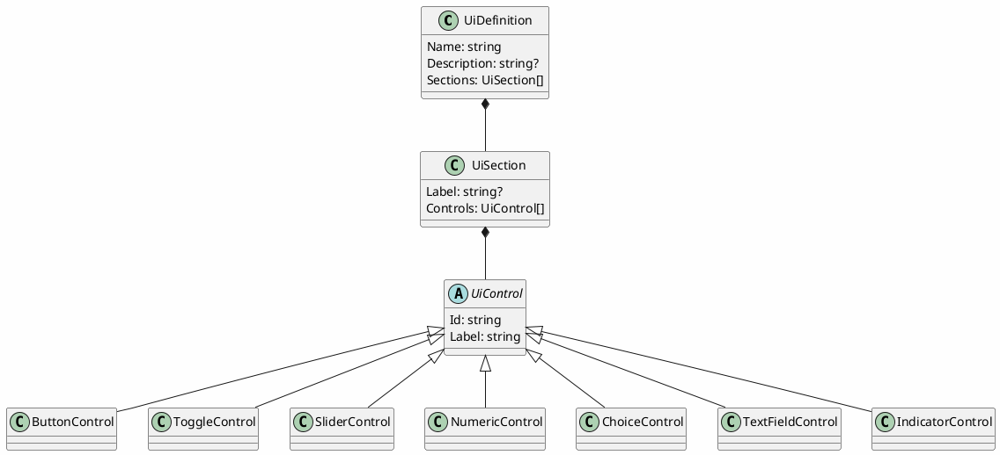

# UI Definitions

## Purpose

Gives concrete, serializable shape to the "control surface declaration" concept already described
in [device-control-modules.md](device-control-modules.md) §"Shape of a device control module": a
device control module describes *what controls exist* (a color picker, a set of toggles, a slider)
once, as data, and every front end (TUI, WPF, eventually a CLI form listing) renders that
description using its own native widgets — instead of each front end needing hand-written UI code
per device, and instead of a device module needing to know anything about Terminal.Gui or WPF.

This directly answers device-control-modules.md's open question "how rich the control-surface
metadata needs to be" with an actual shape, informed by real devices: the `@startsalt` mockups
already written for [Kuando Busylight](proposals/kuando-busylight-protocol.md),
[Velleman K8055](proposals/velleman-k8055-protocol.md), [EByte](proposals/ebyte-e810-dtu-config-protocol.md),
and [Zoom H4n](proposals/zoom-h4n-remote-protocol.md) are what this model needs to be able to
describe — a color swatch picker, toggle switches, sliders, a device list plus a settings form, a
button panel. The model is built from those concrete examples, not designed in the abstract first.

## Status

**First step only, landed 2026-09-15**: the representation model itself (`DevTerm.UiDefinitions`)
and JSON/XML serialization, with round-trip tests against a real example (a full Busylight control
panel, matching that proposal's mockup exactly). **Not yet built**: anything that actually reads
this model and produces real Terminal.Gui or WPF controls from it, or wires it to a live
`IControlSurface` — that's the next step once `IControlSurface` itself exists in code (it's still
design-only, per device-control-modules.md).

## Shape

A `UiDefinition` is a named panel made of `UiSection`s (a label plus a flat list of controls — no
deeper nesting for now, matching every mockup written so far, all of which are one level of
grouping). Each `UiControl` carries an `Id` (what it reads/writes — a parameter or command name a
future `IControlSurface` would recognize) and a `Label` (what a human sees), plus kind-specific
fields:

- `ButtonControl` — invokes a command, no value of its own (e.g. "Apply", "Reboot", "Reset Counter").
- `ToggleControl` — a boolean (e.g. "Mute", a digital output channel).
- `SliderControl` — a bounded numeric range with a step (e.g. an analog output 0-255, a volume level).
- `NumericControl` — a bounded numeric value entered as a number rather than dragged (e.g. on/off
  blink duration in ms) — the same shape as `SliderControl` but a different natural widget.
- `ChoiceControl` — one of a fixed set of named options, either as a dropdown or a radio group (a
  `Style` field picks which — a small option count reads better as radio buttons, e.g. a color
  preset or a connection mode; a longer list reads better as a dropdown, e.g. a sound track name).
- `TextFieldControl` — free text (e.g. an IP address, a hostname).
- `IndicatorControl` — a read-only display bound to live decoder output, not a control the user
  changes (e.g. a digital input's current state, a pulse counter value, a connection status line).

Serialization is polymorphic on control kind — `System.Text.Json`'s `[JsonDerivedType]` for JSON,
`[XmlInclude]` for XML — both built into their respective frameworks, no hand-rolled discriminator
parsing.

## Why a flat one-level Section→Control structure, not deeper nesting

Every real mockup written against actual devices so far (Busylight, K8055, EByte, H4n) needed at
most one level of visual grouping (a labeled row/section), never nested groups-within-groups. Matching
what real devices actually need beats designing for hypothetical deeper nesting up front — this can
grow a `Sections: UiSection[]` (nested sections) later if a device genuinely needs it, without
breaking the JSON/XML shape of what exists today (an added optional property, not a redesign).

## Open questions

- How a `UiControl.Id` actually resolves to a real `IControlSurface` command/parameter once that
  contract exists in code — this model is deliberately independent of `IControlSurface` for now
  (no reference to it, no behavior, just data), so the binding mechanism is still open.
- Whether `IndicatorControl` needs a format/unit hint (e.g. "show this raw byte as hex" vs. "show
  this as a percentage") or whether that's better left to the decoder producing the value in
  already-formatted form.
- Whether conditional/interlocked controls (a control that's disabled or hidden based on another
  control's value — device-control-modules.md's open question) belong in this model at all, or are
  out of scope for a first declarative version and require a real code-based control surface
  instead.
- Whether `Sections` should ever nest — deferred per above until a real device actually needs it.
