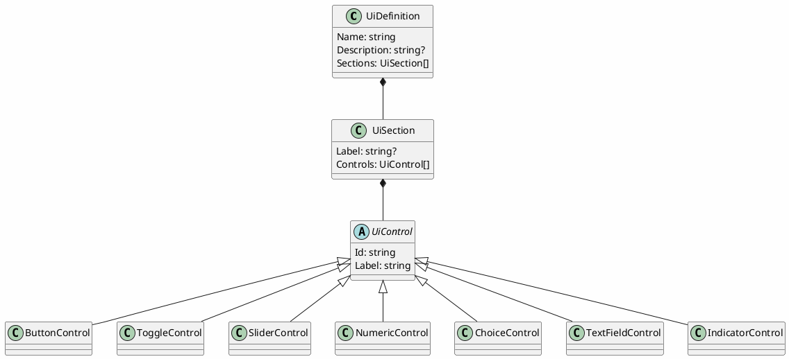
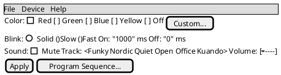

# UI Definitions

## Purpose

Gives concrete, serializable shape to the "control surface declaration" concept already described
in [device-control-modules.md](device-control-modules.md) §"Shape of a device control module": a
device control module describes *what controls exist* (a color picker, a set of toggles, a slider)
once, as data, and every front end (TUI, WPF, eventually a CLI form listing) renders that
description using its own native widgets — instead of each front end needing hand-written UI code
per device, and instead of a device module needing to know anything about Terminal.Gui or WPF.

This directly answers device-control-modules.md's open question "how rich the control-surface
metadata needs to be" with an actual shape, informed by real devices: the `@startsalt` mockups
already written for [Kuando Busylight](proposals/kuando-busylight-protocol.md),
[Velleman K8055](proposals/velleman-k8055-protocol.md), [EByte](proposals/ebyte-e810-dtu-config-protocol.md),
and [Zoom H4n](proposals/zoom-h4n-remote-protocol.md) are what this model needs to be able to
describe — a color swatch picker, toggle switches, sliders, a device list plus a settings form, a
button panel. The model is built from those concrete examples, not designed in the abstract first.

## Status

**Representation model, landed 2026-09-15**: `DevTerm.UiDefinitions` and JSON/XML serialization,
round-trip tested against a real example (a full Busylight control panel, matching that proposal's
mockup exactly).

**Generic renderer + first real `IControlSurface`, landed 2026-09-22**: `IControlSurface` and
`IStructuredPresenter` now exist in code (`DevTerm.Core.Control`/`DevTerm.Core.Presenters`), and
both front ends read a `UiDefinition` generically and produce real, wired controls from it —
`ControlPanelMode` (TUI, Terminal.Gui) and `ControlPanelWindow` (WPF) — proven against the real
Velleman K8055 (`DevTerm.Devices.K8055`: a `UiDefinition`, an `IControlSurface`, and an
`IStructuredPresenter` decoder). Neither renderer is K8055-specific — any device's
`UiDefinition`/`IControlSurface` pair renders the same way. Not yet exercised against a second
device (Busylight is the next candidate, a separate future pass) or against the numeric/choice/
textField control kinds on real hardware (K8055's own mockup only uses toggle/slider/indicator/
button).

## Shape

A `UiDefinition` is a named panel made of `UiSection`s (a label plus a flat list of controls — no
deeper nesting for now, matching every mockup written so far, all of which are one level of
grouping). Each `UiControl` carries an `Id` (what it reads/writes — a parameter or command name a
future `IControlSurface` would recognize) and a `Label` (what a human sees), plus kind-specific
fields:

- `ButtonControl` — invokes a command, no value of its own (e.g. "Apply", "Reboot", "Reset Counter").
- `ToggleControl` — a boolean (e.g. "Mute", a digital output channel).
- `SliderControl` — a bounded numeric range with a step (e.g. an analog output 0-255, a volume level).
- `NumericControl` — a bounded numeric value entered as a number rather than dragged (e.g. on/off
  blink duration in ms) — the same shape as `SliderControl` but a different natural widget.
- `ChoiceControl` — one of a fixed set of named options, either as a dropdown or a radio group (a
  `Style` field picks which — a small option count reads better as radio buttons, e.g. a color
  preset or a connection mode; a longer list reads better as a dropdown, e.g. a sound track name).
- `TextFieldControl` — free text (e.g. an IP address, a hostname).
- `IndicatorControl` — a read-only display bound to live decoder output, not a control the user
  changes (e.g. a digital input's current state, a pulse counter value, a connection status line).

Serialization is polymorphic on control kind — `System.Text.Json`'s `[JsonDerivedType]` for JSON,
`[XmlInclude]` for XML — both built into their respective frameworks, no hand-rolled discriminator
parsing.



## Example

The [Kuando Busylight](proposals/kuando-busylight-protocol.md) panel, as both a mockup and the
model that would produce it — this is the actual definition round-trip-tested against both JSON
and XML serializers:



```json
{
  "name": "Kuando Busylight",
  "sections": [
    {
      "label": "Color",
      "controls": [
        { "kind": "choice", "id": "color", "label": "Color", "style": "RadioGroup",
          "options": ["Red", "Green", "Blue", "Yellow", "Off"], "defaultValue": "Off" },
        { "kind": "button", "id": "customColor", "label": "Custom..." }
      ]
    },
    {
      "label": "Blink",
      "controls": [
        { "kind": "choice", "id": "blinkMode", "label": "Blink", "style": "RadioGroup",
          "options": ["Solid", "Slow", "Fast"], "defaultValue": "Solid" },
        { "kind": "numeric", "id": "onMs", "label": "On", "unit": "ms", "defaultValue": 1000 },
        { "kind": "numeric", "id": "offMs", "label": "Off", "unit": "ms", "defaultValue": 0 }
      ]
    },
    {
      "label": "Sound",
      "controls": [
        { "kind": "toggle", "id": "mute", "label": "Mute" },
        { "kind": "choice", "id": "track", "label": "Track",
          "options": ["Funky", "Nordic", "Quiet", "Open Office", "Kuando"] },
        { "kind": "slider", "id": "volume", "label": "Volume", "minimum": 0, "maximum": 7 }
      ]
    },
    {
      "controls": [
        { "kind": "button", "id": "apply", "label": "Apply" },
        { "kind": "button", "id": "programSequence", "label": "Program Sequence..." }
      ]
    }
  ]
}
```

## Why a flat one-level Section→Control structure, not deeper nesting

Every real mockup written against actual devices so far (Busylight, K8055, EByte, H4n) needed at
most one level of visual grouping (a labeled row/section), never nested groups-within-groups. Matching
what real devices actually need beats designing for hypothetical deeper nesting up front — this can
grow a `Sections: UiSection[]` (nested sections) later if a device genuinely needs it, without
breaking the JSON/XML shape of what exists today (an added optional property, not a redesign).

## Open questions

- ~~How a `UiControl.Id` actually resolves to a real `IControlSurface` command/parameter~~ —
  **settled 2026-09-22**: `Id` *is* the command id, 1:1 (`ButtonControl.CommandId` overrides it for
  the rare case a button's id differs from its command — see `K8055UiDefinition`'s
  `resetCounter1`/`resetCounter2` buttons, which don't need the override since their ids already
  match their commands). `IControlSurface.InvokeAsync(commandId, value)` takes everything as a
  single optional string, mirroring `IPresenterInput.Parse(string)`'s "everything is text at the
  boundary" convention.
- Whether `IndicatorControl` needs a format/unit hint (e.g. "show this raw byte as hex" vs. "show
  this as a percentage") or whether that's better left to the decoder producing the value in
  already-formatted form.
- Whether conditional/interlocked controls (a control that's disabled or hidden based on another
  control's value — device-control-modules.md's open question) belong in this model at all, or are
  out of scope for a first declarative version and require a real code-based control surface
  instead.
- Whether `Sections` should ever nest — deferred per above until a real device actually needs it.

See [device-manifests.md](device-manifests.md) for how a `UiDefinition` fits into a complete,
no-code device configuration (inline in a single-file manifest, or by reference in a folder/zip
one) — that doc's own open questions cover the packaging side of this, not repeated here.
