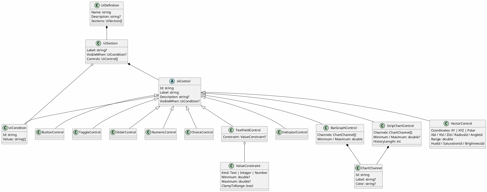
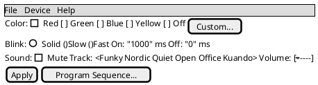
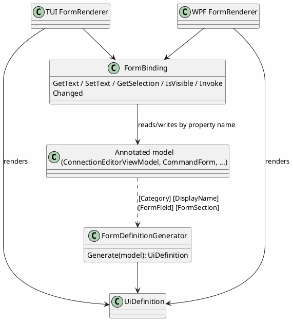

# UI Definitions

## Purpose

Gives concrete, serializable shape to the "control surface declaration" concept already described
in [device-control-modules.md](device-control-modules.md) §"Shape of a device control module": a
device control module describes *what controls exist* (a color picker, a set of toggles, a slider)
once, as data, and every front end (TUI, WPF, eventually a CLI form listing) renders that
description using its own native widgets — instead of each front end needing hand-written UI code
per device, and instead of a device module needing to know anything about Terminal.Gui or WPF.

This directly answers device-control-modules.md's open question "how rich the control-surface
metadata needs to be" with an actual shape, informed by real devices: the `@startsalt` mockups
already written for [Kuando Busylight](features/kuando-busylight-protocol.md),
[Velleman K8055](features/velleman-k8055-protocol.md), [EByte](proposals/ebyte-e810-dtu-config-protocol.md),
and [Zoom H4n](proposals/zoom-h4n-remote-protocol.md) are what this model needs to be able to
describe — a color swatch picker, toggle switches, sliders, a device list plus a settings form, a
button panel. The model is built from those concrete examples, not designed in the abstract first.

## Status

**Representation model, landed 2026-09-15**: `DevTerm.UiDefinitions` and JSON/XML serialization,
round-trip tested against a real example (a full Busylight control panel, matching that proposal's
mockup exactly).

**Generic renderer + first real `IControlSurface`, landed 2026-09-22**: `IControlSurface` and
`IStructuredPresenter` now exist in code (`DevTerm.Core.Control`/`DevTerm.Core.Presenters`), and
both front ends read a `UiDefinition` generically and produce real, wired controls from it —
`ControlPanelMode` (TUI, Terminal.Gui) and `ControlPanelWindow` (WPF) — proven against the real
Velleman K8055 (`DevTerm.Devices.K8055`: a `UiDefinition`, an `IControlSurface`, and an
`IStructuredPresenter` decoder), and, as of the same day, against a second device, Kuando Busylight
(`DevTerm.Devices.Busylight`: a `UiDefinition`, an `IControlSurface`, and a plain `IPresenter`
decoder with no `IStructuredPresenter` — Busylight's panel has no `IndicatorControl`s). Neither
renderer needed any change for the second device — confirming neither is K8055-specific. Busylight's
own mockup exercises `ChoiceControl` (both styles: radio-group color/blink presets, a dropdown
track list) and `NumericControl` (on/off timing) for the first time, alongside the toggle/slider/
button kinds K8055 already exercised; `TextFieldControl` is still unexercised by any real device
module. Busylight's real-hardware verification is still pending (software-only pass so far, real
device review deferred to the user); K8055's is done for WPF, still pending for the TUI side.

**Value constraints, command previews, and renderer layout, landed 2026-09-25**: a serializable
`ValueConstraint` (below) plus one shared `ValueValidator`, both renderers validating every typed
value with it before sending; an optional `DevTerm.Core.Control.ICommandPreview` capability that
lets a surface show exactly what a control would send (implemented by the SCPI, K8055, and
Busylight surfaces); and collapsible sections, aligned labels, and a bottom "Notes" section for
`Description` in both renderers — see [docs/specs/device-control-panel.md](../specs/device-control-panel.md).

**Display controls, manifest panels, and TUI fitting, landed 2026-09-25 (later the same day)**: three
display-only chart controls — `BarGraphControl`, `StripChartControl`, `VectorControl` (below) — with
their shared, framework-agnostic live state (`LiveDisplayState`) rendered in both front ends (TUI:
block characters and braille in colored character cells; WPF: real drawing); a loaded
[device manifest](device-manifests.md)'s `UiDefinition` is now a live panel (**Device > Device
Manifest...**); the TUI form scrolls sideways instead of letting a wide row run off the right edge
and re-wraps its Notes on resize; and both renderers remember each section's expand/collapse state
per definition for the life of the process.

**Forms from one definition, landed 2026-09-25 (Phase 2 of the UI batch)**: attributes on a model's
properties plus a reflection-based generator (`DevTerm.UiDefinitions.Forms`) turn any annotated model
into a `UiDefinition`, and a form-oriented renderer in each front end draws it two-way bound to the
model — see [Forms from one definition](#forms-from-one-definition) below. The Connection Editor's
connection fields are generated this way in both front ends, and the new
[manifest editor](../specs/manifest-editor.md) builds all of its forms with it. Sections and
controls gained an optional visibility condition (`VisibleWhen`), `UiControl` an optional
`Description` (help text), `ChoiceStyle` a `CheckList` (multi-select), and `IndicatorControl` a
`Style` (`Plain`/`Warning`).

## Shape

A `UiDefinition` is a named panel made of `UiSection`s (a label plus a flat list of controls — no
deeper nesting for now, matching every mockup written so far, all of which are one level of
grouping). Each `UiControl` carries an `Id` (what it reads/writes — a parameter or command name a
future `IControlSurface` would recognize) and a `Label` (what a human sees), plus kind-specific
fields:

- `ButtonControl` — invokes a command, no value of its own (e.g. "Apply", "Reboot", "Reset Counter").
  Optionally carries `ParameterFieldIds: List<string>?` (added 2026-09-23, for the SCPI module — see
  [scpi-instrument-control.md](features/scpi-instrument-control.md)): when set, the renderer reads
  each named sibling control's current value (a `TextFieldControl`/`NumericControl`'s text, a
  `ChoiceControl`'s selected option), comma-joins them, and invokes `CommandId ?? Id` with the
  joined string — the generic mechanism for "pick a command, fill in one or more parameter fields,
  then send," without a bespoke dynamic-form widget per device.
- `ToggleControl` — a boolean (e.g. "Mute", a digital output channel).
- `SliderControl` — a bounded numeric range with a step (e.g. an analog output 0-255, a volume level).
- `NumericControl` — a bounded numeric value entered as a number rather than dragged (e.g. on/off
  blink duration in ms) — the same shape as `SliderControl` but a different natural widget.
- `ChoiceControl` — one of a fixed set of named options, either as a dropdown or a radio group (a
  `Style` field picks which — a small option count reads better as radio buttons, e.g. a color
  preset or a connection mode; a longer list reads better as a dropdown, e.g. a sound track name).
- `TextFieldControl` — free text (e.g. an IP address, a hostname), or, with an optional
  `Constraint: ValueConstraint?`, a typed value with a data type and bounds (see "Values and
  widgets" below).
- `IndicatorControl` — a read-only display bound to live decoder output, not a control the user
  changes (e.g. a digital input's current state, a pulse counter value, a connection status line).
- `BarGraphControl` — a read-only bar graph, one bar per `ChartChannel` (`Id`, optional `Label`,
  optional `#RRGGBB` `Color`), each filled to its latest value within `Minimum`/`Maximum`, with a
  `Unit` for the readout (e.g. several ADC channels side by side).
- `StripChartControl` — a read-only strip/roll chart recorder: a trace per `ChartChannel` of its last
  `HistoryLength` values, scrolling left as values arrive; the value axis is `Minimum`/`Maximum` when
  both are set, otherwise auto-scaled (e.g. a temperature or voltage over time).
- `VectorControl` — a read-only coordinate display: a point plus a short trail, from x/y
  (`Coordinates: XY`, `XId`/`YId`), x/y/z (`XYZ`, adding `ZId`, drawn in an oblique projection), or
  r/theta (`Polar`, `RadiusId`/`AngleId` in `AngleUnit` degrees or radians), on axes spanning
  ±`Range`, with an optional live h/s/v color (`HueId`/`SaturationId`/`BrightnessId`) — e.g. a
  joystick, an accelerometer, a phase angle, an RGB sensor's hue.

The three chart controls are display-only like `IndicatorControl`: each channel/coordinate id is a
key the device's structured presenter publishes (`IStructuredPresenter.ValuesChanged`), and one
published value can feed an indicator and any number of charts at once. What's drawn is decided once,
in `DevTerm.UiDefinitions`, by `LiveDisplayState` (`BarGraphState`/`StripChartState`/`VectorState`:
number parsing via `ChartValue.TryParse` — tolerant of a unit or prefix in the reply — clamping,
rolling history, scaling, polar-to-Cartesian conversion, one trail point per published batch, and
HSV color), so both renderers plot identical data identically and the logic is tested without a UI.
Channel colors default to `ChartPalette`'s fixed eight-slot categorical order (never cycled; a ninth
channel is neutral gray).

Serialization is polymorphic on control kind — `System.Text.Json`'s `[JsonDerivedType]` for JSON,
`[XmlInclude]` for XML — both built into their respective frameworks, no hand-rolled discriminator
parsing.



A chart control in JSON (discriminators `barGraph`, `stripChart`, `vector`; XML elements
`BarGraph`, `StripChart`, `Vector`; property names are case-insensitive on read, but `kind` must come
first in each control object):

```json
{ "kind": "barGraph", "id": "levels", "label": "Channels", "minimum": 0, "maximum": 100, "unit": "%",
  "channels": [ { "id": "chA", "label": "A" }, { "id": "chB", "label": "B" } ] }
{ "kind": "stripChart", "id": "history", "label": "A / B", "historyLength": 60,
  "channels": [ { "id": "chA", "label": "A" } ] }
{ "kind": "vector", "id": "polar", "label": "R/Theta", "coordinates": "Polar",
  "radiusId": "r", "angleId": "theta", "angleUnit": "Degrees", "range": 1 }
```

## Example

The [Kuando Busylight](features/kuando-busylight-protocol.md) panel, as both a mockup and the
model that would produce it — this is the actual definition round-trip-tested against both JSON
and XML serializers:



```json
{
  "name": "Kuando Busylight",
  "sections": [
    {
      "label": "Color",
      "controls": [
        { "kind": "choice", "id": "color", "label": "Color", "style": "RadioGroup",
          "options": ["Red", "Green", "Blue", "Yellow", "Off"], "defaultValue": "Off" },
        { "kind": "button", "id": "customColor", "label": "Custom..." }
      ]
    },
    {
      "label": "Blink",
      "controls": [
        { "kind": "choice", "id": "blinkMode", "label": "Blink", "style": "RadioGroup",
          "options": ["Solid", "Slow", "Fast"], "defaultValue": "Solid" },
        { "kind": "numeric", "id": "onMs", "label": "On", "unit": "ms", "defaultValue": 1000 },
        { "kind": "numeric", "id": "offMs", "label": "Off", "unit": "ms", "defaultValue": 0 }
      ]
    },
    {
      "label": "Sound",
      "controls": [
        { "kind": "toggle", "id": "mute", "label": "Mute" },
        { "kind": "choice", "id": "track", "label": "Track",
          "options": ["Funky", "Nordic", "Quiet", "Open Office", "Kuando"] },
        { "kind": "slider", "id": "volume", "label": "Volume", "minimum": 0, "maximum": 7 }
      ]
    },
    {
      "controls": [
        { "kind": "button", "id": "apply", "label": "Apply" },
        { "kind": "button", "id": "programSequence", "label": "Program Sequence..." }
      ]
    }
  ]
}
```

## Values and widgets

A value's **data type and bounds** are declared separately from the **widget** that collects it.
Before this, the widget implied the type: only `SliderControl`/`NumericControl` had
`Minimum`/`Maximum`, so "a number typed into a plain text field" couldn't be expressed, and a SCPI
parameter's `Kind` fixed its widget.

- `ValueConstraint` (`DevTerm.UiDefinitions`): `Kind` (`Text`, `Integer`, `Number`; written by name
  in JSON), optional inclusive `Minimum`/`Maximum`, and `ClampToRange` (default false: an
  out-of-range value is *rejected*; true: it's clamped). A plain class of nullable scalars, so it
  round-trips through both `System.Text.Json` and `XmlSerializer` with no special-casing (see
  `ValueConstraintTests`). Carried by `TextFieldControl.Constraint`; a definition written before it
  existed loads with no constraint (free text), unchanged.
- `ValueValidator.Validate(constraint, input)`: the **one** validator both renderers run on commit,
  and on each field a `ParameterFieldIds` button reads. Result: valid plus a normalized value
  (invariant culture: `" 1e3 "` → `"1000"`, `"3.0"` → `"3"` for `Integer`), or invalid plus a
  message (`'abc' is not a number.`, `9 is out of range (1 to 4).`). An invalid value is never sent.
- `ValueValidator.ConstraintFor(control)` is how a renderer gets a control's constraint:
  `TextFieldControl.Constraint` as declared, or `ValueConstraint.ForRange(Minimum, Maximum)` (a
  clamping `Number` range) for `SliderControl`/`NumericControl` — so their existing `Minimum`/
  `Maximum` JSON keeps working and keeps clamping, but unparsable input is now rejected instead of
  silently replaced by `DefaultValue`.
- The SCPI module uses this so a `ScpiParameterDefinition` can pick its widget independently of its
  `Kind`/bounds: an optional `Control` hint (`Numeric`, `Slider`, `Text`, `Choice`). A `Numeric`
  parameter with `"Control": "Text"` becomes a `TextFieldControl` with a non-clamping `Number`
  constraint (`Integer` when `DecimalPlaces` is 0) over its `Minimum`/`Maximum`; `"Slider"` becomes a
  `SliderControl` (step `10^-DecimalPlaces`). A hint that doesn't fit the kind (a slider for text, a
  choice with no options) falls back to the kind's default widget. See
  [scpi-instrument-control.md](features/scpi-instrument-control.md).

The model says nothing about *what a control sends*; that's the surface's job. A surface that can
describe it implements `DevTerm.Core.Control.ICommandPreview` alongside `IControlSurface` (kept
separate so existing surfaces and test fakes compile unchanged), and both renderers show it — see
the spec's "Command preview" section.

## Forms from one definition

A settings screen is the same vocabulary as a device panel — labeled groups of text fields, toggles,
choices, read-only lines — so it's declared the same way, once, on the model it edits, and each front
end renders it with one generic engine instead of a hand-built field list per front end.

**Declaring a form.** Standard `System.ComponentModel` attributes a model may already carry
(`CliOptions` did) do most of it: `[Category]` is the section, `[DisplayName]` the label (a property
without one gets its name humanized: `DataBits` → "Data bits"), `[Description]` the help text,
`[Browsable(false)]` leaves a property out. Two attributes add what those can't say:

- `[FormField]` on a property: `Kind` (`Auto`, or `TextField`/`Toggle`/`Choice`/`Numeric`/`Slider`/
  `Indicator`/`Button`), `Order` within its section, `OptionsFrom` (a property listing the choices),
  `ChoiceStyle`, `VisibleWhen`/`VisibleWhenValues`, a `ValueKind` with `Minimum`/`Maximum` (becomes
  the field's `ValueConstraint`), `Step`, `Unit`, `MaxLength`, `Warning` (for an indicator).
- `[FormSection("Category", ...)]` on the class: the section's `Order`, a `Label` other than the
  category name (empty: no header), and a `VisibleWhen` for the whole section.

Once any property of a type has `[FormField]`, only those are fields (opt-in — a view model has many
properties that aren't); a type with none gets a field for every browsable, editable property of a
type a form can edit. `Auto` infers the widget from the property: `bool` → toggle, an enum or
`OptionsFrom` → choice, a read-only property → indicator, `ICommand` → button, anything else → text
field (with an `Integer`/`Number` constraint for a numeric type).

**Generating it.** `FormDefinitionGenerator.Generate(model)` (or `Generate<T>()`/`Generate(type,
instance)`) walks the properties in declaration order and produces a plain `UiDefinition`: a
control's `Id` is its property name, defaults and `OptionsFrom` lists are read from the instance.
The result is an ordinary definition — it serializes to JSON/XML like any other.

**Binding it.** `FormBinding` connects a rendered form to its model by id = property name: read as
text/bool/check-list selection, write back (validated against the control's constraint and converted
to the property's type — a string-typed view-model property keeps whatever was typed, so a field is
never fought mid-edit, while an `int` property is only written a value that converts), evaluate
conditions, run a command property, and report changes — relaying the model's own
`INotifyPropertyChanged`, or raising its own after each write for a plain model. Both front ends'
renderers bind through it (not WPF `{Binding}`s), so the conversion/visibility/validation rules are
the same in both and a plain model still updates every dependent row.

**Rendering it.** `DevTerm.Console.FormRenderer` and `DevTerm.Wpf.FormRenderer` are the form-oriented
siblings of the control-panel renderers: same vocabulary and layout conventions (labeled sections,
aligned label column, the shared `ValueValidator`), but a field *writes a property* instead of
invoking a command, and they return an embeddable view rather than a window. Each lets a host
replace one control's widget (`CustomWidgets`) while the form keeps its row, label, alignment and
visibility — how the Connection Editor keeps its rich detected-device pickers. TUI specifics
(Terminal.Gui v2.5.0 has no combo box): a choice that fits one line is an `OptionSelector`, one too
wide wraps as radio-style check boxes over up to three lines, a longer one becomes a text field plus a
`Pick...` list; a hidden section or row takes no rows, and the form re-lays itself out on every
change.

**Conditions** (`UiCondition`, on a section or a control): `Id` names a value — a model property in a
form (e.g. `IsSerialTransport`), another control's value in a definition — and `Values` the values
that show it (case-insensitive; none means "while it's true"; a collection value matches when any
item does). This answers the open question below about conditional controls, for forms: the
Connection Editor shows one transport's group at a time with section conditions, the SCPI profile row
only while the `scpi` presenter is checked, and the manifest editor shows only the fields a control's
kind has. The control-panel renderers don't evaluate conditions yet.

**Scope questions from the backlog, settled**:

1. *Does one level of grouping cover the Connection Editor's transport-conditional field groups?*
   Yes, with conditions: each transport's fields are one section with a visibility condition, and a
   row inside one (the HID vs. USBTMC picker) carries its own. No nesting was needed.
2. *Does `ConnectionEditorViewModel` sit under the render engine or get subsumed by it?* Under it.
   The view model stays the binding/validation layer — it is the form's model (its annotated
   properties generate `FormDefinition`), and everything that isn't a field (profile list,
   import/export, dirty tracking, detected-device discovery, carrying over the settings the form
   doesn't show) is unchanged and still covered by its own tests.



## Why a flat one-level Section→Control structure, not deeper nesting

Every real mockup written against actual devices so far (Busylight, K8055, EByte, H4n) needed at
most one level of visual grouping (a labeled row/section), never nested groups-within-groups. Matching
what real devices actually need beats designing for hypothetical deeper nesting up front — this can
grow a `Sections: UiSection[]` (nested sections) later if a device genuinely needs it, without
breaking the JSON/XML shape of what exists today (an added optional property, not a redesign).

## Open questions

- ~~How a `UiControl.Id` actually resolves to a real `IControlSurface` command/parameter~~ —
  **settled 2026-09-22**: `Id` *is* the command id, 1:1 (`ButtonControl.CommandId` overrides it for
  the rare case a button's id differs from its command — see `K8055UiDefinition`'s
  `resetCounter1`/`resetCounter2` buttons, which don't need the override since their ids already
  match their commands). `IControlSurface.InvokeAsync(commandId, value)` takes everything as a
  single optional string, mirroring `IPresenterInput.Parse(string)`'s "everything is text at the
  boundary" convention.
- Whether `IndicatorControl` needs a format/unit hint (e.g. "show this raw byte as hex" vs. "show
  this as a percentage") or whether that's better left to the decoder producing the value in
  already-formatted form.
- ~~Whether conditional/interlocked controls (a control that's disabled or hidden based on another
  control's value — device-control-modules.md's open question) belong in this model at all~~ —
  **partly settled 2026-09-25**: *hidden* based on another value does, as `VisibleWhen`
  (`UiCondition`), evaluated by the form renderers (see [Forms from one definition](#forms-from-one-definition)).
  Still open: evaluating it in the control-panel renderers too, and *disabled*/interlocked controls.
- Whether `Sections` should ever nest — deferred per above until a real device actually needs it.

See [device-manifests.md](device-manifests.md) for how a `UiDefinition` fits into a complete,
no-code device configuration (inline in a single-file manifest, or by reference in a folder/zip
one) — that doc's own open questions cover the packaging side of this, not repeated here.
