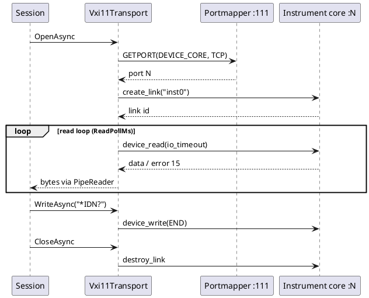

# VXI-11 transport

`--transport vxi11 --host <ip>` talks to an LXI instrument over VXI-11 (ONC-RPC over TCP) instead of
a raw SCPI socket. It is for instruments with no raw SCPI port; an instrument that has one (the Rigol
DG1062Z answers on 5555) is still simpler over `--transport tcp`. Discovery is separate
(see [LXI support](features/lxi-support.md)).

## Protocol subset

| Step | RPC | Notes |
|---|---|---|
| Find the port | portmapper (program 100000 v2) `GETPORT`, proc 3, TCP 111 | skipped when `Port` is set |
| Open | DEVICE_CORE (0x0607AF v1) `create_link`, proc 10 | device name defaults to `inst0` |
| Send | `device_write`, proc 11, flag END (0x08) | the whole typed line is one message |
| Receive | `device_read`, proc 12 | reply reason END = 0x04; error 15 (I/O timeout) means "no data yet" |
| Close | `destroy_link`, proc 23 | best effort |

Framing is RPC record marking (high bit of the 4-byte length = last fragment), AUTH_NONE. Not built:
device_clear, the status byte, SRQ/interrupt channel, locking, abort channel.

## Design points

- **Synchronous channel, one gate.** The core channel is request/response, so a single `SemaphoreSlim`
  serializes reads and writes. The read loop polls with a short `io_timeout` (`ReadPollMs`, default 50)
  so a write waits at most about one poll.
- **Replies need a line terminator for the ASCII presenter.** If a reply ends with END but no LF, the
  transport appends one (`AppendLineFeedAtEnd`, default true). The DG1062Z already includes its LF.
- **Reuses the TCP plumbing** (`ITcpConnectionSource`), so tests drive it with a real loopback fake server.
- Options: `Host` (required), `Port` (0 = ask the portmapper), `Device`, `WriteTimeoutMs`, `ReadPollMs`,
  `AppendLineFeedAtEnd`. CLI/profile surface: `Host`, `Port` (optional), `WriteTimeoutMs`.

## Status

**Implemented 2026-10-03** (`src/DevTerm.Transports.Vxi11`, 6 unit tests against a fake portmapper plus
core server, plus a real-hardware test). **Verified against the Rigol DG1062Z at 192.168.0.87**: `*IDN?`
returned `Rigol Technologies,DG1062Z,DG1ZA232603118,03.01.12` through both the test and the console CLI.
No other instrument has been tried; instruments that need device_clear, SRQ or locking are not covered.

## Completion checklist

- [x] ONC-RPC client, portmapper lookup, create/write/read/destroy
- [x] Config wiring: CLI, validator, profile JSON, connection editor, description, error hint
- [x] Unit tests with a fake server; real-hardware test against the DG1062Z
- [ ] device_clear, status byte, SRQ, locking (add when an instrument needs them)
